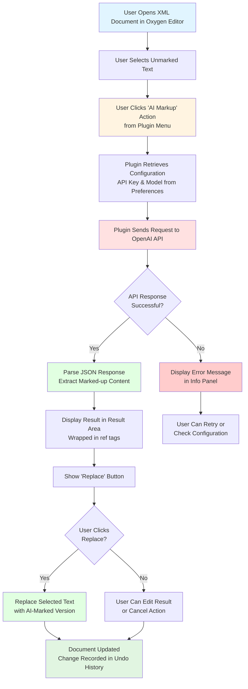
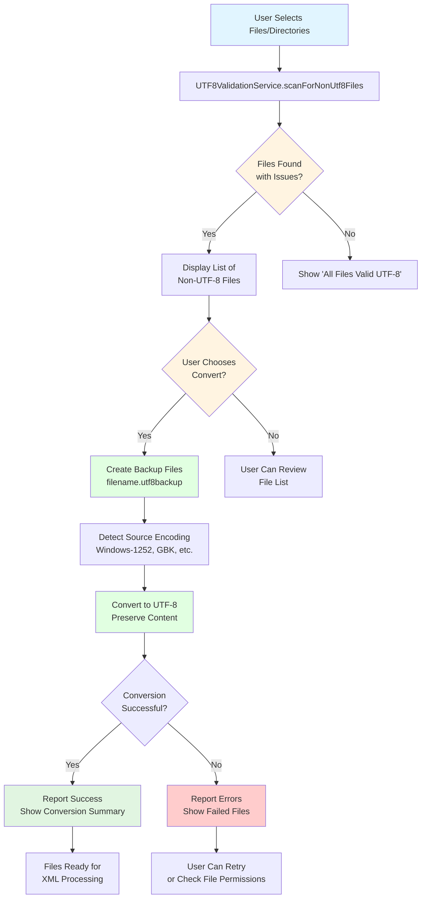

# DILA AI Markup Assistant Plugin

**Product Requirements Document & User Guide**

> **👥 For Users**: This document covers installation, features, and usage instructions
>
> **🔧 For Developers**: Looking for technical implementation details, architecture, and build information? See [PLUGIN_OVERVIEW.md](PLUGIN_OVERVIEW.md)

---

## Executive Summary

The DILA AI Markup Assistant is an Oxygen XML Editor plugin designed to accelerate TEI (Text Encoding Initiative) XML document editing through AI-powered markup automation, comprehensive UTF-8 encoding validation, and XML tag management. The plugin serves scholarly document editors who need to efficiently process large volumes of references and citations while maintaining encoding integrity across international character sets.

### Version Information

- **Released Version**: 0.4.0
- **Target Platform**: Oxygen XML Editor 27.0+
- **Java Compatibility**: JDK 1.8+

---

## Table of Contents

1. [Product Overview](#product-overview)
2. [Key Features](#key-features)
3. [Use Cases & User Stories](#use-cases--user-stories)
4. [System Architecture](#system-architecture)
5. [Installation & Configuration](#installation--configuration)
6. [User Guide](#user-guide)
7. [API Reference](#api-reference)
8. [Testing & Quality Assurance](#testing--quality-assurance)
9. [Development Status](#development-status)
10. [Support & Contact](#support--contact)

---

## Product Overview

### Problem Statement

Scholarly editors working with TEI XML documents face three major challenges:

1. **Manual Markup Tedium**: Manually tagging references, citations, and structured data is time-consuming and error-prone
2. **Encoding Issues**: Mixed-encoding files cause corruption when processing documents with international characters
3. **Tag Management**: Cleaning up excessive or incorrect XML markup requires careful manual editing

### Solution

The DILA AI Markup Assistant plugin provides:

- **AI-Powered Markup**: Automated detection and tagging of references using Large Language Models
- **UTF-8 Validation**: Comprehensive encoding detection, validation, and conversion tools
- **Tag Removal**: Intelligent XML tag stripping while preserving content
- **Multi-Language Support**: Full interface localization for English, Simplified Chinese, and Traditional Chinese

### Target Users

- **TEI XML Document Editors**: Scholars and archivists working with encoded texts
- **Digital Humanities Researchers**: Academics processing historical documents
- **Publishing Professionals**: Editorial teams preparing scholarly publications
- **Archive Managers**: Curators managing digital collections with encoding concerns

---

## Key Features

### 1. AI-Powered Reference Markup

Automatically detect and tag references, citations, and scholarly elements using fine-tuned language models.

**Capabilities:**
- Integration with OpenAI-compatible APIs
- Customizable fine-tuned models for domain-specific markup
- Support for multiple reference formats
- Asynchronous processing to prevent UI blocking
- Review and edit AI suggestions before applying

**Technical Details:**
- API Endpoint: `https://api.openai.com/v1/chat/completions`
- Authentication: Bearer token (API key)
- Request/Response: JSON format
- Models: Configurable fine-tuned GPT models

### 2. XML Tag Removal

Remove XML/HTML tags from selected text while preserving the content.

**Capabilities:**
- Strip all XML/HTML tags from selected text
- Preserve text content and formatting
- Handle nested and complex tag structures
- Preview results before applying
- Undo support for safe experimentation

**Use Cases:**
- Converting marked-up text to plain text
- Extracting content from over-tagged documents
- Preparing text for re-markup with different tags
- Cleaning up malformed or excessive markup

**Example:**
```xml
<!-- Before -->
<p>This is a <ref target="#note1">reference</ref> with <emph>emphasis</emph>.</p>

<!-- After Tag Removal -->
This is a reference with emphasis.
```

### 3. UTF-8 File Validation & Conversion

Comprehensive tools for ensuring proper UTF-8 encoding across all project files.

**Capabilities:**
- **Encoding Detection**: Automatic detection of file encodings
  - UTF-16 BOM detection (Little Endian: FF FE, Big Endian: FE FF)
  - Common encodings: Windows-1252, ISO-8859-1, GBK, GB2312, Big5, Shift_JIS, EUC-KR
  - Alternating null byte pattern detection for UTF-16 without BOM

- **Batch Processing**: Scan entire directories recursively
  - Text file filtering (skips binary files automatically)
  - Performance optimized for large directories (1000+ files)
  - Max file size: 50MB per file

- **Safe Conversion**: Convert files to UTF-8 with automatic backup
  - Creates `.utf8backup` files before conversion
  - Preserves original file structure and content
  - Detailed success/failure reporting

- **Error Handling**: Comprehensive error reporting and recovery
  - File permission handling
  - Encoding detection failures
  - Conversion error details

### 4. Multi-Language Interface

Full internationalization support for global users.

**Supported Languages:**
- **English (en_US)**: Default language
- **Simplified Chinese (zh_CN)**: 简体中文完整支持
- **Traditional Chinese (zh_TW)**: 繁體中文介面支持

**Translation Coverage:**
- Menu labels and button text (~50+ UI elements)
- Error messages and notifications
- Status messages and operation feedback
- Help text and tooltips
- UTF-8 tool-specific messages
- XML markup terminology

**Implementation:**
- Automatic language detection from Oxygen XML Editor locale
- Java ResourceBundle pattern for i18n
- TEI XML format for translation storage
- Graceful fallback to English for missing translations

---

## Use Cases & User Stories

### Use Case 1: AI-Powered Markup of Scholarly References

**User Story:**
> As a TEI XML document editor, I want to automatically markup references and citations using AI so that I can efficiently process scholarly documents with proper semantic tagging.

**Workflow:**
1. User opens TEI XML document in Oxygen XML Editor
2. User opens the DILA AI Markup Assistant view panel
3. User selects unmarked text containing potential references
4. User clicks "AI Markup" from the Actions menu
5. Plugin sends text to configured AI model with system prompt
6. AI processes request and returns properly tagged XML
7. Plugin displays result in result area with preview
8. User reviews and optionally edits the AI-generated markup
9. User clicks "Replace" to apply markup to document
10. Document is updated with change recorded in undo history

**Success Criteria:**
- Text is correctly sent to API with proper formatting
- API response is parsed successfully
- Markup is valid TEI XML
- User can preview before applying
- Undo functionality works correctly

### Use Case 2: Tag Removal for Content Extraction

**User Story:**
> As a digital humanities researcher, I want to remove XML tags from marked-up text so that I can extract plain content for analysis or re-markup.

**Workflow:**
1. User opens document with over-tagged or incorrectly tagged content
2. User selects text containing unwanted XML tags
3. User clicks "Tag Removal" from the Tools menu
4. Plugin strips all XML/HTML tags while preserving text content
5. Plugin displays cleaned text in result area
6. User reviews the cleaned content
7. User clicks "Replace" to apply changes
8. Original tagged text is replaced with clean content

**Success Criteria:**
- All XML/HTML tags are removed
- Text content is fully preserved
- No formatting artifacts remain
- Special characters handled correctly
- Undo works for reverting changes

### Use Case 3: UTF-8 File Validation

**User Story:**
> As a document processor working with international content, I want to validate and convert file encodings to UTF-8 so that all text files are properly encoded for XML processing.

**Workflow:**
1. User opens DILA AI Markup Assistant view
2. User clicks "UTF-8 Check" from the Tools menu
3. Plugin prompts user to select files or directories
4. Plugin recursively scans all text files
5. Plugin identifies files that are not valid UTF-8
6. Plugin displays list of non-UTF-8 files with paths and count
7. User reviews the list and clicks "Transfer" (Convert)
8. Plugin creates `.utf8backup` files for each file
9. Plugin detects source encoding automatically
10. Plugin converts each file to UTF-8
11. Plugin displays conversion summary with success/failure counts
12. User reviews conversion results

**Success Criteria:**
- All text files are scanned correctly
- Non-UTF-8 files are accurately identified
- BOM patterns are detected correctly
- Backups are created before conversion
- Original content is preserved after conversion
- Detailed reporting of conversion status

### Use Case 4: Multi-Language Interface Usage

**User Story:**
> As an international user of the plugin, I want the interface to display in my preferred language so that I can use the plugin effectively in my native language.

**Workflow:**
1. User configures Oxygen XML Editor language setting (e.g., zh_CN)
2. User opens DILA AI Markup Assistant
3. All menu items display in selected language (简体中文)
4. Button labels show in selected language
5. Error messages appear in selected language
6. Tooltips and help text use selected language
7. If translation is missing, plugin falls back to English
8. User can perform all operations with native language interface

**Success Criteria:**
- Language auto-detects from Oxygen settings
- All UI elements use correct language
- Error messages are translated
- Fallback to English works seamlessly
- No raw translation keys displayed

---

## System Architecture

### Component Overview

```text
┌─────────────────────────────────────────────────────────────┐
│                    Oxygen XML Editor                         │
│  ┌─────────────────────────────────────────────────────┐    │
│  │         DILA AI Markup Assistant Plugin             │    │
│  │                                                       │    │
│  │  ┌──────────────────────────────────────────────┐   │    │
│  │  │  DAMAWorkspaceAccessPluginExtension          │   │    │
│  │  │  - UI Management (Views, Menus, Buttons)     │   │    │
│  │  │  - Action Handlers (AI, Tag, UTF-8)          │   │    │
│  │  │  - Async Processing (ExecutorService)        │   │    │
│  │  │  - i18n Integration                           │   │    │
│  │  └──────────────────────────────────────────────┘   │    │
│  │                      │                                │    │
│  │        ┌─────────────┴─────────────┐                │    │
│  │        │                             │                │    │
│  │  ┌─────▼──────┐         ┌──────────▼─────────┐     │    │
│  │  │  Options   │         │  UTF8Validation    │     │    │
│  │  │  Manager   │         │  Service           │     │    │
│  │  └────────────┘         └────────────────────┘     │    │
│  │                                                       │    │
│  └───────────────────────────────────────────────────────┘  │
└─────────────────────────────────────────────────────────────┘
                          │
          ┌───────────────┼───────────────┐
          │               │               │
    ┌─────▼─────┐   ┌─────▼─────┐  ┌────▼────┐
    │  OpenAI   │   │   File    │  │  i18n   │
    │    API    │   │  System   │  │ Bundle  │
    └───────────┘   └───────────┘  └─────────┘
```

### Java Class Structure

```text
com.dila.dama.plugin/
├── preferences/
│   └── DAMAOptionPagePluginExtension.java (458 lines)
│       - Configuration management
│       - API key storage (secure)
│       - Model name settings
│       - Preferences UI
│
├── workspace/
│   ├── DAMAWorkspaceAccessPlugin.java (38 lines)
│   │   - Plugin descriptor
│   │   - Lifecycle management
│   │
│   └── DAMAWorkspaceAccessPluginExtension.java (1309 lines)
│       - Main plugin logic
│       - UI components (text areas, buttons, menu)
│       - Action listeners (AI markup, tag removal, UTF-8 check)
│       - Async processing with ExecutorService
│       - i18n integration
│       - Editor integration
│
└── utf8/
    └── UTF8ValidationService.java (344 lines)
        - UTF-8 validation logic
        - Encoding detection
        - File conversion
        - Backup management
```

### File Structure

```text
dila-ai-markup-plugin/
├── pom.xml                          # Maven configuration
├── assembly.xml                     # Packaging descriptor
├── README.MD                        # This document
├── src/
│   ├── main/
│   │   ├── java/                    # Production code (~2,150 lines)
│   │   │   └── com/dila/dama/plugin/
│   │   │       ├── preferences/     # Configuration (1 class)
│   │   │       ├── workspace/       # Core logic (2 classes)
│   │   │       └── utf8/            # UTF-8 tools (1 class)
│   │   │
│   │   └── resources/               # Plugin resources
│   │       ├── plugin.xml           # Plugin descriptor
│   │       ├── extension.xml        # Extension metadata
│   │       ├── images/              # Icons (5+ files)
│   │       │   ├── DILA_LOGO_AI_round_50.png
│   │       │   └── gear-icon-*.png  # Theme-specific
│   │       └── i18n/
│   │           └── translation.xml  # 3 languages
│   │
│   └── test/
│       ├── java/                    # Test code (99 tests)
│       │   └── com/dila/dama/plugin/
│       │       ├── i18n/            # 5 test classes
│       │       ├── test/            # 1 test class
│       │       ├── utf8/            # 1 test class (30+ tests)
│       │       └── workspace/       # 1 test class
│       │
│       └── resources/               # Test resources
│           └── i18n/
│               └── translation.xml
│
└── target/                          # Build output
    ├── dila-ai-markup-plugin-0.4.0.jar
    └── dilaAIMarkupPlugin.zip       # Distribution package
```

### Technology Stack

| Component | Technology | Version |
|-----------|------------|---------|
| **Build System** | Maven | 3.x+ |
| **Language** | Java | JDK 1.8+ |
| **Platform** | Oxygen XML Editor SDK | 27.1.0.3 |
| **UI Framework** | Java Swing | Built-in |
| **i18n** | Java ResourceBundle | Built-in |
| **Testing** | JUnit 4 | 4.13.2 |
| **Mocking** | Mockito | 4.11.0 |
| **Assertions** | AssertJ | 3.24.2 |
| **HTTP Client** | Java HttpURLConnection | Built-in |
| **JSON Parsing** | Manual parsing | N/A |
| **Concurrency** | ExecutorService | Built-in |

### Data Flow

#### AI Markup Flow
```
User Selection → Plugin → OpenAI API → Plugin → Result Area → Replace → Document
                    ↓                      ↓
                Config Storage        JSON Parser
```

#### UTF-8 Validation Flow
```
File/Dir Selection → Scanner → Validator → Report
                        ↓          ↓
                   Text Filter  Encoding Detector

Convert Action → Backup Creator → Converter → Result Reporter
                       ↓              ↓
                  .utf8backup     UTF-8 Writer
```

#### Tag Removal Flow
```
User Selection → Plugin → Regex Parser → Result Area → Replace → Document
                                 ↓
                        Tag Stripper (preserves content)
```

### Detailed Workflow Diagrams

Visual representations of the complete workflows with decision points and error handling.

#### AI Markup Workflow Diagram



**Key Decision Points**:
- **API Response Success**: Handles both successful responses and error cases (invalid API key, network issues, rate limiting)
- **User Replace Decision**: User can review and edit AI suggestions before applying or cancel the operation

**Error Handling**:
- Network failures display helpful error messages
- API errors guide users to check configuration
- All operations can be undone via Oxygen's undo history

#### UTF-8 Validation Workflow Diagram



**Key Decision Points**:
- **Files Found with Issues**: Determines if conversion is needed or if all files are already UTF-8
- **User Chooses Convert**: Two-stage workflow allows review before making irreversible changes
- **Conversion Successful**: Handles both successful conversions and failures with detailed error reporting

**Safety Features**:
- Automatic backup creation (`.utf8backup`) before any conversion
- Detailed success/failure reporting for batch operations
- File permission and encoding detection error handling
- 50MB file size limit to prevent memory issues

---

## Installation & Configuration

### System Requirements

**Minimum Requirements:**
- Oxygen XML Editor 27.0 or higher
- Java Runtime Environment (JRE) 1.8 or higher
- 100 MB free disk space
- Internet connection for AI markup features

**Recommended Requirements:**
- Oxygen XML Editor 27.1+
- Java 8 or Java 11
- 500 MB free disk space
- Stable internet connection (for API calls)

### Installation Steps

#### Method 1: Using Oxygen's Add-on Manager (Recommended)

1. Build the plugin:
   ```bash
   cd dila-ai-markup-plugin
   mvn clean install
   ```

2. Locate the distribution package:
   ```
   target/dilaAIMarkupPlugin.zip
   ```

3. Install in Oxygen XML Editor:
   - Open Oxygen XML Editor
   - Go to **Help → Install new add-ons...**
   - Click **Add** button
   - Select the `dilaAIMarkupPlugin.zip` file
   - Click **Next** and follow the wizard
   - **Restart** Oxygen XML Editor when prompted

4. Verify installation:
   - Go to **Window → Show View → Other...**
   - Look for "DILA AI Markup Assistant" in the view list

#### Method 2: Manual Installation

1. Extract `dilaAIMarkupPlugin.zip`

2. Copy contents to Oxygen plugins directory:
   ```
   Windows: C:\Program Files\Oxygen XML Editor 27\plugins\
   macOS: /Applications/Oxygen XML Editor 27/plugins/
   Linux: /opt/oxygen-xml-editor-27/plugins/
   ```

3. Restart Oxygen XML Editor

### Configuration

#### 1. Open Preferences

- Go to **Options → Preferences** in Oxygen XML Editor
- Navigate to **Plugins** section
- Find **DILA AI Markup Assistant**

#### 2. Configure API Settings

**Required Settings:**

- **API Key**: Your OpenAI API key
  - Click in the API Key field
  - Paste your API key (starts with `sk-`)
  - The key is stored securely using Oxygen's `secretOption`

**Optional Settings:**

- **Parse Model**: Fine-tuned model name for parsing references
  - Format: `ft:gpt-4o-2024-08-06:organization:model-name:identifier`
  - Leave empty to use default model

- **Detect Model**: Fine-tuned model name for detection
  - Format: Same as Parse Model
  - Leave empty to use default model

#### 3. Save Configuration

- Click **OK** to save settings
- Settings are persisted in Oxygen's options storage
- No restart required

#### 4. Verify Configuration

1. Open a TEI XML document
2. Open the DILA AI Markup Assistant view
3. Select some text
4. Click **Actions → AI Markup**
5. If configured correctly, the plugin will process the request
6. If there's an error, check the info area for guidance

### Obtaining an API Key

To use AI markup features, you need an OpenAI API key:

1. Visit https://platform.openai.com/
2. Sign up or log in to your account
3. Navigate to **API Keys** section
4. Click **Create new secret key**
5. Copy the key and store it securely
6. Paste into the plugin preferences

**Note:** API usage incurs costs based on OpenAI's pricing. Monitor your usage at https://platform.openai.com/usage

---

## User Guide

### Opening the Plugin

1. Launch Oxygen XML Editor
2. Go to **Window → Show View → Other...**
3. Select **DILA AI Markup Assistant**
4. The plugin panel opens on the right side (default position)
5. Panel shows two text areas: **Info** (top) and **Result** (bottom)

### Using AI Markup

**Prerequisites:**
- Valid API key configured in preferences
- TEI XML document open in editor
- Text selected in the editor

**Steps:**

1. **Select Text**
   - Highlight text containing references or citations
   - Can span multiple lines or paragraphs

2. **Trigger AI Markup**
   - Click **Actions → AI Markup** in plugin menu
   - Or use keyboard shortcut (if configured)

3. **Wait for Processing**
   - Plugin displays "Processing..." in info area
   - Operation runs asynchronously (UI remains responsive)
   - Typical processing time: 2-10 seconds depending on text length

4. **Review Result**
   - AI-generated markup appears in result area
   - Example:
     ```xml
     <ref target="#citation1">Smith et al. 2020</ref>
     ```

5. **Edit if Needed** (Optional)
   - Click in result area to edit the markup
   - Modify tags, attributes, or content as needed

6. **Apply Markup**
   - Click **Replace** button
   - Original selected text is replaced with AI markup
   - Change is recorded in undo history
   - Click **Cancel** to discard results

**Tips:**
- Select focused text for better AI accuracy
- Review and edit AI suggestions before applying
- Use Ctrl+Z (Undo) if results are unexpected
- Check API usage in OpenAI dashboard

### Using Tag Removal

**Prerequisites:**
- TEI XML document open in editor
- Text with XML tags selected

**Steps:**

1. **Select Tagged Text**
   - Highlight text containing XML/HTML tags
   - Example:
     ```xml
     <p>This is a <ref>reference</ref> with <emph>emphasis</emph>.</p>
     ```

2. **Trigger Tag Removal**
   - Click **Tools → Tag Removal** in plugin menu

3. **Review Result**
   - Cleaned text appears in result area
   - Example:
     ```
     This is a reference with emphasis.
     ```
   - All tags removed, content preserved

4. **Apply Changes**
   - Click **Replace** button to apply
   - Original tagged text replaced with clean text
   - Click **Cancel** to discard

**Use Cases:**
- Converting marked-up text to plain text
- Extracting content from over-tagged documents
- Preparing text for re-markup with different schema
- Cleaning up malformed markup

### Using UTF-8 Validation

#### Checking Files for UTF-8 Compliance

**Steps:**

1. **Trigger UTF-8 Check**
   - Click **Tools → UTF-8 Check** in plugin menu

2. **Select Files or Directories**
   - File selection dialog appears
   - Select individual files or entire directories
   - Can select multiple items

3. **Wait for Scanning**
   - Plugin scans recursively (for directories)
   - Only text files are checked (binary files skipped)
   - Progress shown in info area

4. **Review Results**
   - List of non-UTF-8 files displayed in result area
   - Shows full file paths
   - Shows total count
   - Example:
     ```
     Found 3 non-UTF-8 files:
     
     c:\docs\legacy\file1.xml (Windows-1252)
     c:\docs\archive\file2.txt (GBK)
     c:\docs\old\file3.html (ISO-8859-1)
     
     Total: 3 files need conversion
     ```

5. **If No Issues Found**
   - Message: "All files are valid UTF-8"
   - No action needed

#### Converting Files to UTF-8

**Prerequisites:**
- UTF-8 check has identified non-UTF-8 files
- Files are writable (not read-only)

**Steps:**

1. **Review File List**
   - Check the list of non-UTF-8 files in result area
   - Verify these are the files you want to convert

2. **Trigger Conversion**
   - Click **Transfer** button (appears after UTF-8 check)
   - Confirmation dialog may appear (if implemented)

3. **Wait for Conversion**
   - Plugin processes each file
   - Creates `.utf8backup` files first
   - Detects source encoding automatically
   - Converts to UTF-8

4. **Review Conversion Results**
   - Summary displayed in result area
   - Example:
     ```
     Conversion Complete
     
     Successfully converted: 3 files
     Failed conversions: 0 files
     
     Details:
     ✓ file1.xml (Windows-1252)
     ✓ file2.txt (GBK)
     ✓ file3.html (ISO-8859-1)
     
     Backup files created with .utf8backup extension
     ```

5. **Verify Results**
   - Check converted files in editor
   - Verify content is preserved
   - Check for any encoding issues

6. **Rollback if Needed**
   - If conversion causes issues:
     1. Delete converted files
     2. Rename `.utf8backup` files (remove extension)
     3. Original files restored

**Important Notes:**
- **Always backup important files** before conversion
- Conversion is **irreversible** (except via backups)
- Test on small file set first before batch conversion
- Some encodings may not convert perfectly (rare)

### Supported Encodings

The plugin can detect and convert from these encodings to UTF-8:

| Encoding | Description | Common In |
|----------|-------------|-----------|
| **Windows-1252** | Western European | Windows English systems |
| **ISO-8859-1** | Latin-1 | Unix/Linux systems |
| **GBK** | Chinese (Simplified) | Mainland China systems |
| **GB2312** | Chinese (Simplified) | Legacy Chinese systems |
| **Big5** | Chinese (Traditional) | Taiwan, Hong Kong systems |
| **Shift_JIS** | Japanese | Japanese systems |
| **EUC-KR** | Korean | Korean systems |
| **Windows-1251** | Cyrillic | Russian, Eastern Europe |
| **ISO-8859-2** | Central European | Central Europe |
| **UTF-16 LE** | Unicode (Little Endian) | Windows systems |
| **UTF-16 BE** | Unicode (Big Endian) | Some Unix systems |

### Multi-Language Interface

The plugin automatically detects your Oxygen XML Editor language setting and displays the interface in that language (if supported).

**Supported Languages:**

| Language | Locale | Coverage |
|----------|--------|----------|
| English | en_US | 100% (default) |
| Simplified Chinese | zh_CN | 100% |
| Traditional Chinese | zh_TW | 100% |

**Changing Language:**

1. In Oxygen XML Editor, go to **Options → Preferences**
2. Navigate to **Global → Language**
3. Select desired language
4. Restart Oxygen XML Editor
5. Plugin interface updates automatically

**Fallback Behavior:**
- If translation is missing, plugin displays English text
- No raw translation keys shown
- Fallback is seamless and automatic

---

## API Reference

### UTF8ValidationService API

Static utility class for UTF-8 file validation and conversion.

#### Methods

##### `isValidUtf8(Path filePath)`

Validate if a file is valid UTF-8 encoded.

**Parameters:**
- `filePath` (Path): Path to file to validate

**Returns:**
- `boolean`: `true` if file is valid UTF-8, `false` otherwise

**Example:**
```java
Path file = Paths.get("document.xml");
boolean isValid = UTF8ValidationService.isValidUtf8(file);
if (!isValid) {
    System.out.println("File needs conversion");
}
```

##### `convertFilesToUtf8(List<Path> filesToConvert, String sourceEncoding)`

Convert files to UTF-8 encoding with automatic backup.

**Parameters:**
- `filesToConvert` (List<Path>): List of files to convert
- `sourceEncoding` (String): Source encoding (null for auto-detection)

**Returns:**
- `ConversionResult`: Object containing success and failure lists

**Example:**
```java
List<Path> files = Arrays.asList(
    Paths.get("file1.txt"),
    Paths.get("file2.xml")
);

ConversionResult result = UTF8ValidationService.convertFilesToUtf8(files, null);

System.out.println("Converted: " + result.getSuccessCount());
System.out.println("Failed: " + result.getFailureCount());

for (ConversionSuccess success : result.getSuccesses()) {
    System.out.println("✓ " + success.getFilePath() + 
                       " from " + success.getSourceEncoding());
}
```

##### `scanForNonUtf8Files(Path[] selectedPaths)`

Recursively scan directories for non-UTF-8 files.

**Note:** This method is primarily used in tests. Production code uses alternative implementation in `DAMAWorkspaceAccessPluginExtension`.

**Parameters:**
- `selectedPaths` (Path[]): Array of file or directory paths to scan

**Returns:**
- `List<Path>`: List of non-UTF-8 file paths

**Example:**
```java
Path[] paths = {Paths.get("src/"), Paths.get("docs/")};
List<Path> nonUtf8Files = UTF8ValidationService.scanForNonUtf8Files(paths);

System.out.println("Found " + nonUtf8Files.size() + " non-UTF-8 files");
nonUtf8Files.forEach(System.out::println);
```

#### Nested Classes

##### `ConversionResult`

Container for conversion operation results.

**Methods:**
- `List<ConversionSuccess> getSuccesses()`: Get successful conversions
- `List<ConversionFailure> getFailures()`: Get failed conversions
- `int getSuccessCount()`: Get count of successful conversions
- `int getFailureCount()`: Get count of failed conversions

##### `ConversionSuccess`

Details of a successful file conversion.

**Methods:**
- `Path getFilePath()`: Get file path
- `Path getBackupPath()`: Get backup file path
- `String getSourceEncoding()`: Get detected source encoding

##### `ConversionFailure`

Details of a failed file conversion.

**Methods:**
- `Path getFilePath()`: Get file path
- `String getError()`: Get error message

### Configuration API

Accessing plugin configuration through Oxygen's options storage:

```java
// Get options storage
WSOptionsStorage optionsStorage = pluginWorkspace.getOptionsStorage();

// Get API key (secure)
String apiKey = optionsStorage.getSecretOption(
    "dila.dama.api.key", 
    "" // default value
);

// Get model names
String parseModel = optionsStorage.getOption(
    "dila.dama.ft.parse.model",
    "" // default value
);

String detectModel = optionsStorage.getOption(
    "dila.dama.ft.detect.model",
    "" // default value
);

// Set options
optionsStorage.setSecretOption("dila.dama.api.key", apiKey);
optionsStorage.setOption("dila.dama.ft.parse.model", parseModel);
```

---

## Testing & Quality Assurance

### Test Coverage

**Total Tests**: 99 comprehensive tests
**Success Rate**: 100% (all tests passing)
**Test Framework**: JUnit 4 with Mockito and AssertJ

### Test Structure

| Test Class | Tests | Purpose |
|------------|-------|---------|
| **UTF8ValidationServiceTest** | 30+ | UTF-8 validation and conversion |
| **LocalizationTest** | 15+ | Resource bundle and i18n |
| **StandaloneLocalizationTest** | 10+ | Standalone i18n (Java 8 compatible) |
| **ResourceBundleIntegrationTest** | 5+ | Integration with Oxygen |
| **TranslationXmlValidatorTest** | 5+ | XML translation validation |
| **TranslationConsistencyTest** | 5+ | Translation consistency checks |
| **DAMAWorkspaceAccessPluginExtensionTest** | 5+ | Plugin integration |

### Running Tests

```bash
# Run all tests
mvn test

# Run specific test class
mvn test -Dtest=UTF8ValidationServiceTest

# Run with coverage (if configured)
mvn test jacoco:report

# Skip tests (for fast builds)
mvn install -DskipTests
```

### Quality Metrics

| Metric | Value |
|--------|-------|
| **Code Coverage** | All major functionality |
| **Test Success Rate** | 100% |
| **Build Time** | <30 seconds |
| **Package Size** | ~500KB |
| **Lines of Code (Main)** | ~2,150 lines |
| **Lines of Code (Test)** | ~1,800 lines |

### Performance Benchmarks

| Operation | Performance |
|-----------|-------------|
| **UTF-8 File Scanning** | ~1000 files/second |
| **Encoding Detection** | <10ms per file (avg) |
| **File Conversion** | ~100 files/second |
| **AI Markup Request** | 2-10 seconds (depends on API) |
| **Tag Removal** | <100ms (local processing) |

---

## Development Status

### Current Version: 0.4.0

**Branch**: `feature/utf8-tool-java`  
**Status**: Active Development  
**Release Date**: TBD

### Development Objectives

#### 1. Code Quality Improvements ✅ In Progress

**Planned Removals:**
- ❌ 8 unused imports in `DAMAOptionPagePluginExtension.java`
- ❌ ~118 lines of commented-out dead code
- ❌ Unused `getInstance()` method in `DAMAWorkspaceAccessPlugin`
- ❌ Duplicate `isTextFile()` method in `UTF8ValidationService`
- ❌ Unused constant `SAFE_KEY_FALLBACK` (causing compilation issues)

**Code to Preserve:**
- ✅ `UTF8ValidationService.scanForNonUtf8Files()` - Used in 5 test cases
- ✅ `UTF8ValidationService.scanPathRecursively()` - Supports test infrastructure
- ✅ All test classes and resources

**Expected Outcome:**
- ~200 lines of dead code removed
- Zero compilation warnings
- Improved code maintainability
- 100% test pass rate maintained

#### 2. Known Issues Being Addressed 🔧

**CRITICAL:**
- `SAFE_KEY_FALLBACK` is commented out but still referenced (lines 447, 454 in DAMAOptionPagePluginExtension)

**Other Issues:**
- Unused `getInstance()` method never called
- Duplicate `isTextFile()` implementations
- Some methods only used in tests, not in production

#### 3. Production vs Test Code 📊

| Method | Location | Usage |
|--------|----------|-------|
| `isValidUtf8()` | UTF8ValidationService | ✅ Production + Tests |
| `convertFilesToUtf8()` | UTF8ValidationService | ✅ Production + Tests |
| `scanForNonUtf8Files()` | UTF8ValidationService | ⚠️ Tests only |
| `scanPathRecursively()` | UTF8ValidationService | ⚠️ Tests only |
| `isTextFile()` | UTF8ValidationService | ❌ Unused (duplicate exists in Extension) |
| `getInstance()` | DAMAWorkspaceAccessPlugin | ❌ Never called |

### Version History

#### Version 0.4.0 (Released)
- ƒo. Ref-to-Link action for converting `<ref>` to CBRD links and safe `<ptr>` replacement
- ƒo. CBRD preferences for endpoint, referer, and timeout settings
- ƒo. Clear validation and error handling for invalid selections and API failures
- ƒo. Expanded automated test coverage (99 tests passing)

#### Version 0.3.0 (Previous)
- ✅ Full Java implementation (pure Java, no JavaScript)
- ✅ UTF-8 validation service with comprehensive encoding support
- ✅ Enhanced localization (3 languages)
- ✅ 70+ comprehensive tests (100% pass rate)
- ✅ Improved error handling
- ✅ Performance optimizations

#### Version 0.2.3
- Oxygen integrated options-preferences page
- Fine-tuned LLM model configuration
- API key management

#### Version 0.2.2
- Options saved with Oxygen's wsOptionsStorage
- Improved API key security with secretOption

#### Version 0.2.1
- Fixed: Error calling LLM after saving options

#### Version 0.2.0
- Multi-language support added
- Custom options-preferences page

#### Version 0.1.0
- Initial release
- AI-driven markup for references
- TEI tag removal

### Roadmap

#### Version 0.5.0 (Planned)
- [ ] Enhanced AI prompt customization
- [ ] Batch processing for multiple files
- [ ] Custom tag templates
- [ ] Performance monitoring dashboard
- [ ] Additional language support

#### Version 0.6.0 (Planned)
- [ ] Local LLM support (offline mode)
- [ ] Advanced UTF-8 validation reporting
- [ ] Integration with version control
- [ ] Export/import configuration profiles

---

## Support & Contact

### Getting Help

For issues, questions, or contributions:

- **Email**: jeffwu@dila.edu.tw
- **Organization**: DILA (Digital Archives of Buddhist Studies)
- **Repository**: OCR2Markup (GitHub)
- **Branch**: feature/utf8-tool-java (development)
- **Main Branch**: main (stable releases)

### Reporting Issues

When reporting issues, please include:

1. **Plugin Version**: Found in Help → About in Oxygen
2. **Oxygen Version**: e.g., 27.1.0
3. **Operating System**: Windows/macOS/Linux and version
4. **Java Version**: Run `java -version` in terminal
5. **Steps to Reproduce**: Detailed steps to trigger the issue
6. **Expected Behavior**: What should happen
7. **Actual Behavior**: What actually happens
8. **Error Messages**: Any error messages or stack traces
9. **Screenshots**: If applicable

### Contributing

Contributions are welcome! Please:

1. Fork the repository
2. Create a feature branch
3. Make your changes with tests
4. Ensure all tests pass (`mvn test`)
5. Submit a pull request with description

### Development Resources

**Documentation:**
- This README provides complete user and developer documentation
- JavaDoc comments in source code
- Test cases as usage examples

**Tools:**
- **Build**: Maven 3.x
- **IDE**: IntelliJ IDEA, Eclipse, or VS Code
- **Testing**: JUnit 4, Mockito, AssertJ
- **Debug**: Enable debug mode with `-Ddila.debug=true`

**Build Commands:**
```bash
# Clean build
mvn clean install

# Run tests only
mvn test

# Skip tests (fast build)
mvn install -DskipTests

# Debug build
mvn clean install -Ddila.debug=true

# Package distribution
mvn clean package
```

### License

**END USER LICENSE AGREEMENT**

See `extension.xml` for complete license terms.

### Credits

**Developer**: Jeff Y.H. Wu  
**Email**: jeffwu@dila.edu.tw  
**Organization**: DILA (Digital Archives of Buddhist Studies)  
**Role**: Project Assistant

**Acknowledgments:**
- Oxygen XML Editor SDK team for comprehensive API
- OpenAI for LLM API access
- Contributors to encoding detection algorithms
- TEI community for markup standards

---

## Appendix

### Troubleshooting

#### Issue: API Key Not Working

**Symptoms:**
- Error message: "API authentication failed"
- Status code 401 errors

**Solutions:**
1. Verify API key is correct (no extra spaces)
2. Check API key status at https://platform.openai.com/api-keys
3. Ensure API key has proper permissions
4. Check account has available credits
5. Try regenerating the API key

#### Issue: UTF-8 Conversion Fails

**Symptoms:**
- Error message during conversion
- Files not converted

**Solutions:**
1. Check file permissions (must be writable)
2. Ensure enough disk space for backups
3. Close files in other applications
4. Try converting one file at a time
5. Check source encoding is supported

#### Issue: Plugin Not Appearing

**Symptoms:**
- Plugin view not in Window menu
- Plugin not loading

**Solutions:**
1. Verify installation (check plugins directory)
2. Check Oxygen version (27.0+ required)
3. Check Java version (1.8+ required)
4. Restart Oxygen XML Editor
5. Check for error messages in Oxygen console
6. Reinstall plugin

#### Issue: Slow Performance

**Symptoms:**
- Long processing times
- UI freezing

**Solutions:**
1. Check internet connection (for AI markup)
2. Reduce text selection size
3. Close unnecessary documents
4. Restart Oxygen XML Editor
5. Check system resources (RAM, CPU)

### FAQ

**Q: Can I use this plugin without an OpenAI API key?**  
A: Yes, you can use UTF-8 validation and tag removal without an API key. Only AI markup requires an API key.

**Q: Does the plugin work offline?**  
A: UTF-8 validation and tag removal work offline. AI markup requires internet connection.

**Q: Can I use other AI models?**  
A: Yes, you can configure fine-tuned models or use compatible API endpoints.

**Q: Is my API key secure?**  
A: Yes, the plugin uses Oxygen's secure storage (`secretOption`) for API keys.

**Q: Can I customize the AI prompt?**  
A: Currently, the prompt is fixed. Custom prompts are planned for version 0.4.0.

**Q: Does conversion modify original files?**  
A: Yes, but backups are created first with `.utf8backup` extension.

**Q: Can I undo AI markup?**  
A: Yes, use Ctrl+Z (Cmd+Z on Mac) or Edit → Undo.

**Q: What file types are supported for UTF-8 validation?**  
A: Text files (.xml, .txt, .html, .java, .py, etc.). Binary files are skipped.

**Q: Can I batch process multiple documents?**  
A: Currently, batch processing is limited to UTF-8 validation. Full batch processing planned for v0.5.0.

**Q: How do I report bugs?**  
A: Email jeffwu@dila.edu.tw with version info, steps to reproduce, and error messages.

---

*Last Updated: Jan 5, 2026*
*Document Version: 1.0 (PRD Format)*
*Plugin Version: 0.4.0*
