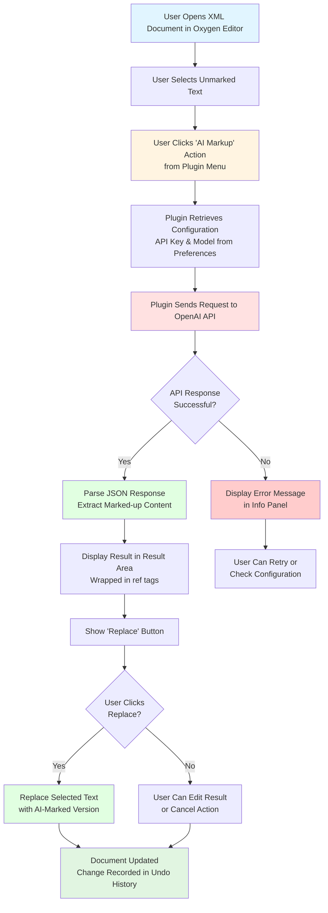

# DILA AI Markup Plugin

An **Oxygen XML Editor Plugin** that provides AI-powered assistance for marking up TEI (Text Encoding Initiative) XML documents.

## Overview

This Maven-based Java plugin integrates with Oxygen XML Editor (version 27.0+) to automate the tedious process of manually marking up references and citations in XML documents by leveraging AI language models.

## Main Purpose

- **AI-driven markup assistance** for detecting and tagging references in TEI XML documents
- **Tag removal** functionality for XML elements
- Integration with **OpenAI's API** (or compatible endpoints) for LLM-based text processing

## Key Features

### Version 0.2.3
- Oxygen Integrated Options-Preferences page for setting fine-tuned LLM models and API key

### Version 0.2.2
- Options saved with Oxygen's wsOptionsStorage approach
- API key saved and retrieved with better security using Oxygen's secretOption

### Version 0.2.1
- Issue fixed: Error calling LLM after saving options caused by API key handling

### Version 0.2.0
- Multi-language support (English, Simplified Chinese, Traditional Chinese)
- Custom Options-Preferences page for setting fine-tuned LLM models and API key

### Version 0.1.0
- AI-driven markup for unmarked references
- TEI tag removal

## Key Components

### 1. Plugin Structure (pom.xml)
- **Maven project** with groupId: `dila`, artifactId: `dila-ai-markup-plugin`
- **Version:** 0.2.3
- **Packaging:** Builds a JAR file and packages it as a ZIP for Oxygen XML Editor
- **Dependencies:** Oxygen SDK version 27.1.0.3

### 2. Java Code
- **`DAMAOptionPagePluginExtension.java`** - Creates a preferences page in Oxygen's settings where users can configure:
  - API key (stored securely using Oxygen's secret option)
  - Fine-tuned parse model name
  - Fine-tuned detect model name

### 3. JavaScript UI (dila-ai-markup.js)
- Creates a custom view panel in Oxygen XML Editor
- Provides menu actions for "AI Markup" and "Tag Removal"
- Handles text selection, API communication, and result display
- Features:
  - Asynchronous API calls to prevent UI blocking
  - UTF-8 encoding support
  - Debug logging capabilities
  - Error handling and user feedback

### 4. Multi-language Support (i18n/translation.xml)
- **English** (en_US)
- **Simplified Chinese** (zh_CN)
- **Traditional Chinese** (zh_TW)

## Workflow



## Workflow Steps

1. **User selects unmarked text** in an XML document within Oxygen XML Editor
2. **User triggers "AI Markup" action** from the plugin's custom view menu
3. **Plugin retrieves configuration** (API key and model name) from Oxygen's secure storage
4. **Plugin sends text to OpenAI API** with a system prompt instructing how to markup references
5. **AI processes the request** and returns properly tagged XML (e.g., `<ref>...</ref>` elements)
6. **Plugin displays the result** in a text area with a "Replace" button
7. **User reviews the AI-generated markup** and can edit if needed
8. **User clicks "Replace"** to insert the marked-up version into the original document
9. **Document is updated** with the change recorded in the undo history

## Installation

1. Build the plugin using Maven:
   ```bash
   mvn clean install
   ```

2. The build process creates `dilaAIMarkupPlugin.zip` in the `target` directory

3. Install in Oxygen XML Editor:
   - Go to **Help → Install new add-ons**
   - Add the plugin ZIP file
   - Restart Oxygen XML Editor

## Configuration

1. Open **Options → Preferences** in Oxygen XML Editor
2. Navigate to **DILA AI Markup Assistant** preferences page
3. Configure:
   - **API Key**: Your OpenAI API key (stored securely)
   - **Parse Model**: Fine-tuned model name for parsing (e.g., `ft:gpt-4o-2024-08-06:...`)
   - **Detect Model**: Fine-tuned model name for detection
4. Click **OK** to save settings

## Usage

1. Open a TEI XML document in Oxygen XML Editor
2. Open the **DILA AI Markup Assistant** view (View menu)
3. Select text that needs markup in your document
4. Click **Actions → AI Markup**
5. Review the AI-generated markup in the result area
6. Click **Replace** to apply the markup to your document

## Developer Information

- **Developer**: Jeff Y.H. Wu
- **Email**: jeffwu@dila.edu.tw
- **Organization**: DILA (Digital Archives of Buddhist Studies)
- **Role**: Project Assistant

## Technical Details

### Build Requirements
- **Java**: JDK 1.8 or higher
- **Maven**: 3.x or higher
- **JAVA_HOME**: Must be set to a valid JDK installation

### Dependencies
- Oxygen SDK 27.1.0.3 (provided scope)
- JUnit 4.13.2 (test scope)

### Debug Mode
Enable debug logging by setting environment variable or system property:
```bash
# Environment variable
export DILA_DEBUG=true

# System property
-Ddila.debug=true
```

## Architecture

```
dila-ai-markup-plugin/
├── pom.xml                          # Maven project configuration
├── assembly.xml                     # Assembly descriptor for packaging
├── src/
│   └── main/
│       ├── java/                    # Java source code
│       │   └── com/dila/dama/plugin/preferences/
│       │       └── DAMAOptionPagePluginExtension.java
│       └── resources/               # Plugin resources
│           ├── plugin.xml           # Plugin descriptor
│           ├── extension.xml        # Extension metadata
│           ├── dila-ai-markup.js    # Main JavaScript logic
│           └── i18n/                # Internationalization
│               └── translation.xml  # Multi-language translations
└── target/                          # Build output directory
```

## API Integration

The plugin communicates with OpenAI-compatible API endpoints:
- **Endpoint**: `https://api.openai.com/v1/chat/completions`
- **Method**: POST
- **Authentication**: Bearer token (API key)
- **Request Format**: JSON with messages array
- **Response Format**: JSON with choices array

## License

END USER LICENSE AGREEMENT (see extension.xml for details)

## Support

For issues, questions, or contributions, please contact:
- **Email**: jeffwu@dila.edu.tw
- **Organization**: DILA (Digital Archives of Buddhist Studies)

---

*This plugin is designed for scholarly TEI XML document editing workflows, specifically for automating reference and citation markup tasks.*