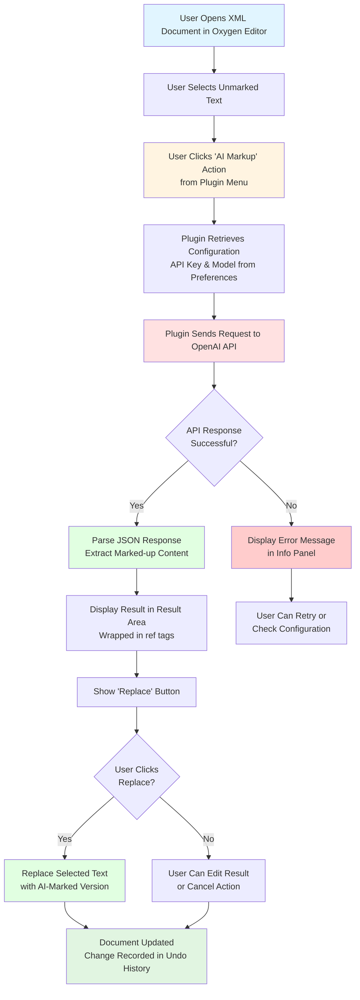

# DILA AI Markup Plugin

An **Oxygen XML Editor Plugin** that provides AI-powered assistance for marking up TEI (Text Encoding Initiative) XML documents.

## Overview

This Maven-based Java plugin integrates with Oxygen XML Editor (version 27.0+) to automate the tedious process of manually marking up references and citations in XML documents by leveraging AI language models.

## Main Purpose

- **AI-driven markup assistance** for detecting and tagging references in TEI XML documents
- **Tag removal** functionality for XML elements
- Integration with **OpenAI's API** (or compatible endpoints) for LLM-based text processing

## Key Features

### Version 0.2.3
- Oxygen Integrated Options-Preferences page for setting fine-tuned LLM models and API key

### Version 0.2.2
- Options saved with Oxygen's wsOptionsStorage approach
- API key saved and retrieved with better security using Oxygen's secretOption

### Version 0.2.1
- Issue fixed: Error calling LLM after saving options caused by API key handling

### Version 0.2.0
- Multi-language support (English, Simplified Chinese, Traditional Chinese)
- Custom Options-Preferences page for setting fine-tuned LLM models and API key

### Version 0.1.0
- AI-driven markup for unmarked references
- TEI tag removal

## Key Components

### 1. Plugin Structure (pom.xml)
- **Maven project** with groupId: `dila`, artifactId: `dila-ai-markup-plugin`
- **Version:** 0.2.3
- **Packaging:** Builds a JAR file and packages it as a ZIP for Oxygen XML Editor
- **Dependencies:** Oxygen SDK version 27.1.0.3

### 2. Java Code
- **`DAMAOptionPagePluginExtension.java`** - Creates a preferences page in Oxygen's settings where users can configure:
  - API key (stored securely using Oxygen's secret option)
  - Fine-tuned parse model name
  - Fine-tuned detect model name

### 3. JavaScript UI (dila-ai-markup.js)
- Creates a custom view panel in Oxygen XML Editor
- Provides menu actions for "AI Markup" and "Tag Removal"
- Handles text selection, API communication, and result display
- Features:
  - Asynchronous API calls to prevent UI blocking
  - UTF-8 encoding support
  - Debug logging capabilities
  - Error handling and user feedback

### 4. Multi-language Support (i18n/translation.xml)
- **English** (en_US)
- **Simplified Chinese** (zh_CN)
- **Traditional Chinese** (zh_TW)

## Workflow



## Workflow Steps

1. **User selects unmarked text** in an XML document within Oxygen XML Editor
2. **User triggers "AI Markup" action** from the plugin's custom view menu
3. **Plugin retrieves configuration** (API key and model name) from Oxygen's secure storage
4. **Plugin sends text to OpenAI API** with a system prompt instructing how to markup references
5. **AI processes the request** and returns properly tagged XML (e.g., `<ref>...</ref>` elements)
6. **Plugin displays the result** in a text area with a "Replace" button
7. **User reviews the AI-generated markup** and can edit if needed
8. **User clicks "Replace"** to insert the marked-up version into the original document
9. **Document is updated** with the change recorded in the undo history

## Installation

1. Build the plugin using Maven:
   ```bash
   mvn clean install
   ```

2. The build process creates `dilaAIMarkupPlugin.zip` in the `target` directory

3. Install in Oxygen XML Editor:
   - Go to **Help → Install new add-ons**
   - Add the plugin ZIP file
   - Restart Oxygen XML Editor

## Configuration

1. Open **Options → Preferences** in Oxygen XML Editor
2. Navigate to **DILA AI Markup Assistant** preferences page
3. Configure:
   - **API Key**: Your OpenAI API key (stored securely)
   - **Parse Model**: Fine-tuned model name for parsing (e.g., `ft:gpt-4o-2024-08-06:...`)
   - **Detect Model**: Fine-tuned model name for detection
4. Click **OK** to save settings

## Usage

1. Open a TEI XML document in Oxygen XML Editor
2. Open the **DILA AI Markup Assistant** view (View menu)
3. Select text that needs markup in your document
4. Click **Actions → AI Markup**
5. Review the AI-generated markup in the result area
6. Click **Replace** to apply the markup to your document

## Developer Information

- **Developer**: Jeff Y.H. Wu
- **Email**: jeffwu@dila.edu.tw
- **Organization**: DILA (Digital Archives of Buddhist Studies)
- **Role**: Project Assistant

## Technical Details

### Build Requirements
- **Java**: JDK 1.8 or higher
- **Maven**: 3.x or higher
- **JAVA_HOME**: Must be set to a valid JDK installation

### Dependencies
- Oxygen SDK 27.1.0.3 (provided scope)
- JUnit 4.13.2 (test scope)

### Debug Mode
Enable debug logging by setting environment variable or system property:
```bash
# Environment variable
export DILA_DEBUG=true

# System property
-Ddila.debug=true
```

## Architecture

```
dila-ai-markup-plugin/
├── pom.xml                          # Maven project configuration
├── assembly.xml                     # Assembly descriptor for packaging
├── src/
│   └── main/
│       ├── java/                    # Java source code
│       │   └── com/dila/dama/plugin/preferences/
│       │       └── DAMAOptionPagePluginExtension.java
│       └── resources/               # Plugin resources
│           ├── plugin.xml           # Plugin descriptor
│           ├── extension.xml        # Extension metadata
│           ├── dila-ai-markup.js    # Main JavaScript logic
│           └── i18n/                # Internationalization
│               └── translation.xml  # Multi-language translations
└── target/                          # Build output directory
```

## API Integration

The plugin communicates with OpenAI-compatible API endpoints:
- **Endpoint**: `https://api.openai.com/v1/chat/completions`
- **Method**: POST
- **Authentication**: Bearer token (API key)
- **Request Format**: JSON with messages array
- **Response Format**: JSON with choices array

## License

END USER LICENSE AGREEMENT (see extension.xml for details)

## Support

For issues, questions, or contributions, please contact:
- **Email**: jeffwu@dila.edu.tw
- **Organization**: DILA (Digital Archives of Buddhist Studies)

---

## Planned Feature: UTF-8 Check/Convert Tool

### Overview
A new "Tools" menu will be added after the "Actions" menu to provide file encoding utilities.

### Feature: UTF-8 Check/Convert

**Menu Location**: Tools → UTF-8 check/convert

**Functionality**:
1. Opens a dialog allowing users to select folders or files
2. Scans selected files to detect their encoding
3. Lists all non-UTF-8 files in the info area
4. Provides "OK" button to convert non-UTF-8 files to UTF-8
5. Displays conversion results in the result area
6. Provides "Cancel" button to exit without making changes

### Required Modifications to `dila-ai-markup.js`

#### 1. Add New Menu Item (after line ~250)
```javascript
// Create Tools menu
var menuTools = new Packages.javax.swing.JMenu(i18nFn("menu.tools"));

// Create UTF-8 check/convert menu item
var menuItemUtf8Check = new Packages.javax.swing.JMenuItem(i18nFn("menu.tools.utf8.check"));
menuTools.add(menuItemUtf8Check);

// Add Tools menu to menu bar (after Actions menu)
menuBar.add(menuTools);
```

#### 2. Add i18n Keys to `translation.xml`
```xml
<!-- English -->
<key value="menu.tools">
    <val lang="en_US">Tools</val>
    <val lang="zh_CN">工具</val>
    <val lang="zh_TW">工具</val>
</key>
<key value="menu.tools.utf8.check">
    <val lang="en_US">UTF-8 check/convert</val>
    <val lang="zh_CN">UTF-8 检查/转换</val>
    <val lang="zh_TW">UTF-8 檢查/轉換</val>
</key>
```

#### 3. Add Action Listener (after line ~453)
```javascript
// Add action listener to UTF-8 check/convert menu item
menuItemUtf8Check.addActionListener(function() {
    logDebug("UTF-8 check/convert action triggered");
    
    // Switch back to main view
    cardLayout.show(cardPanel, "MAIN");
    buttonPanel.setVisible(false);
    
    infoArea.setText(i18nFn("utf8.check.select.files") + "\n");
    
    // Create file/folder chooser
    var fileChooser = new Packages.javax.swing.JFileChooser();
    fileChooser.setFileSelectionMode(Packages.javax.swing.JFileChooser.FILES_AND_DIRECTORIES);
    fileChooser.setMultiSelectionEnabled(true);
    fileChooser.setDialogTitle(i18nFn("utf8.check.dialog.title"));
    
    var result = fileChooser.showOpenDialog(customViewPanel);
    
    if (result == Packages.javax.swing.JFileChooser.APPROVE_OPTION) {
        var selectedFiles = fileChooser.getSelectedFiles();
        var nonUtf8Files = [];
        
        // Scan files for encoding
        for (var i = 0; i < selectedFiles.length; i++) {
            var file = selectedFiles[i];
            scanFileOrDirectory(file, nonUtf8Files);
        }
        
        // Display results
        if (nonUtf8Files.length > 0) {
            infoArea.append(i18nFn("utf8.check.found.non.utf8") + nonUtf8Files.length + "\n\n");
            for (var j = 0; j < nonUtf8Files.length; j++) {
                infoArea.append(nonUtf8Files[j].getPath() + "\n");
            }
            
            // Show OK/Cancel buttons for conversion
            showUtf8ConversionButtons(nonUtf8Files);
        } else {
            infoArea.append(i18nFn("utf8.check.all.utf8"));
        }
    }
});

// Helper function to scan file or directory
function scanFileOrDirectory(file, nonUtf8Files) {
    if (file.isDirectory()) {
        var files = file.listFiles();
        if (files != null) {
            for (var i = 0; i < files.length; i++) {
                scanFileOrDirectory(files[i], nonUtf8Files);
            }
        }
    } else if (file.isFile()) {
        if (!isUtf8File(file)) {
            nonUtf8Files.push(file);
        }
    }
}

// Helper function to check if file is UTF-8
function isUtf8File(file) {
    try {
        var FileInputStream = Packages.java.io.FileInputStream;
        var InputStreamReader = Packages.java.io.InputStreamReader;
        var BufferedReader = Packages.java.io.BufferedReader;
        var StandardCharsets = Packages.java.nio.charset.StandardCharsets;
        
        var fis = new FileInputStream(file);
        var isr = new InputStreamReader(fis, StandardCharsets.UTF_8);
        var reader = new BufferedReader(isr);
        
        try {
            while (reader.readLine() != null) {
                // If we can read the entire file as UTF-8, it's UTF-8
            }
            return true;
        } catch (e) {
            return false;
        } finally {
            reader.close();
        }
    } catch (e) {
        logDebug("Error checking file encoding: " + e);
        return false;
    }
}

// Helper function to show conversion buttons
function showUtf8ConversionButtons(nonUtf8Files) {
    // Clear button panel and add OK/Cancel buttons
    buttonPanel.removeAll();
    
    var okButton = new Packages.javax.swing.JButton(i18nFn("button.ok"));
    var cancelButton = new Packages.javax.swing.JButton(i18nFn("button.cancel"));
    
    okButton.addActionListener(function() {
        convertFilesToUtf8(nonUtf8Files);
    });
    
    cancelButton.addActionListener(function() {
        buttonPanel.setVisible(false);
        infoArea.setText(i18nFn("utf8.conversion.cancelled"));
    });
    
    buttonPanel.add(okButton);
    buttonPanel.add(cancelButton);
    buttonPanel.setVisible(true);
}

// Helper function to convert files to UTF-8
function convertFilesToUtf8(files) {
    resultArea.setText(i18nFn("utf8.conversion.started") + "\n\n");
    var successCount = 0;
    var failCount = 0;
    
    for (var i = 0; i < files.length; i++) {
        var file = files[i];
        try {
            convertFileToUtf8(file);
            resultArea.append(i18nFn("utf8.conversion.success") + file.getPath() + "\n");
            successCount++;
        } catch (e) {
            resultArea.append(i18nFn("utf8.conversion.failed") + file.getPath() + ": " + e + "\n");
            failCount++;
        }
    }
    
    resultArea.append("\n" + i18nFn("utf8.conversion.summary") + "\n");
    resultArea.append(i18nFn("utf8.conversion.success.count") + successCount + "\n");
    resultArea.append(i18nFn("utf8.conversion.fail.count") + failCount + "\n");
    
    buttonPanel.setVisible(false);
}

// Helper function to convert single file to UTF-8
function convertFileToUtf8(file) {
    var Files = Packages.java.nio.file.Files;
    var StandardCharsets = Packages.java.nio.charset.StandardCharsets;
    var Charset = Packages.java.nio.charset.Charset;
    
    // Detect current encoding (simplified - assumes common encodings)
    var content = null;
    var encodings = ["ISO-8859-1", "Windows-1252", "GBK", "Big5"];
    
    for (var i = 0; i < encodings.length; i++) {
        try {
            var bytes = Files.readAllBytes(file.toPath());
            content = new Packages.java.lang.String(bytes, Charset.forName(encodings[i]));
            break;
        } catch (e) {
            // Try next encoding
        }
    }
    
    if (content != null) {
        // Write as UTF-8
        Files.write(file.toPath(), content.getBytes(StandardCharsets.UTF_8));
    } else {
        throw new Error("Could not detect encoding");
    }
}
```

#### 4. Additional i18n Keys Needed
```xml
<key value="utf8.check.select.files"><val lang="en_US">Please select files or folders to check encoding...</val></key>
<key value="utf8.check.dialog.title"><val lang="en_US">Select Files or Folders</val></key>
<key value="utf8.check.found.non.utf8"><val lang="en_US">Found non-UTF-8 files: </val></key>
<key value="utf8.check.all.utf8"><val lang="en_US">All selected files are UTF-8 encoded.</val></key>
<key value="utf8.conversion.started"><val lang="en_US">Starting UTF-8 conversion...</val></key>
<key value="utf8.conversion.success"><val lang="en_US">✓ Converted: </val></key>
<key value="utf8.conversion.failed"><val lang="en_US">✗ Failed: </val></key>
<key value="utf8.conversion.summary"><val lang="en_US">Conversion Summary:</val></key>
<key value="utf8.conversion.success.count"><val lang="en_US">Successfully converted: </val></key>
<key value="utf8.conversion.fail.count"><val lang="en_US">Failed: </val></key>
<key value="utf8.conversion.cancelled"><val lang="en_US">Conversion cancelled.</val></key>
<key value="button.ok"><val lang="en_US">OK</val></key>
<key value="button.cancel"><val lang="en_US">Cancel</val></key>
```

### Implementation Notes
- The encoding detection uses Java NIO for better performance
- Multiple encoding detection is attempted (ISO-8859-1, Windows-1252, GBK, Big5)
- Original files are overwritten with UTF-8 versions (consider backup strategy)
- Recursive directory scanning is supported
- Results are displayed in both info and result areas

---

*This plugin is designed for scholarly TEI XML document editing workflows, specifically for automating reference and citation markup tasks.*
