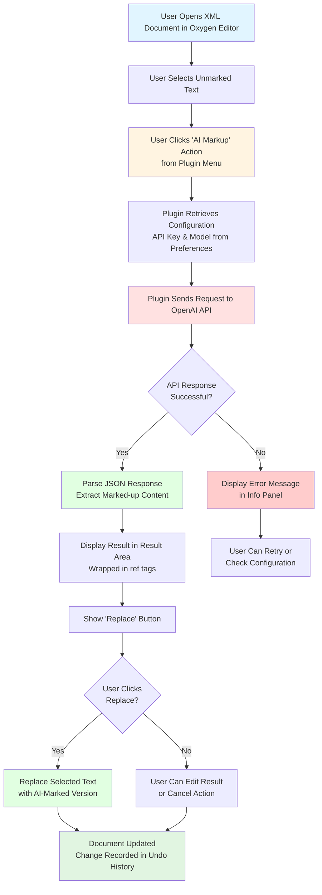

# DILA AI Markup Plugin

An **Oxygen XML Editor Plugin** that provides AI-powered assistance for marking up TEI (Text Encoding Initiative) XML documents.

## Overview

This Maven-based Java plugin integrates with Oxygen XML Editor (version 27.0+) to automate the tedious process of manually marking up references and citations in XML documents by leveraging AI language models.

## Main Purpose

- **AI-driven markup assistance** for detecting and tagging references in TEI XML documents
- **Tag removal** functionality for XML elements
- Integration with **OpenAI's API** (or compatible endpoints) for LLM-based text processing

## Key Features

### Version 0.2.3
- Oxygen Integrated Options-Preferences page for setting fine-tuned LLM models and API key

### Version 0.2.2
- Options saved with Oxygen's wsOptionsStorage approach
- API key saved and retrieved with better security using Oxygen's secretOption

### Version 0.2.1
- Issue fixed: Error calling LLM after saving options caused by API key handling

### Version 0.2.0
- Multi-language support (English, Simplified Chinese, Traditional Chinese)
- Custom Options-Preferences page for setting fine-tuned LLM models and API key

### Version 0.1.0
- AI-driven markup for unmarked references
- TEI tag removal

## Key Components

### 1. Plugin Structure (pom.xml)
- **Maven project** with groupId: `dila`, artifactId: `dila-ai-markup-plugin`
- **Version:** 0.2.3
- **Packaging:** Builds a JAR file and packages it as a ZIP for Oxygen XML Editor
- **Dependencies:** Oxygen SDK version 27.1.0.3

### 2. Java Code
- **`DAMAOptionPagePluginExtension.java`** - Creates a preferences page in Oxygen's settings where users can configure:
  - API key (stored securely using Oxygen's secret option)
  - Fine-tuned parse model name
  - Fine-tuned detect model name

### 3. JavaScript UI (dila-ai-markup.js)
- Creates a custom view panel in Oxygen XML Editor
- Provides menu actions for "AI Markup" and "Tag Removal"
- Handles text selection, API communication, and result display
- Features:
  - Asynchronous API calls to prevent UI blocking
  - UTF-8 encoding support
  - Debug logging capabilities
  - Error handling and user feedback

### 4. Multi-language Support (i18n/translation.xml)
- **English** (en_US)
- **Simplified Chinese** (zh_CN)
- **Traditional Chinese** (zh_TW)

## Workflow



## Workflow Steps

1. **User selects unmarked text** in an XML document within Oxygen XML Editor
2. **User triggers "AI Markup" action** from the plugin's custom view menu
3. **Plugin retrieves configuration** (API key and model name) from Oxygen's secure storage
4. **Plugin sends text to OpenAI API** with a system prompt instructing how to markup references
5. **AI processes the request** and returns properly tagged XML (e.g., `<ref>...</ref>` elements)
6. **Plugin displays the result** in a text area with a "Replace" button
7. **User reviews the AI-generated markup** and can edit if needed
8. **User clicks "Replace"** to insert the marked-up version into the original document
9. **Document is updated** with the change recorded in the undo history

## Installation

1. Build the plugin using Maven:
   ```bash
   mvn clean install
   ```

2. The build process creates `dilaAIMarkupPlugin.zip` in the `target` directory

3. Install in Oxygen XML Editor:
   - Go to **Help → Install new add-ons**
   - Add the plugin ZIP file
   - Restart Oxygen XML Editor

## Configuration

1. Open **Options → Preferences** in Oxygen XML Editor
2. Navigate to **DILA AI Markup Assistant** preferences page
3. Configure:
   - **API Key**: Your OpenAI API key (stored securely)
   - **Parse Model**: Fine-tuned model name for parsing (e.g., `ft:gpt-4o-2024-08-06:...`)
   - **Detect Model**: Fine-tuned model name for detection
4. Click **OK** to save settings

## Usage

1. Open a TEI XML document in Oxygen XML Editor
2. Open the **DILA AI Markup Assistant** view (View menu)
3. Select text that needs markup in your document
4. Click **Actions → AI Markup**
5. Review the AI-generated markup in the result area
6. Click **Replace** to apply the markup to your document

## Developer Information

- **Developer**: Jeff Y.H. Wu
- **Email**: jeffwu@dila.edu.tw
- **Organization**: DILA (Digital Archives of Buddhist Studies)
- **Role**: Project Assistant

## Technical Details

### Build Requirements
- **Java**: JDK 1.8 or higher
- **Maven**: 3.x or higher
- **JAVA_HOME**: Must be set to a valid JDK installation

### Dependencies
- Oxygen SDK 27.1.0.3 (provided scope)
- JUnit 4.13.2 (test scope)

### Debug Mode
Enable debug logging by setting environment variable or system property:
```bash
# Environment variable
export DILA_DEBUG=true

# System property
-Ddila.debug=true
```

## Architecture

```
dila-ai-markup-plugin/
├── pom.xml                          # Maven project configuration
├── assembly.xml                     # Assembly descriptor for packaging
├── src/
│   └── main/
│       ├── java/                    # Java source code
│       │   └── com/dila/dama/plugin/preferences/
│       │       └── DAMAOptionPagePluginExtension.java
│       └── resources/               # Plugin resources
│           ├── plugin.xml           # Plugin descriptor
│           ├── extension.xml        # Extension metadata
│           ├── dila-ai-markup.js    # Main JavaScript logic
│           └── i18n/                # Internationalization
│               └── translation.xml  # Multi-language translations
└── target/                          # Build output directory
```

## API Integration

The plugin communicates with OpenAI-compatible API endpoints:
- **Endpoint**: `https://api.openai.com/v1/chat/completions`
- **Method**: POST
- **Authentication**: Bearer token (API key)
- **Request Format**: JSON with messages array
- **Response Format**: JSON with choices array

## License

END USER LICENSE AGREEMENT (see extension.xml for details)

## Support

For issues, questions, or contributions, please contact:
- **Email**: jeffwu@dila.edu.tw
- **Organization**: DILA (Digital Archives of Buddhist Studies)

---

## Proposed Enhancement: UTF-8 Check/Convert Tool (Revised)

### Feasibility Assessment: High (with revised approach)

The initial plan's reliance on automatic encoding detection is not feasible without external libraries, which are not permitted for this project. Automatic detection is unreliable and risks corrupting user files.

A **revised, safer approach** is highly feasible as it uses only the standard Java and Oxygen APIs. The core principle is to **make the user responsible for identifying the source encoding**, removing risky guesswork from the tool.

### Recommended Implementation (Oxygen API Compliant & Modular)

This implementation follows a modular approach by separating the new tool's logic into its own files, as recommended by the Oxygen SDK documentation for loading multiple scripts.

**Workflow:**

1.  **Select Files:** The user selects files or folders.
2.  **Validate, Don't Detect:** The tool iterates through files and uses Java's `CharsetDecoder` to rigorously check: "Is this file *valid* UTF-8?" It does **not** guess the encoding of non-UTF-8 files.
3.  **Report and Prompt:** The tool lists all files that failed validation and prompts the user with a dialog containing a dropdown menu (`JComboBox`) to select the correct source encoding (e.g., `windows-1252`, `Big5`, `GBK`).
4.  **User-Driven Conversion:** The user selects the encoding and confirms.
5.  **Safe Conversion Execution:** The tool **creates a backup** of each original file (e.g., `myfile.xml.bak`) before reading it with the user-specified encoding and writing it back as UTF-8.
6.  **Final Report:** The tool reports the results.

### Required Modifications

#### 1. Add Java Helper Class for Encoding Validation

A new Java class is required to handle the robust UTF-8 validation.

**File:** `src/main/java/com/dila/dama/plugin/util/EncodingUtils.java`
```java
package com.dila.dama.plugin.util;

import java.nio.ByteBuffer;
import java.nio.charset.CharacterCodingException;
import java.nio.charset.Charset;
import java.nio.charset.CharsetDecoder;
import java.nio.charset.CodingErrorAction;
import java.nio.file.Files;
import java.nio.file.Path;

public class EncodingUtils {
    /**
     * Robustly checks if a file is valid UTF-8.
     * @param path The path to the file.
     * @return true if the file is valid UTF-8, false otherwise.
     */
    public static boolean isUtf8(Path path) {
        try {
            byte[] bytes = Files.readAllBytes(path);
            CharsetDecoder decoder = Charset.forName("UTF-8").newDecoder();
            decoder.onMalformedInput(CodingErrorAction.REPORT);
            decoder.onUnmappableCharacter(CodingErrorAction.REPORT);
            decoder.decode(ByteBuffer.wrap(bytes));
            return true;
        } catch (CharacterCodingException e) {
            return false; // Bytes are not valid UTF-8.
        } catch (Exception e) {
            return false; // Other I/O errors.
        }
    }
}
```

#### 2. Add New i18n Keys to `translation.xml`

The `i18n/translation.xml` file must be updated to include text for the new UI elements.

```xml
<!-- Add these keys inside the <i18n> element in translation.xml -->
<key value="menu.tools">
    <val lang="en_US">Tools</val>
    <val lang="zh_CN">工具</val>
    <val lang="zh_TW">工具</val>
</key>
<key value="menu.tools.utf8.check">
    <val lang="en_US">UTF-8 Check/Convert</val>
    <val lang="zh_CN">UTF-8 检查/转换</val>
    <val lang="zh_TW">UTF-8 檢查/轉換</val>
</key>
<key value="utf8.check.dialog.title">
    <val lang="en_US">Specify Source Encoding</val>
    <val lang="zh_CN">指定源编码</val>
    <val lang="zh_TW">指定源編碼</val>
</key>
<key value="utf8.check.select.label">
    <val lang="en_US">Select the source encoding:</val>
    <val lang="zh_CN">请选择源编码：</val>
    <val lang="zh_TW">請選擇源編碼：</val>
</key>
<key value="utf8.check.not.valid">
    <val lang="en_US">Found {0} files that are not valid UTF-8.</val>
    <val lang="zh_CN">发现 {0} 个非 UTF-8 编码的文件。</val>
    <val lang="zh_TW">發現 {0} 個非 UTF-8 編碼的檔案。</val>
</key>
<key value="utf8.check.all.valid">
    <val lang="en_US">All selected files are already valid UTF-8.</val>
    <val lang="zh_CN">所有选定文件都已是有效的 UTF-8 编码。</val>
    <val lang="zh_TW">所有選定檔案都已是有效的 UTF-8 編碼。</val>
</key>
<key value="utf8.conversion.backing.up">
    <val lang="en_US">✓ Backed up: </val>
    <val lang="zh_CN">✓ 已备份: </val>
    <val lang="zh_TW">✓ 已備份: </val>
</key>
<key value="utf8.conversion.success">
    <val lang="en_US">✓ Converted: </val>
    <val lang="zh_CN">✓ 已转换: </val>
    <val lang="zh_TW">✓ 已轉換: </val>
</key>
<key value="utf8.conversion.failed">
    <val lang="en_US">✗ Failed: </val>
    <val lang="zh_CN">✗ 失败: </val>
    <val lang="zh_TW">✗ 失敗: </val>
</key>
```

#### 3. Create a New JavaScript Module for the Tool

To keep the code organized, all logic for the new feature should be in its own file.

**File:** `src/main/resources/utf8-tool.js`
```javascript
// This script assumes that 'menuBar', 'i18nFn', 'customViewPanel', 'infoArea', 
// and 'resultArea' are globally available from the main 'dila-ai-markup.js' script.

(function() {
    // Create Tools menu
    var menuTools = new Packages.javax.swing.JMenu(i18nFn("menu.tools"));
    var menuItemUtf8Check = new Packages.javax.swing.JMenuItem(i18nFn("menu.tools.utf8.check"));
    menuTools.add(menuItemUtf8Check);
    menuBar.add(menuTools);

    // Add Action Listener
    menuItemUtf8Check.addActionListener(function() {
        var fileChooser = new Packages.javax.swing.JFileChooser();
        // ... configure file chooser ...
        var result = fileChooser.showOpenDialog(customViewPanel);

        if (result == Packages.javax.swing.JFileChooser.APPROVE_OPTION) {
            var selectedFiles = fileChooser.getSelectedFiles();
            var nonUtf8Files = [];
            
            // Scan files and populate nonUtf8Files array
            // ...
            
            if (nonUtf8Files.length > 0) {
                // Show JOptionPane with JComboBox for encoding selection
                // ...
                if (dialogResult == Packages.javax.swing.JOptionPane.OK_OPTION) {
                    var userSelectedEncoding = encodingComboBox.getSelectedItem();
                    convertFilesWithBackup(nonUtf8Files, userSelectedEncoding);
                }
            } else {
                infoArea.setText(i18nFn("utf8.check.all.valid"));
            }
        }
    });

    // Helper function for safe conversion with backup
    function convertFilesWithBackup(files, sourceEncoding) {
        resultArea.setText("Starting conversion...\n");
        var Files = Packages.java.nio.file.Files;
        var StandardCopyOption = Packages.java.nio.file.StandardCopyOption;

        for (var i = 0; i < files.length; i++) {
            var file = files[i];
            var originalPath = file.toPath();
            var backupPath = file.toPath().getParent().resolve(file.getName() + ".bak");
            try {
                // 1. Create backup
                Files.copy(originalPath, backupPath, StandardCopyOption.REPLACE_EXISTING);
                resultArea.append(i18nFn("utf8.conversion.backing.up") + backupPath.getFileName() + "\n");

                // 2. Read with user-specified encoding
                var contentBytes = Files.readAllBytes(originalPath);
                var content = new Packages.java.lang.String(contentBytes, sourceEncoding);
                
                // 3. Write back as UTF-8
                Files.write(originalPath, content.getBytes("UTF-8"));
                resultArea.append(i18nFn("utf8.conversion.success") + file.getName() + "\n");
            } catch (e) {
                resultArea.append(i18nFn("utf8.conversion.failed") + file.getName() + " - " + e.getMessage() + "\n");
            }
        }
    }
})();
```

#### 4. Update `plugin.xml` to Load the New Module

The `src/main/resources/plugin.xml` file must be modified to load the new JavaScript file after the main script.

```xml
<!-- In plugin.xml, below <extension> for the type="WorkspaceAccessJS" -->
       <extension 
              type="WorkspaceAccessJSModule" 
              href="utf8-tool.js"/>
```
#### 5. Ensure the key files include the new version

Ensure the version in `pom.xml`, `plugin.xml`, `extension.xml` is updated to `0.2.4` to reflect the new feature addition.

*This plugin is designed for scholarly TEI XML document editing workflows, specifically for automating reference and citation markup tasks.*