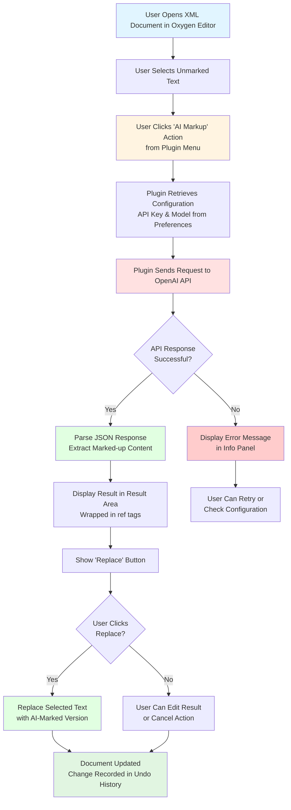

# DILA AI Markup Plugin

An **Oxygen XML Editor Plugin** that provides AI-powered assistance for marking up TEI (Text Encoding Initiative) XML documents.

## Overview

This Maven-based Java plugin integrates with Oxygen XML Editor (version 27.0+) to automate the tedious process of manually marking up references and citations in XML documents by leveraging AI language models.

## Main Purpose

- **AI-driven markup assistance** for detecting and tagging references in TEI XML documents
- **Tag removal** functionality for XML elements
- Integration with **OpenAI's API** (or compatible endpoints) for LLM-based text processing

## Key Features

### Version 0.2.3
- Oxygen Integrated Options-Preferences page for setting fine-tuned LLM models and API key

### Version 0.2.2
- Options saved with Oxygen's wsOptionsStorage approach
- API key saved and retrieved with better security using Oxygen's secretOption

### Version 0.2.1
- Issue fixed: Error calling LLM after saving options caused by API key handling

### Version 0.2.0
- Multi-language support (English, Simplified Chinese, Traditional Chinese)
- Custom Options-Preferences page for setting fine-tuned LLM models and API key

### Version 0.1.0
- AI-driven markup for unmarked references
- TEI tag removal

## Key Components

### 1. Plugin Structure (pom.xml)
- **Maven project** with groupId: `dila`, artifactId: `dila-ai-markup-plugin`
- **Version:** 0.2.3
- **Packaging:** Builds a JAR file and packages it as a ZIP for Oxygen XML Editor
- **Dependencies:** Oxygen SDK version 27.1.0.3

### 2. Java Code
- **`DAMAOptionPagePluginExtension.java`** - Creates a preferences page in Oxygen's settings where users can configure:
  - API key (stored securely using Oxygen's secret option)
  - Fine-tuned parse model name
  - Fine-tuned detect model name

### 3. JavaScript UI (dila-ai-markup.js)
- Creates a custom view panel in Oxygen XML Editor
- Provides menu actions for "AI Markup" and "Tag Removal"
- Handles text selection, API communication, and result display
- Features:
  - Asynchronous API calls to prevent UI blocking
  - UTF-8 encoding support
  - Debug logging capabilities
  - Error handling and user feedback

### 4. Multi-language Support (i18n/translation.xml)
- **English** (en_US)
- **Simplified Chinese** (zh_CN)
- **Traditional Chinese** (zh_TW)

## Workflow



## Workflow Steps

1. **User selects unmarked text** in an XML document within Oxygen XML Editor
2. **User triggers "AI Markup" action** from the plugin's custom view menu
3. **Plugin retrieves configuration** (API key and model name) from Oxygen's secure storage
4. **Plugin sends text to OpenAI API** with a system prompt instructing how to markup references
5. **AI processes the request** and returns properly tagged XML (e.g., `<ref>...</ref>` elements)
6. **Plugin displays the result** in a text area with a "Replace" button
7. **User reviews the AI-generated markup** and can edit if needed
8. **User clicks "Replace"** to insert the marked-up version into the original document
9. **Document is updated** with the change recorded in the undo history

## Installation

1. Build the plugin using Maven:
   ```bash
   mvn clean install
   ```

2. The build process creates `dilaAIMarkupPlugin.zip` in the `target` directory

3. Install in Oxygen XML Editor:
   - Go to **Help → Install new add-ons**
   - Add the plugin ZIP file
   - Restart Oxygen XML Editor

## Configuration

1. Open **Options → Preferences** in Oxygen XML Editor
2. Navigate to **DILA AI Markup Assistant** preferences page
3. Configure:
   - **API Key**: Your OpenAI API key (stored securely)
   - **Parse Model**: Fine-tuned model name for parsing (e.g., `ft:gpt-4o-2024-08-06:...`)
   - **Detect Model**: Fine-tuned model name for detection
4. Click **OK** to save settings

## Usage

1. Open a TEI XML document in Oxygen XML Editor
2. Open the **DILA AI Markup Assistant** view (View menu)
3. Select text that needs markup in your document
4. Click **Actions → AI Markup**
5. Review the AI-generated markup in the result area
6. Click **Replace** to apply the markup to your document

## Developer Information

- **Developer**: Jeff Y.H. Wu
- **Email**: jeffwu@dila.edu.tw
- **Organization**: DILA (Digital Archives of Buddhist Studies)
- **Role**: Project Assistant

## Technical Details

### Build Requirements
- **Java**: JDK 1.8 or higher
- **Maven**: 3.x or higher
- **JAVA_HOME**: Must be set to a valid JDK installation

### Dependencies
- Oxygen SDK 27.1.0.3 (provided scope)
- JUnit 4.13.2 (test scope)

### Debug Mode
Enable debug logging by setting environment variable or system property:
```bash
# Environment variable
export DILA_DEBUG=true

# System property
-Ddila.debug=true
```

## Architecture

```
dila-ai-markup-plugin/
├── pom.xml                          # Maven project configuration
├── assembly.xml                     # Assembly descriptor for packaging
├── src/
│   └── main/
│       ├── java/                    # Java source code
│       │   └── com/dila/dama/plugin/
│       │       ├── preferences/
│       │       │   └── DAMAOptionPagePluginExtension.java
│       │       └── util/
│       │           └── EncodingUtils.java  # UTF-8 validation utility
│       └── resources/               # Plugin resources
│           ├── plugin.xml           # Plugin descriptor
│           ├── extension.xml        # Extension metadata
│           ├── dila-ai-markup.js    # Main JavaScript logic
│           ├── utf8-tool.js         # UTF-8 tool module
│           └── i18n/                # Internationalization
│               └── translation.xml  # Multi-language translations
└── target/                          # Build output directory
```

## API Integration

The plugin communicates with OpenAI-compatible API endpoints:
- **Endpoint**: `https://api.openai.com/v1/chat/completions`
- **Method**: POST
- **Authentication**: Bearer token (API key)
- **Request Format**: JSON with messages array
- **Response Format**: JSON with choices array

## License

END USER LICENSE AGREEMENT (see extension.xml for details)

## Support

For issues, questions, or contributions, please contact:
- **Email**: jeffwu@dila.edu.tw
- **Organization**: DILA (Digital Archives of Buddhist Studies)

---

## Proposed Enhancement: UTF-8 Check/Convert Tool (Safe Implementation)

### Feasibility Assessment: High ✅

This implementation combines the safety of user-driven encoding selection with the practicality of comprehensive file processing. It avoids the pitfalls of automatic encoding detection while providing a robust and user-friendly tool.

### Core Design Principles

1. **Safety First**: No file corruption through automatic backup creation
2. **User Responsibility**: User selects source encoding via dropdown dialog
3. **Validation Over Detection**: Use strict UTF-8 validation, not unreliable detection
4. **Modular Architecture**: Separate JavaScript module for maintainability
5. **Comprehensive Reporting**: Clear feedback on all operations

### Implementation Overview

**Workflow:**
1. **File Selection**: User selects files/folders via standard file chooser
2. **UTF-8 Validation**: Tool uses `CharsetDecoder` to strictly validate UTF-8 compliance
3. **User Prompt**: For non-UTF-8 files, show dialog with encoding dropdown (`JComboBox`)
4. **Backup Creation**: Automatically create `.bak` files before conversion
5. **Safe Conversion**: Read with user-specified encoding, write as UTF-8
6. **Results Report**: Display detailed success/failure summary

### Required Modifications

#### 1. Add Java Utility Class for Robust UTF-8 Validation

**File:** `src/main/java/com/dila/dama/plugin/util/EncodingUtils.java`
```java
package com.dila.dama.plugin.util;

import java.nio.ByteBuffer;
import java.nio.charset.CharacterCodingException;
import java.nio.charset.Charset;
import java.nio.charset.CharsetDecoder;
import java.nio.charset.CodingErrorAction;
import java.nio.file.Files;
import java.nio.file.Path;
import java.io.IOException;

/**
 * Utility class for encoding operations and validation.
 */
public class EncodingUtils {
    
    /**
     * Robustly checks if a file is valid UTF-8 using strict validation.
     * @param path The path to the file to validate
     * @return true if the file is valid UTF-8, false otherwise
     */
    public static boolean isValidUtf8(Path path) {
        try {
            byte[] bytes = Files.readAllBytes(path);
            CharsetDecoder decoder = Charset.forName("UTF-8").newDecoder();
            decoder.onMalformedInput(CodingErrorAction.REPORT);
            decoder.onUnmappableCharacter(CodingErrorAction.REPORT);
            decoder.decode(ByteBuffer.wrap(bytes));
            return true;
        } catch (CharacterCodingException e) {
            return false; // Invalid UTF-8 encoding detected
        } catch (IOException e) {
            return false; // File I/O error
        } catch (Exception e) {
            return false; // Any other error
        }
    }
    
    /**
     * Get available character encodings for the dropdown.
     * @return Array of common encoding names
     */
    public static String[] getCommonEncodings() {
        return new String[] {
            "Windows-1252",
            "ISO-8859-1", 
            "GBK",
            "Big5",
            "Shift_JIS",
            "EUC-KR",
            "Windows-1251"
        };
    }
}
```

#### 2. Create Modular JavaScript Tool

**File:** `src/main/resources/utf8-tool.js`
```javascript
/**
 * UTF-8 Check/Convert Tool Module
 * This module adds UTF-8 validation and conversion functionality to the DILA AI Markup Plugin.
 */
(function() {
    'use strict';
    
    // Ensure required globals are available
    if (typeof menuBar === 'undefined' || typeof i18nFn === 'undefined') {
        throw new Error('UTF-8 tool requires main plugin to be loaded first');
    }
    
    // Import Java classes
    var JFileChooser = Packages.javax.swing.JFileChooser;
    var JMenu = Packages.javax.swing.JMenu;
    var JMenuItem = Packages.javax.swing.JMenuItem;
    var JOptionPane = Packages.javax.swing.JOptionPane;
    var JComboBox = Packages.javax.swing.JComboBox;
    var JLabel = Packages.javax.swing.JLabel;
    var JPanel = Packages.javax.swing.JPanel;
    var BorderLayout = Packages.java.awt.BorderLayout;
    var Files = Packages.java.nio.file.Files;
    var StandardCopyOption = Packages.java.nio.file.StandardCopyOption;
    var EncodingUtils = Packages.com.dila.dama.plugin.util.EncodingUtils;
    
    // Create Tools menu
    var menuTools = new JMenu(i18nFn("menu.tools"));
    var menuItemUtf8Check = new JMenuItem(i18nFn("menu.tools.utf8.check"));
    menuTools.add(menuItemUtf8Check);
    menuBar.add(menuTools);
    
    // Add action listener for UTF-8 check/convert
    menuItemUtf8Check.addActionListener(function() {
        logDebug("UTF-8 check/convert tool activated");
        
        // Switch to main view and clear areas
        if (typeof cardLayout !== 'undefined' && typeof cardPanel !== 'undefined') {
            cardLayout.show(cardPanel, "MAIN");
        }
        if (typeof buttonPanel !== 'undefined') {
            buttonPanel.setVisible(false);
        }
        
        infoArea.setText(i18nFn("utf8.check.select.files") + "\n");
        
        // Create and configure file chooser
        var fileChooser = new JFileChooser();
        fileChooser.setFileSelectionMode(JFileChooser.FILES_AND_DIRECTORIES);
        fileChooser.setMultiSelectionEnabled(true);
        fileChooser.setDialogTitle(i18nFn("utf8.check.dialog.title"));
        
        var result = fileChooser.showOpenDialog(customViewPanel);
        
        if (result === JFileChooser.APPROVE_OPTION) {
            var selectedFiles = fileChooser.getSelectedFiles();
            processSelectedFiles(selectedFiles);
        }
    });
    
    /**
     * Process selected files and folders for UTF-8 validation
     */
    function processSelectedFiles(selectedFiles) {
        var nonUtf8Files = [];
        var totalFiles = 0;
        
        infoArea.append(i18nFn("utf8.scanning.files") + "\n");
        
        // Scan all selected files/folders
        for (var i = 0; i < selectedFiles.length; i++) {
            scanFileOrDirectory(selectedFiles[i], nonUtf8Files, totalFiles);
        }
        
        // Display results
        if (nonUtf8Files.length > 0) {
            infoArea.append("\n" + i18nFn("utf8.check.found.non.utf8", [nonUtf8Files.length]) + "\n\n");
            
            // List non-UTF-8 files
            for (var j = 0; j < Math.min(nonUtf8Files.length, 10); j++) {
                infoArea.append("• " + nonUtf8Files[j].getPath() + "\n");
            }
            
            if (nonUtf8Files.length > 10) {
                infoArea.append("... " + i18nFn("utf8.check.more.files", [nonUtf8Files.length - 10]) + "\n");
            }
            
            // Show encoding selection dialog
            showEncodingSelectionDialog(nonUtf8Files);
        } else {
            infoArea.append("\n" + i18nFn("utf8.check.all.valid"));
        }
    }
    
    /**
     * Recursively scan files and directories
     */
    function scanFileOrDirectory(file, nonUtf8Files, totalFilesRef) {
        if (file.isDirectory()) {
            var files = file.listFiles();
            if (files !== null) {
                for (var i = 0; i < files.length; i++) {
                    scanFileOrDirectory(files[i], nonUtf8Files, totalFilesRef);
                }
            }
        } else if (file.isFile() && isTextFile(file)) {
            totalFilesRef[0]++;
            if (!EncodingUtils.isValidUtf8(file.toPath())) {
                nonUtf8Files.push(file);
            }
        }
    }
    
    /**
     * Check if file is likely a text file based on extension
     */
    function isTextFile(file) {
        var name = file.getName().toLowerCase();
        var textExtensions = ['.xml', '.txt', '.html', '.htm', '.xhtml', '.css', '.js', '.json', '.md', '.properties'];
        
        for (var i = 0; i < textExtensions.length; i++) {
            if (name.endsWith(textExtensions[i])) {
                return true;
            }
        }
        return false;
    }
    
    /**
     * Show dialog for encoding selection
     */
    function showEncodingSelectionDialog(nonUtf8Files) {
        var panel = new JPanel(new BorderLayout());
        var label = new JLabel(i18nFn("utf8.check.select.encoding"));
        var encodingComboBox = new JComboBox(EncodingUtils.getCommonEncodings());
        
        panel.add(label, BorderLayout.NORTH);
        panel.add(encodingComboBox, BorderLayout.CENTER);
        
        var options = [i18nFn("button.convert"), i18nFn("button.cancel")];
        var dialogResult = JOptionPane.showOptionDialog(
            customViewPanel,
            panel,
            i18nFn("utf8.check.dialog.title"),
            JOptionPane.YES_NO_OPTION,
            JOptionPane.QUESTION_MESSAGE,
            null,
            options,
            options[0]
        );
        
        if (dialogResult === 0) { // Convert button clicked
            var selectedEncoding = encodingComboBox.getSelectedItem().toString();
            convertFilesWithBackup(nonUtf8Files, selectedEncoding);
        } else {
            infoArea.append("\n" + i18nFn("utf8.conversion.cancelled"));
        }
    }
    
    /**
     * Convert files to UTF-8 with automatic backup
     */
    function convertFilesWithBackup(files, sourceEncoding) {
        resultArea.setText(i18nFn("utf8.conversion.started", [sourceEncoding]) + "\n\n");
        
        var successCount = 0;
        var failCount = 0;
        
        for (var i = 0; i < files.length; i++) {
            var file = files[i];
            var originalPath = file.toPath();
            var backupPath = originalPath.getParent().resolve(file.getName() + ".bak");
            
            try {
                // Create backup
                Files.copy(originalPath, backupPath, StandardCopyOption.REPLACE_EXISTING);
                resultArea.append(i18nFn("utf8.conversion.backing.up") + backupPath.getFileName() + "\n");
                
                // Read with specified encoding
                var contentBytes = Files.readAllBytes(originalPath);
                var content = new Packages.java.lang.String(contentBytes, sourceEncoding);
                
                // Write as UTF-8
                Files.write(originalPath, content.getBytes("UTF-8"));
                resultArea.append(i18nFn("utf8.conversion.success") + file.getName() + "\n\n");
                successCount++;
                
            } catch (e) {
                resultArea.append(i18nFn("utf8.conversion.failed") + file.getName() + ": " + e.getMessage() + "\n\n");
                failCount++;
                logDebug("Conversion failed for " + file.getName() + ": " + e);
            }
        }
        
        // Final summary
        resultArea.append("═══════════════════════════════════\n");
        resultArea.append(i18nFn("utf8.conversion.summary") + "\n");
        resultArea.append(i18nFn("utf8.conversion.success.count", [successCount]) + "\n");
        resultArea.append(i18nFn("utf8.conversion.fail.count", [failCount]) + "\n");
        
        if (successCount > 0) {
            resultArea.append("\n" + i18nFn("utf8.conversion.backup.note") + "\n");
        }
    }
    
    logDebug("UTF-8 Check/Convert tool module loaded successfully");
})();
```

#### 3. Update i18n Translations

**Add to `src/main/resources/i18n/translation.xml`:**
```xml
<!-- UTF-8 Tool Translations -->
<key value="menu.tools">
    <val lang="en_US">Tools</val>
    <val lang="zh_CN">工具</val>
    <val lang="zh_TW">工具</val>
</key>
<key value="menu.tools.utf8.check">
    <val lang="en_US">UTF-8 Check/Convert</val>
    <val lang="zh_CN">UTF-8 检查/转换</val>
    <val lang="zh_TW">UTF-8 檢查/轉換</val>
</key>
<key value="utf8.check.select.files">
    <val lang="en_US">Please select files or folders to check for UTF-8 encoding...</val>
    <val lang="zh_CN">请选择要检查 UTF-8 编码的文件或文件夹...</val>
    <val lang="zh_TW">請選擇要檢查 UTF-8 編碼的檔案或資料夾...</val>
</key>
<key value="utf8.check.dialog.title">
    <val lang="en_US">UTF-8 Encoding Tool</val>
    <val lang="zh_CN">UTF-8 编码工具</val>
    <val lang="zh_TW">UTF-8 編碼工具</val>
</key>
<key value="utf8.scanning.files">
    <val lang="en_US">Scanning files for UTF-8 compliance...</val>
    <val lang="zh_CN">正在扫描文件的 UTF-8 兼容性...</val>
    <val lang="zh_TW">正在掃描檔案的 UTF-8 相容性...</val>
</key>
<key value="utf8.check.found.non.utf8">
    <val lang="en_US">Found {0} files that are not valid UTF-8:</val>
    <val lang="zh_CN">发现 {0} 个非有效 UTF-8 编码的文件：</val>
    <val lang="zh_TW">發現 {0} 個非有效 UTF-8 編碼的檔案：</val>
</key>
<key value="utf8.check.more.files">
    <val lang="en_US">and {0} more files</val>
    <val lang="zh_CN">还有 {0} 个文件</val>
    <val lang="zh_TW">還有 {0} 個檔案</val>
</key>
<key value="utf8.check.all.valid">
    <val lang="en_US">✓ All selected files are already valid UTF-8.</val>
    <val lang="zh_CN">✓ 所有选定文件都已是有效的 UTF-8 编码。</val>
    <val lang="zh_TW">✓ 所有選定檔案都已是有效的 UTF-8 編碼。</val>
</key>
<key value="utf8.check.select.encoding">
    <val lang="en_US">Select the source encoding for conversion:</val>
    <val lang="zh_CN">请选择转换的源编码：</val>
    <val lang="zh_TW">請選擇轉換的源編碼：</val>
</key>
<key value="utf8.conversion.started">
    <val lang="en_US">Starting UTF-8 conversion from {0} encoding...</val>
    <val lang="zh_CN">开始从 {0} 编码转换为 UTF-8...</val>
    <val lang="zh_TW">開始從 {0} 編碼轉換為 UTF-8...</val>
</key>
<key value="utf8.conversion.backing.up">
    <val lang="en_US">✓ Backed up: </val>
    <val lang="zh_CN">✓ 已备份：</val>
    <val lang="zh_TW">✓ 已備份：</val>
</key>
<key value="utf8.conversion.success">
    <val lang="en_US">✓ Converted: </val>
    <val lang="zh_CN">✓ 已转换：</val>
    <val lang="zh_TW">✓ 已轉換：</val>
</key>
<key value="utf8.conversion.failed">
    <val lang="en_US">✗ Failed: </val>
    <val lang="zh_CN">✗ 失败：</val>
    <val lang="zh_TW">✗ 失敗：</val>
</key>
<key value="utf8.conversion.summary">
    <val lang="en_US">Conversion Summary:</val>
    <val lang="zh_CN">转换摘要：</val>
    <val lang="zh_TW">轉換摘要：</val>
</key>
<key value="utf8.conversion.success.count">
    <val lang="en_US">Successfully converted: {0} files</val>
    <val lang="zh_CN">成功转换：{0} 个文件</val>
    <val lang="zh_TW">成功轉換：{0} 個檔案</val>
</key>
<key value="utf8.conversion.fail.count">
    <val lang="en_US">Failed: {0} files</val>
    <val lang="zh_CN">失败：{0} 个文件</val>
    <val lang="zh_TW">失敗：{0} 個檔案</val>
</key>
<key value="utf8.conversion.cancelled">
    <val lang="en_US">UTF-8 conversion cancelled by user.</val>
    <val lang="zh_CN">用户取消了 UTF-8 转换。</val>
    <val lang="zh_TW">使用者取消了 UTF-8 轉換。</val>
</key>
<key value="utf8.conversion.backup.note">
    <val lang="en_US">Note: Original files backed up with .bak extension</val>
    <val lang="zh_CN">注意：原文件已备份为 .bak 扩展名</val>
    <val lang="zh_TW">注意：原檔案已備份為 .bak 副檔名</val>
</key>
<key value="button.convert">
    <val lang="en_US">Convert</val>
    <val lang="zh_CN">转换</val>
    <val lang="zh_TW">轉換</val>
</key>
<key value="button.cancel">
    <val lang="en_US">Cancel</val>
    <val lang="zh_CN">取消</val>
    <val lang="zh_TW">取消</val>
</key>
```

#### 4. Update Plugin Configuration

**Update `src/main/resources/plugin.xml` to load the new module:**
```xml
<plugin
 name="DILA AI Markup Assistant"
 description="AI-powered markup assistance for TEI XML documents"
 version="0.2.4"
 vendor="DILA">
 
 <extension type="WorkspaceAccessJS" href="dila-ai-markup.js"/>
 <extension type="WorkspaceAccessJSModule" href="utf8-tool.js"/>
 
</plugin>
```

**Update version in `pom.xml`:**
```xml
<version>0.2.4</version>
```

#### 5. Ensure the key files include the new version

Ensure the version in `pom.xml`, `plugin.xml`, `extension.xml` is updated to `0.2.4` to reflect the new feature addition.

### Key Advantages of This Implementation

1. **Safety Guaranteed**: Automatic backup creation prevents data loss
2. **User Control**: Encoding selection via intuitive dropdown interface
3. **Robust Validation**: Uses Java's strict `CharsetDecoder` for UTF-8 verification
4. **Modular Design**: Separate JavaScript module for maintainability
5. **Comprehensive Feedback**: Detailed progress and result reporting
6. **Internationalized**: Full multi-language support
7. **File Type Filtering**: Only processes likely text files
8. **Error Handling**: Graceful handling of conversion failures

### Testing Strategy

1. **UTF-8 Valid Files**: Verify tool correctly identifies UTF-8 files
2. **Mixed Encoding Files**: Test with files in Windows-1252, GBK, Big5
3. **Large Directories**: Test recursive directory scanning
4. **Edge Cases**: Test with binary files, empty files, permission issues
5. **Backup Verification**: Ensure backups are created correctly
6. **Conversion Accuracy**: Verify character preservation after conversion

---

*This enhanced plugin provides comprehensive UTF-8 encoding management for scholarly TEI XML document workflows.*