# DILA AI Markup Assistant Plugin - RUP Design Document

**Rational Unified Process (RUP) - Object-Oriented Design**

---

## Document Information

| Property | Value |
|----------|-------|
| **Document Type** | RUP Design Document |
| **Project** | DILA AI Markup Assistant Plugin |
| **Version** | 0.3.0 |
| **Date** | October 10, 2025 |
| **Author** | Jeff Y.H. Wu (jeffwu@dila.edu.tw) |
| **Status** | In Development |

---

## Table of Contents

1. [Overview](#overview)
2. [Design Principles](#design-principles)
3. [Class Diagrams](#class-diagrams)
4. [Class Specifications](#class-specifications)
5. [Sequence Diagrams](#sequence-diagrams)
6. [State Diagrams](#state-diagrams)
7. [OCL Constraints](#ocl-constraints)
8. [Design Patterns](#design-patterns)
9. [Package Structure](#package-structure)
10. [Deployment View](#deployment-view)

---

## Overview

### Purpose

This document describes the object-oriented design of the DILA AI Markup Assistant Plugin using RUP methodology. It focuses on:

- **類別 (Classes)**: Core classes and their responsibilities
- **關聯 (Associations)**: Relationships between classes
- **Multiplicity (多重性)**: Cardinality of relationships
- **屬性 (Attributes)**: Class properties and fields
- **方法 (Methods)**: Class operations and behaviors
- **OCL (Object Constraint Language)**: Formal constraints and invariants

### Design Goals

1. **Separation of Concerns**: UI, business logic, and utilities are separated
2. **Single Responsibility**: Each class has one primary responsibility
3. **Dependency Inversion**: Depend on abstractions, not concrete implementations
4. **Testability**: All components are independently testable
5. **Extensibility**: Easy to add new features without modifying existing code

---

## Design Principles

### SOLID Principles Applied

| Principle | Application |
|-----------|-------------|
| **Single Responsibility** | Each class handles one aspect (UI, validation, conversion, configuration) |
| **Open/Closed** | Extension points through interfaces, closed for modification |
| **Liskov Substitution** | Result types (Success/Failure) are substitutable |
| **Interface Segregation** | Focused interfaces for specific operations |
| **Dependency Inversion** | Depends on Oxygen SDK abstractions, not implementations |

### Architectural Layers

```
┌─────────────────────────────────────────┐
│         Presentation Layer              │  UI Components (Swing)
│  DAMAWorkspaceAccessPluginExtension     │
└────────────┬────────────────────────────┘
             │ Uses
┌────────────▼────────────────────────────┐
│         Business Logic Layer            │  Core Operations
│  UTF8ValidationService                  │
│  AIMarkupProcessor (implicit)           │
└────────────┬────────────────────────────┘
             │ Uses
┌────────────▼────────────────────────────┐
│         Configuration Layer             │  Settings Management
│  DAMAOptionPagePluginExtension          │
└────────────┬────────────────────────────┘
             │ Uses
┌────────────▼────────────────────────────┐
│         Infrastructure Layer            │  Oxygen SDK, File System
│  WSEditor, OptionsStorage, File I/O     │
└─────────────────────────────────────────┘
```

---

## Class Diagrams

### 1. Core Plugin Architecture

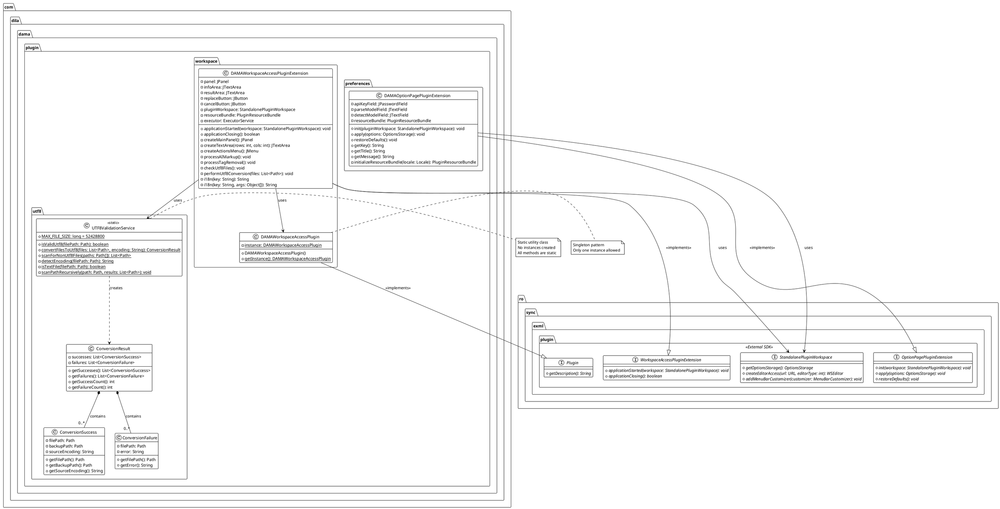

### 2. Detailed Class Relationships with Multiplicity

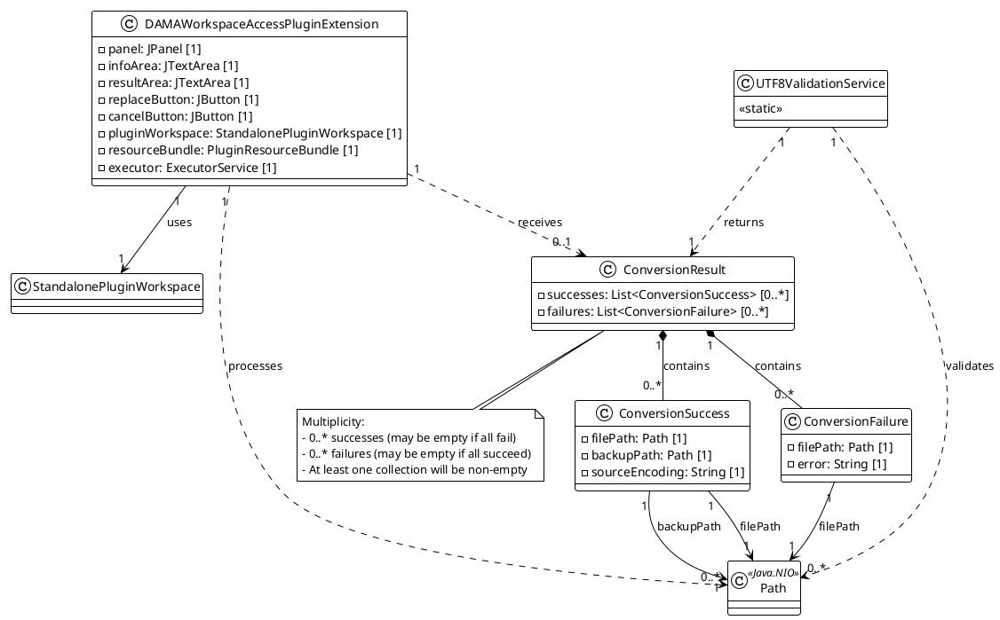

### 3. UI Component Hierarchy

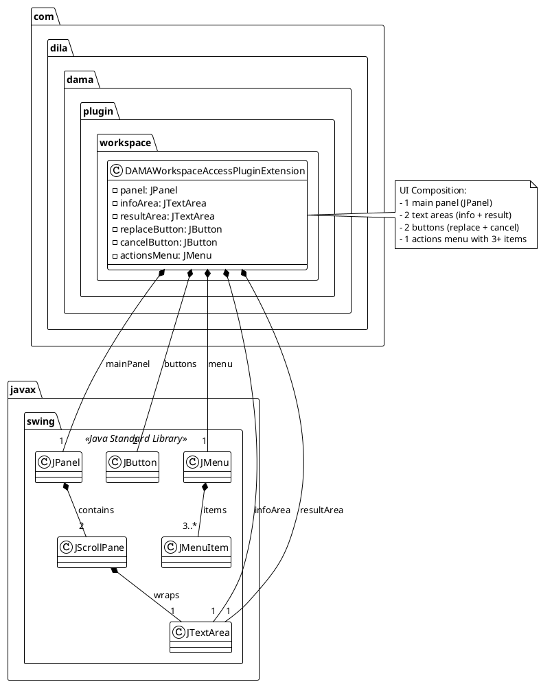

---

## Class Specifications

### Package: com.dila.dama.plugin.workspace

#### Class: DAMAWorkspaceAccessPlugin

**Stereotype**: `<<Singleton>>`

**責任 (Responsibility)**: Plugin descriptor and lifecycle manager

**屬性 (Attributes)**:

| Name | Type | Visibility | Multiplicity | Description |
|------|------|------------|--------------|-------------|
| instance | DAMAWorkspaceAccessPlugin | private static | 1 | Singleton instance |

**方法 (Methods)**:

| Signature | Visibility | Return Type | Description |
|-----------|------------|-------------|-------------|
| DAMAWorkspaceAccessPlugin() | public | void | Constructor, ensures singleton |
| getInstance() | public static | DAMAWorkspaceAccessPlugin | Returns singleton instance |

**OCL Constraints**:
```ocl
context DAMAWorkspaceAccessPlugin
inv singleton: DAMAWorkspaceAccessPlugin.allInstances()->size() = 1

context DAMAWorkspaceAccessPlugin::getInstance()
post: result = instance
```

---

#### Class: DAMAWorkspaceAccessPluginExtension

**Stereotype**: `<<Extension Point>>`

**責任 (Responsibility)**: Main plugin UI and business logic coordinator

**屬性 (Attributes)**:

| Name | Type | Visibility | Multiplicity | Default | Description |
|------|------|------------|--------------|---------|-------------|
| panel | JPanel | private | 1 | null | Main UI panel |
| infoArea | JTextArea | private | 1 | null | Information display area |
| resultArea | JTextArea | private | 1 | null | Result display area |
| replaceButton | JButton | private | 1 | null | Replace action button |
| cancelButton | JButton | private | 1 | null | Cancel action button |
| pluginWorkspace | StandalonePluginWorkspace | private | 1 | null | Oxygen workspace reference |
| resourceBundle | PluginResourceBundle | private | 1 | null | i18n resource bundle |
| executor | ExecutorService | private | 1 | null | Async task executor |

**方法 (Methods)**:

| Signature | Visibility | Return Type | Parameters | Description |
|-----------|------------|-------------|------------|-------------|
| applicationStarted | public | void | workspace: StandalonePluginWorkspace | Initialize plugin on app start |
| applicationClosing | public | boolean | - | Cleanup on app close |
| createMainPanel | private | JPanel | - | Create main UI panel |
| createTextArea | private | JTextArea | rows: int, cols: int | Create configured text area |
| createActionsMenu | private | JMenu | - | Create actions menu |
| processAIMarkup | private | void | - | Handle AI markup action |
| processTagRemoval | private | void | - | Handle tag removal action |
| checkUtf8Files | private | void | - | Handle UTF-8 check action |
| performUtf8Conversion | private | void | files: List\<Path\> | Convert files to UTF-8 |
| i18n | private | String | key: String | Get localized string |
| i18n | private | String | key: String, args: Object[] | Get formatted localized string |

**OCL Constraints**:
```ocl
context DAMAWorkspaceAccessPluginExtension
inv workspaceInitialized: 
    self.panel <> null implies self.pluginWorkspace <> null

inv textAreasCreated:
    self.panel <> null implies (self.infoArea <> null and self.resultArea <> null)

inv buttonsCreated:
    self.panel <> null implies (self.replaceButton <> null and self.cancelButton <> null)

inv executorCreated:
    self.pluginWorkspace <> null implies self.executor <> null

context DAMAWorkspaceAccessPluginExtension::createTextArea(rows: Integer, cols: Integer)
pre: rows > 0 and cols > 0
post: result <> null and result.rows = rows and result.columns = cols

context DAMAWorkspaceAccessPluginExtension::i18n(key: String)
pre: key <> null and key.size() > 0
pre: self.resourceBundle <> null
post: result <> null

context DAMAWorkspaceAccessPluginExtension::performUtf8Conversion(files: Collection(Path))
pre: files <> null and files->size() > 0
pre: files->forAll(f | f <> null)
post: 
    let result = UTF8ValidationService.convertFilesToUtf8(files, null) in
    result.getSuccessCount() + result.getFailureCount() = files->size()
```

---

### Package: com.dila.dama.plugin.preferences

#### Class: DAMAOptionPagePluginExtension

**Stereotype**: `<<Configuration>>`

**責任 (Responsibility)**: Manage plugin configuration and preferences UI

**屬性 (Attributes)**:

| Name | Type | Visibility | Multiplicity | Default | Description |
|------|------|------------|--------------|---------|-------------|
| apiKeyField | JPasswordField | private | 1 | null | API key input field |
| parseModelField | JTextField | private | 1 | null | Parse model name field |
| detectModelField | JTextField | private | 1 | null | Detect model name field |
| resourceBundle | PluginResourceBundle | private | 1 | null | i18n resource bundle |

**方法 (Methods)**:

| Signature | Visibility | Return Type | Parameters | Description |
|-----------|------------|-------------|------------|-------------|
| init | public | void | workspace: StandalonePluginWorkspace | Initialize preferences page |
| apply | public | void | options: OptionsStorage | Save preferences |
| restoreDefaults | public | void | - | Reset to default values |
| getKey | public | String | - | Get option page key |
| getTitle | public | String | - | Get page title |
| getMessage | public | String | - | Get page description |
| initializeResourceBundle | private | PluginResourceBundle | locale: Locale | Load i18n resources |

**OCL Constraints**:
```ocl
context DAMAOptionPagePluginExtension
inv fieldsInitialized:
    self.apiKeyField <> null and 
    self.parseModelField <> null and 
    self.detectModelField <> null

context DAMAOptionPagePluginExtension::apply(options: OptionsStorage)
pre: options <> null
post: 
    -- API key is stored securely
    options.getSecretOption('dila.dama.api.key', '') = 
        new String(self.apiKeyField.getPassword())

context DAMAOptionPagePluginExtension::getKey()
post: result = 'dila.dama.preferences'

context DAMAOptionPagePluginExtension::restoreDefaults()
post: 
    self.apiKeyField.text = '' and
    self.parseModelField.text = '' and
    self.detectModelField.text = ''
```

---

### Package: com.dila.dama.plugin.utf8

#### Class: UTF8ValidationService

**Stereotype**: `<<Utility>>` `<<Static>>`

**責任 (Responsibility)**: UTF-8 validation and file encoding conversion

**屬性 (Attributes)**:

| Name | Type | Visibility | Multiplicity | Default | Description |
|------|------|------------|--------------|---------|-------------|
| MAX_FILE_SIZE | long | public static final | 1 | 52428800 | Max file size (50MB) |

**方法 (Methods)**:

| Signature | Visibility | Return Type | Parameters | Description |
|-----------|------------|-------------|------------|-------------|
| isValidUtf8 | public static | boolean | filePath: Path | Check if file is valid UTF-8 |
| convertFilesToUtf8 | public static | ConversionResult | files: List\<Path\>, encoding: String | Convert files to UTF-8 |
| scanForNonUtf8Files | public static | List\<Path\> | paths: Path[] | Find non-UTF-8 files |
| detectEncoding | private static | String | filePath: Path | Detect file encoding |
| isTextFile | private static | boolean | filePath: Path | Check if file is text |
| scanPathRecursively | private static | void | path: Path, results: List\<Path\> | Recursive directory scan |

**OCL Constraints**:
```ocl
context UTF8ValidationService
inv staticClass: UTF8ValidationService.allInstances()->size() = 0

context UTF8ValidationService::isValidUtf8(filePath: Path)
pre: filePath <> null
pre: Files.exists(filePath) = true
pre: Files.isRegularFile(filePath) = true
post: result = true or result = false

context UTF8ValidationService::convertFilesToUtf8(
    files: Collection(Path), 
    encoding: String)
pre: files <> null and files->size() > 0
pre: files->forAll(f | f <> null and Files.exists(f))
post: result <> null
post: result.getSuccessCount() + result.getFailureCount() = files->size()
post: result.getSuccesses()->forAll(s | 
    Files.exists(s.getBackupPath()) and
    s.getBackupPath().toString().endsWith('.utf8backup')
)

context UTF8ValidationService::scanForNonUtf8Files(paths: Path[])
pre: paths <> null and paths.length > 0
pre: paths->forAll(p | p <> null and Files.exists(p))
post: result <> null
post: result->forAll(f | not isValidUtf8(f))
```

---

#### Class: ConversionResult

**Stereotype**: `<<Value Object>>`

**責任 (Responsibility)**: Container for conversion operation results

**屬性 (Attributes)**:

| Name | Type | Visibility | Multiplicity | Description |
|------|------|------------|--------------|-------------|
| successes | List\<ConversionSuccess\> | private | 0..* | Successfully converted files |
| failures | List\<ConversionFailure\> | private | 0..* | Failed conversions |

**方法 (Methods)**:

| Signature | Visibility | Return Type | Description |
|-----------|------------|-------------|-------------|
| getSuccesses() | public | List\<ConversionSuccess\> | Get successful conversions |
| getFailures() | public | List\<ConversionFailure\> | Get failed conversions |
| getSuccessCount() | public | int | Count of successes |
| getFailureCount() | public | int | Count of failures |

**OCL Constraints**:
```ocl
context ConversionResult
inv notEmpty: self.successes->size() + self.failures->size() > 0

inv countsMatch:
    self.getSuccessCount() = self.successes->size() and
    self.getFailureCount() = self.failures->size()

inv immutable:
    -- Collections should be immutable after creation
    self.successes->isUnique() and
    self.failures->isUnique()
```

---

#### Class: ConversionSuccess

**Stereotype**: `<<Value Object>>` `<<Immutable>>`

**責任 (Responsibility)**: Details of a successful file conversion

**屬性 (Attributes)**:

| Name | Type | Visibility | Multiplicity | Description |
|------|------|------------|--------------|-------------|
| filePath | Path | private final | 1 | Converted file path |
| backupPath | Path | private final | 1 | Backup file path |
| sourceEncoding | String | private final | 1 | Original encoding |

**方法 (Methods)**:

| Signature | Visibility | Return Type | Description |
|-----------|------------|-------------|-------------|
| getFilePath() | public | Path | Get file path |
| getBackupPath() | public | Path | Get backup path |
| getSourceEncoding() | public | String | Get source encoding |

**OCL Constraints**:
```ocl
context ConversionSuccess
inv pathsNotNull:
    self.filePath <> null and self.backupPath <> null

inv encodingNotNull:
    self.sourceEncoding <> null and self.sourceEncoding.size() > 0

inv backupPathValid:
    self.backupPath.toString().endsWith('.utf8backup')

inv sameDirectory:
    self.filePath.getParent() = self.backupPath.getParent()

inv immutable:
    -- All fields are final, cannot be changed after construction
    self.filePath@pre = self.filePath and
    self.backupPath@pre = self.backupPath and
    self.sourceEncoding@pre = self.sourceEncoding
```

---

#### Class: ConversionFailure

**Stereotype**: `<<Value Object>>` `<<Immutable>>`

**責任 (Responsibility)**: Details of a failed file conversion

**屬性 (Attributes)**:

| Name | Type | Visibility | Multiplicity | Description |
|------|------|------------|--------------|-------------|
| filePath | Path | private final | 1 | File that failed conversion |
| error | String | private final | 1 | Error message |

**方法 (Methods)**:

| Signature | Visibility | Return Type | Description |
|-----------|------------|-------------|-------------|
| getFilePath() | public | Path | Get file path |
| getError() | public | String | Get error message |

**OCL Constraints**:
```ocl
context ConversionFailure
inv pathNotNull: self.filePath <> null

inv errorNotNull: 
    self.error <> null and self.error.size() > 0

inv immutable:
    -- All fields are final
    self.filePath@pre = self.filePath and
    self.error@pre = self.error
```

---

## Sequence Diagrams

### 1. Application Startup Sequence

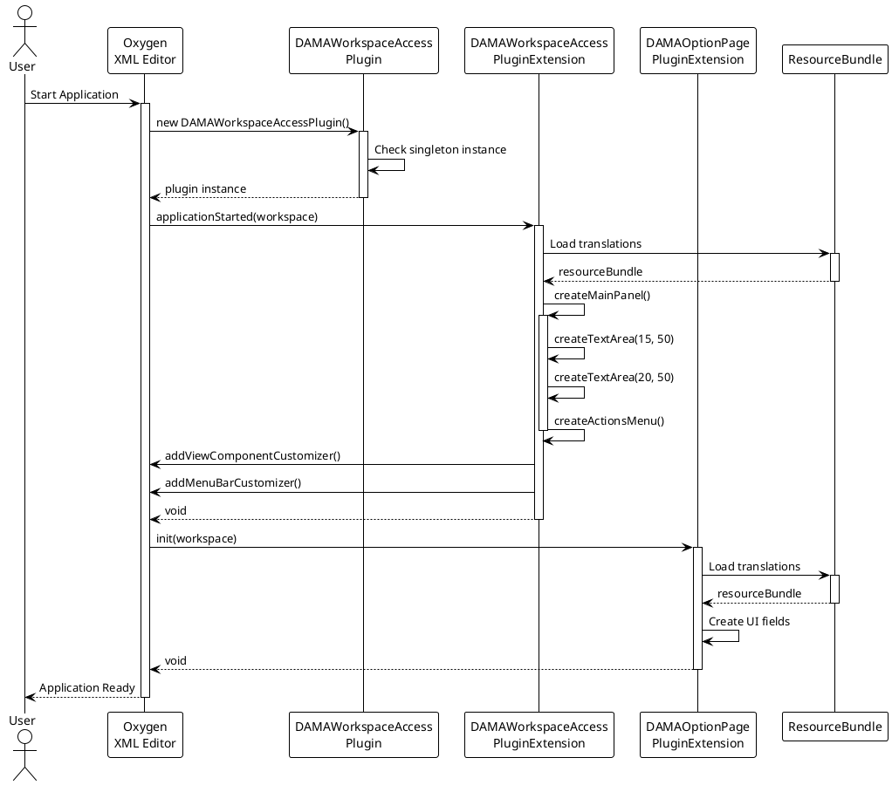

### 2. AI Markup Processing Sequence

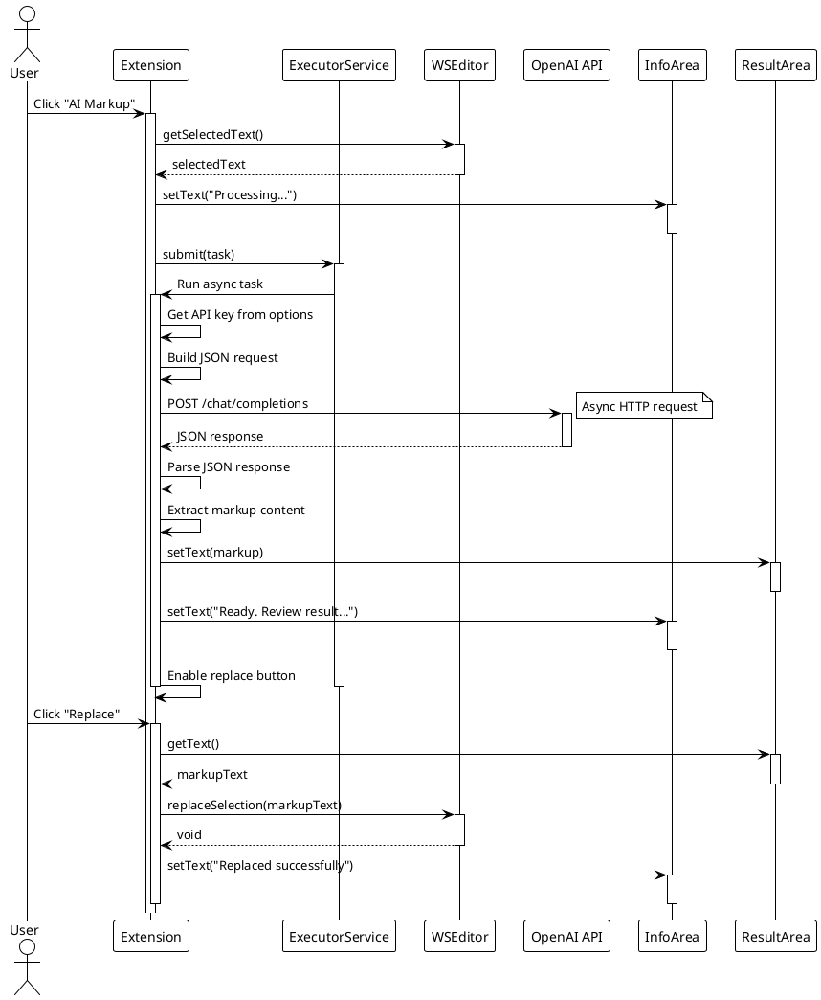

### 3. UTF-8 Validation and Conversion Sequence

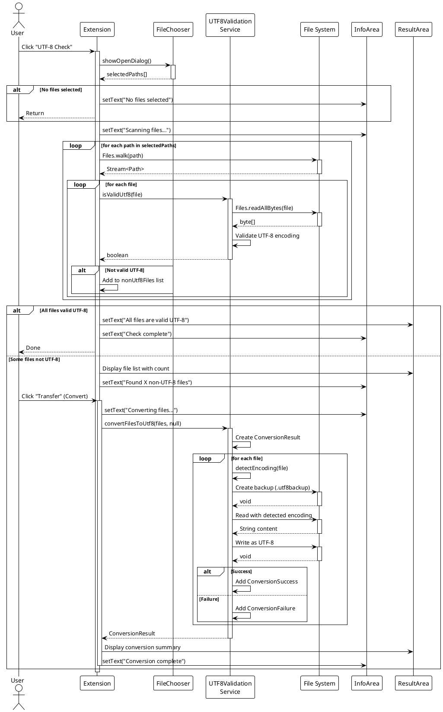

### 4. Tag Removal Sequence

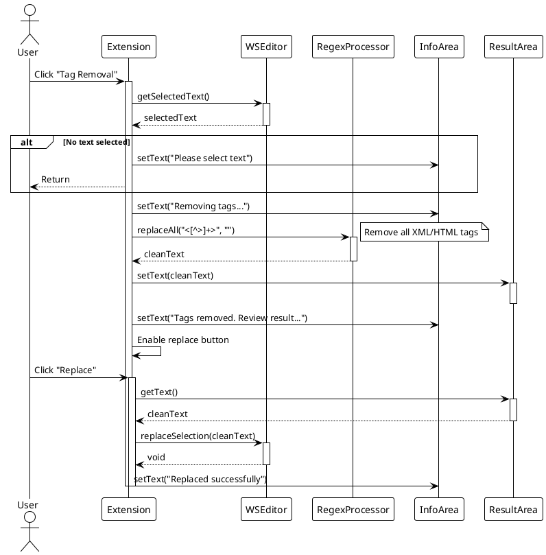

---

## State Diagrams

### 1. Plugin Extension Lifecycle State

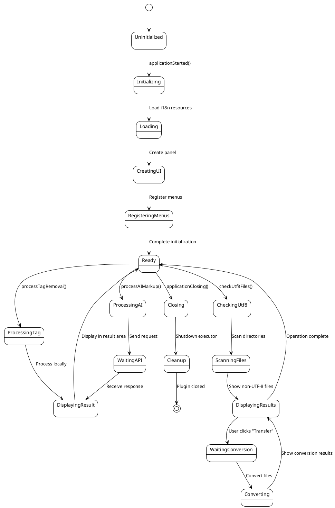

### 2. Conversion Operation State

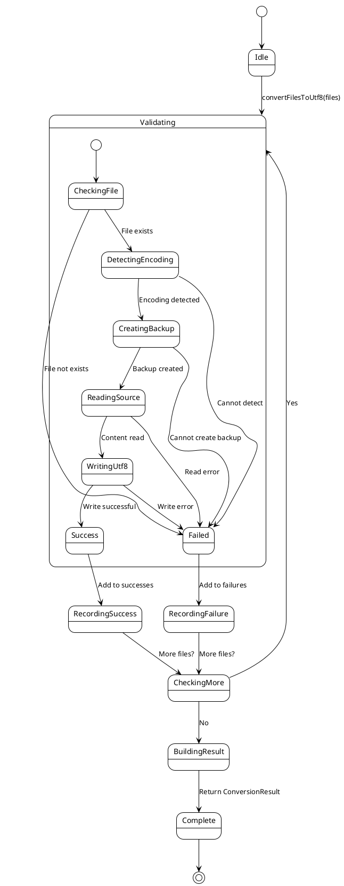

### 3. UI Button State

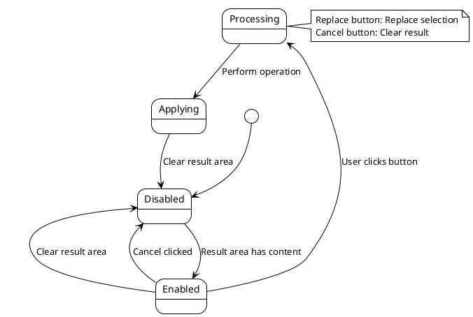

---

## OCL Constraints

### System-Level Invariants

```ocl
-- Plugin Singleton
context DAMAWorkspaceAccessPlugin
inv singleInstance: 
    DAMAWorkspaceAccessPlugin.allInstances()->size() <= 1

inv instanceConsistency:
    DAMAWorkspaceAccessPlugin.instance <> null implies
    DAMAWorkspaceAccessPlugin.allInstances()->includes(DAMAWorkspaceAccessPlugin.instance)

-- Extension Initialization
context DAMAWorkspaceAccessPluginExtension
inv uiConsistency:
    self.panel <> null implies (
        self.infoArea <> null and
        self.resultArea <> null and
        self.replaceButton <> null and
        self.cancelButton <> null and
        self.resourceBundle <> null and
        self.executor <> null
    )

inv workspaceRequired:
    self.pluginWorkspace <> null

-- UTF-8 Service
context UTF8ValidationService
inv noInstances:
    UTF8ValidationService.allInstances()->size() = 0
    
-- Conversion Result
context ConversionResult
inv resultNotEmpty:
    self.successes->size() + self.failures->size() > 0

inv noDuplicateSuccesses:
    self.successes->forAll(s1, s2 | s1 <> s2 implies s1.filePath <> s2.filePath)

inv noDuplicateFailures:
    self.failures->forAll(f1, f2 | f1 <> f2 implies f1.filePath <> f2.filePath)
```

### Pre/Post Conditions

```ocl
-- AI Markup Processing
context DAMAWorkspaceAccessPluginExtension::processAIMarkup()
pre hasSelection:
    self.pluginWorkspace.getCurrentEditorAccess(StandalonePluginWorkspace.MAIN_EDITING_AREA)
        .getEditorAccess().getSelectedText() <> null and
    self.pluginWorkspace.getCurrentEditorAccess(StandalonePluginWorkspace.MAIN_EDITING_AREA)
        .getEditorAccess().getSelectedText().length() > 0

pre hasApiKey:
    let apiKey = self.pluginWorkspace.getOptionsStorage()
        .getSecretOption('dila.dama.api.key', '') in
    apiKey <> null and apiKey.length() > 0

post infoUpdated:
    self.infoArea.getText() <> null

-- UTF-8 Validation
context UTF8ValidationService::isValidUtf8(filePath: Path)
pre fileExists:
    Files.exists(filePath) = true

pre isRegularFile:
    Files.isRegularFile(filePath) = true

pre notTooLarge:
    Files.size(filePath) <= UTF8ValidationService.MAX_FILE_SIZE

post booleanResult:
    result = true or result = false

-- File Conversion
context UTF8ValidationService::convertFilesToUtf8(
    files: Collection(Path), 
    encoding: String)
pre filesNotNull:
    files <> null and files->size() > 0

pre filesExist:
    files->forAll(f | Files.exists(f) and Files.isRegularFile(f))

pre filesWritable:
    files->forAll(f | Files.isWritable(f))

post resultComplete:
    result <> null and
    result.getSuccessCount() + result.getFailureCount() = files->size()

post backupsCreated:
    result.getSuccesses()->forAll(s | 
        Files.exists(s.getBackupPath()) and
        s.getBackupPath().toString() = s.getFilePath().toString() + '.utf8backup'
    )

post originalContentPreserved:
    result.getSuccesses()->forAll(s |
        -- UTF-8 decoded content equals original decoded content
        Files.readString(s.getFilePath(), StandardCharsets.UTF_8) =
        Files.readString(s.getBackupPath(), Charset.forName(s.getSourceEncoding()))
    )

-- Tag Removal
context DAMAWorkspaceAccessPluginExtension::processTagRemoval()
pre hasSelection:
    self.pluginWorkspace.getCurrentEditorAccess(StandalonePluginWorkspace.MAIN_EDITING_AREA)
        .getEditorAccess().getSelectedText() <> null

post tagsRemoved:
    let result = self.resultArea.getText() in
    not result.matches('.*<[^>]+>.*')

post contentPreserved:
    -- Text content between tags is preserved
    let original = self.pluginWorkspace.getCurrentEditorAccess(
            StandalonePluginWorkspace.MAIN_EDITING_AREA)
        .getEditorAccess().getSelectedText() in
    let cleaned = self.resultArea.getText() in
    -- All non-tag characters from original appear in cleaned
    original.replaceAll('<[^>]+>', '') = cleaned
```

### Derived Attributes

```ocl
context ConversionResult
def: totalFiles: Integer = self.successes->size() + self.failures->size()
def: successRate: Real = 
    if self.totalFiles > 0 
    then self.successes->size() / self.totalFiles 
    else 0.0 endif
def: hasFailures: Boolean = self.failures->size() > 0

context DAMAWorkspaceAccessPluginExtension
def: hasResult: Boolean = 
    self.resultArea <> null and 
    self.resultArea.getText() <> null and
    self.resultArea.getText().length() > 0

def: isProcessing: Boolean = 
    self.executor <> null and 
    not self.executor.isShutdown() and
    self.infoArea.getText().contains('Processing')
```

---

## Design Patterns

### 1. Singleton Pattern

**適用類別 (Applied Classes)**: `DAMAWorkspaceAccessPlugin`

**目的 (Purpose)**: Ensure only one plugin instance exists

**實現 (Implementation)**:
```java
public class DAMAWorkspaceAccessPlugin extends Plugin {
    private static DAMAWorkspaceAccessPlugin instance;
    
    public DAMAWorkspaceAccessPlugin() {
        if (instance != null) {
            throw new IllegalStateException("Plugin already initialized");
        }
        instance = this;
    }
    
    public static DAMAWorkspaceAccessPlugin getInstance() {
        return instance;
    }
}
```

**OCL約束 (OCL Constraints)**:
```ocl
context DAMAWorkspaceAccessPlugin
inv singleton: DAMAWorkspaceAccessPlugin.allInstances()->size() = 1
```

---

### 2. Strategy Pattern (Implicit)

**適用場景 (Applied Scenario)**: Different encoding detection strategies

**目的 (Purpose)**: Support multiple encoding detection algorithms

**實現 (Implementation)**:
```java
private static String detectEncoding(Path filePath) {
    // Strategy 1: Check BOM
    if (hasBOM(bytes)) return detectBOMEncoding(bytes);
    
    // Strategy 2: Check alternating nulls (UTF-16)
    if (hasAlternatingNulls(bytes)) return "UTF-16";
    
    // Strategy 3: Try common encodings
    for (String encoding : COMMON_ENCODINGS) {
        if (canDecode(bytes, encoding)) return encoding;
    }
    
    return "UTF-8"; // Default
}
```

---

### 3. Command Pattern (Implicit)

**適用場景 (Applied Scenario)**: Menu action handlers

**目的 (Purpose)**: Encapsulate requests as objects

**實現 (Implementation)**:
```java
// AI Markup Command
JMenuItem aiMarkupItem = new JMenuItem(i18n("menu.actions.aiMarkup"));
aiMarkupItem.addActionListener(e -> processAIMarkup());

// Tag Removal Command
JMenuItem tagRemovalItem = new JMenuItem(i18n("menu.tools.tagRemoval"));
tagRemovalItem.addActionListener(e -> processTagRemoval());

// UTF-8 Check Command
JMenuItem utf8CheckItem = new JMenuItem(i18n("menu.tools.utf8Check"));
utf8CheckItem.addActionListener(e -> checkUtf8Files());
```

---

### 4. Template Method Pattern

**適用場景 (Applied Scenario)**: File processing workflow

**目的 (Purpose)**: Define skeleton of conversion algorithm

**實現 (Implementation)**:
```java
public static ConversionResult convertFilesToUtf8(List<Path> files, String encoding) {
    ConversionResult result = new ConversionResult();
    
    for (Path file : files) {
        try {
            // Template steps:
            String detectedEncoding = detectEncoding(file);  // Step 1
            Path backup = createBackup(file);                // Step 2
            String content = readWithEncoding(file, detectedEncoding); // Step 3
            writeAsUtf8(file, content);                      // Step 4
            result.addSuccess(file, backup, detectedEncoding);
        } catch (Exception e) {
            result.addFailure(file, e.getMessage());
        }
    }
    
    return result;
}
```

---

### 5. Observer Pattern (Implicit)

**適用場景 (Applied Scenario)**: Button state management

**目的 (Purpose)**: Update button state when result area changes

**實現 (Implementation)**:
```java
resultArea.getDocument().addDocumentListener(new DocumentListener() {
    @Override
    public void insertUpdate(DocumentEvent e) {
        updateButtonStates();
    }
    
    @Override
    public void removeUpdate(DocumentEvent e) {
        updateButtonStates();
    }
    
    @Override
    public void changedUpdate(DocumentEvent e) {
        updateButtonStates();
    }
});

private void updateButtonStates() {
    boolean hasContent = resultArea.getText() != null && 
                        !resultArea.getText().isEmpty();
    replaceButton.setEnabled(hasContent);
    cancelButton.setEnabled(hasContent);
}
```

---

### 6. Value Object Pattern

**適用類別 (Applied Classes)**: `ConversionSuccess`, `ConversionFailure`

**目的 (Purpose)**: Immutable objects representing conversion results

**特性 (Characteristics)**:
- All fields are `final`
- No setters
- Thread-safe
- Can be compared by value

**OCL約束 (OCL Constraints)**:
```ocl
context ConversionSuccess
inv immutable:
    self.filePath@pre = self.filePath and
    self.backupPath@pre = self.backupPath and
    self.sourceEncoding@pre = self.sourceEncoding
```

---

## Package Structure

### Package Dependency Diagram

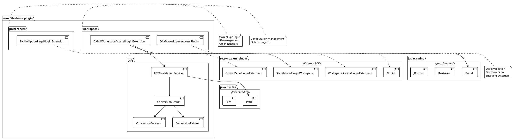

### Package Responsibilities

| Package | Responsibility | Classes | Dependencies |
|---------|---------------|---------|--------------|
| **workspace** | Plugin lifecycle, UI management, action handling | 2 | preferences, utf8, Oxygen SDK, Swing |
| **preferences** | Configuration management, options UI | 1 | Oxygen SDK, Swing |
| **utf8** | UTF-8 validation, file conversion | 4 | Java NIO |

---

## Deployment View

### Component Deployment

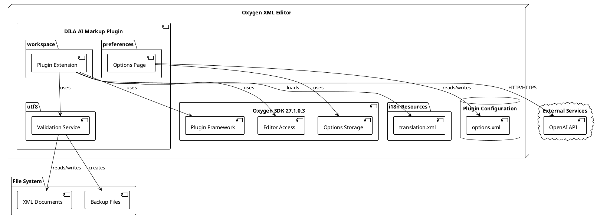

### Runtime Environment

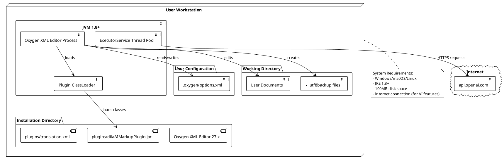

---

## Implementation Notes

### Thread Safety

```ocl
context DAMAWorkspaceAccessPluginExtension
inv threadSafe:
    -- ExecutorService ensures thread-safe async operations
    self.executor <> null implies self.executor.isShutdown() = false

context UTF8ValidationService
inv stateless:
    -- All methods are static, no shared mutable state
    UTF8ValidationService.allInstances()->size() = 0
```

### Performance Considerations

```ocl
context UTF8ValidationService::convertFilesToUtf8(files: Collection(Path), encoding: String)
inv performanceLimit:
    -- Each file must be under MAX_FILE_SIZE
    files->forAll(f | Files.size(f) <= UTF8ValidationService.MAX_FILE_SIZE)

context UTF8ValidationService::isValidUtf8(filePath: Path)
inv fileSize:
    Files.size(filePath) <= UTF8ValidationService.MAX_FILE_SIZE
```

### Error Handling

```ocl
context ConversionResult
inv errorHandling:
    -- All files must result in either success or failure
    self.successes->size() + self.failures->size() > 0

context ConversionFailure
inv errorMessage:
    -- Error messages must be meaningful
    self.error <> null and self.error.size() > 0
```

---

## Appendix: OCL Reference

### OCL Types Used

| Type | Description | Example |
|------|-------------|---------|
| **Boolean** | True/false values | `result = true` |
| **Integer** | Whole numbers | `files->size() = 5` |
| **Real** | Floating point | `successRate = 0.85` |
| **String** | Text strings | `key = 'dila.dama.api.key'` |
| **Collection(T)** | Generic collection | `files: Collection(Path)` |
| **Set(T)** | Unique elements | `Set{1, 2, 3}` |
| **Sequence(T)** | Ordered collection | `Sequence{a, b, c}` |

### OCL Operators

| Operator | Description | Example |
|----------|-------------|---------|
| `->size()` | Collection size | `files->size() > 0` |
| `->forAll(v \| expr)` | All elements satisfy | `files->forAll(f \| f <> null)` |
| `->exists(v \| expr)` | At least one satisfies | `files->exists(f \| isValidUtf8(f))` |
| `->select(v \| expr)` | Filter elements | `files->select(f \| not isValidUtf8(f))` |
| `->includes(elem)` | Contains element | `successes->includes(s)` |
| `@pre` | Previous value | `self.value@pre = self.value` |

### OCL Keywords

- `context`: Define constraint context
- `inv`: Invariant (always true)
- `pre`: Precondition (must be true before operation)
- `post`: Postcondition (must be true after operation)
- `def`: Derived attribute or operation
- `implies`: Logical implication (A implies B)
- `and`, `or`, `not`: Logical operators
- `if-then-else-endif`: Conditional expression
- `let-in`: Variable binding

---

## Document History

| Version | Date | Author | Changes |
|---------|------|--------|---------|
| 1.0 | 2025-10-10 | Jeff Y.H. Wu | Initial RUP design document |

---

## References

1. **Rational Unified Process (RUP)**: IBM Rational Software
2. **UML 2.5 Specification**: Object Management Group (OMG)
3. **OCL 2.4 Specification**: Object Management Group (OMG)
4. **Oxygen XML Editor SDK Documentation**: Syncro Soft
5. **Java Platform SE 8 Documentation**: Oracle Corporation
6. **Design Patterns**: Gamma, Helm, Johnson, Vlissides (Gang of Four)

---

*End of RUP Design Document*
