# DILA AI Markup Assistant Plugin - RUP Design Document

**Rational Unified Process (RUP) - Object-Oriented Design**

---

## Document Information

| Property | Value |
|----------|-------|
| **Document Type** | RUP Design Document |
| **Project** | DILA AI Markup Assistant Plugin |
| **Version** | 0.4.0 |
| **Date** | January 5, 2026 |
| **Author** | Jeff Y.H. Wu (jeffwu@dila.edu.tw) |
| **Status** | In Development |

---

## Table of Contents

1. [Overview](#overview)
2. [Design Principles](#design-principles)
3. [Class Diagrams](#class-diagrams)
4. [Class Specifications](#class-specifications)
5. [Sequence Diagrams](#sequence-diagrams)
6. [State Diagrams](#state-diagrams)
7. [OCL Constraints](#ocl-constraints)
8. [Design Patterns](#design-patterns)
9. [Package Structure](#package-structure)
10. [Deployment View](#deployment-view)

---

## Overview

### Purpose

This document describes the object-oriented design of the DILA AI Markup Assistant Plugin using RUP methodology. It focuses on:

- **類別 (Classes)**: Core classes and their responsibilities
- **關聯 (Associations)**: Relationships between classes
- **Multiplicity (多重性)**: Cardinality of relationships
- **屬性 (Attributes)**: Class properties and fields
- **方法 (Methods)**: Class operations and behaviors
- **OCL (Object Constraint Language)**: Formal constraints and invariants

### Design Goals

1. **Separation of Concerns**: UI, business logic, and utilities are separated
2. **Single Responsibility**: Each class has one primary responsibility
3. **Dependency Inversion**: Depend on abstractions, not concrete implementations
4. **Testability**: All components are independently testable
5. **Extensibility**: Easy to add new features without modifying existing code

### 0.4.0 Implementation Scope

- **UI Actions**: AI Markup, Tag Removal, UTF-8 Check/Convert, and `<ref> to link`
- **Ref-to-Link Pipeline**: Parse `<ref>`, call CBRD API with raw XML (no normalization), rewrite `<ref>` with `<ptr href="...">` and `checked="2"`
- **Auto Conversion**: Ref-to-link conversion runs immediately on action; Convert remains for retry
- **Configuration**: OpenAI + CBRD settings stored in Oxygen options (WSOptionsStorage)

---

## Design Principles

### SOLID Principles Applied

| Principle | Application |
|-----------|-------------|
| **Single Responsibility** | Each class handles one aspect (UI, validation, conversion, configuration) |
| **Open/Closed** | Extension points through interfaces, closed for modification |
| **Liskov Substitution** | Result types (Success/Failure) are substitutable |
| **Interface Segregation** | Focused interfaces for specific operations |
| **Dependency Inversion** | Depends on Oxygen SDK abstractions, not implementations |

### Architectural Layers

```
+--------------------------------------------------------------+
| Presentation Layer (Swing UI)                                |
| DAMAWorkspaceAccessPluginExtension                           |
| - Actions: AI Markup, Tag Removal, UTF-8, Ref-to-Link         |
+--------------------------------------------------------------+
                |
+--------------------------------------------------------------+
| Application Layer (Command)                                  |
| ConvertReferenceCommand                                      |
+--------------------------------------------------------------+
                |
+--------------------------------------------------------------+
| Domain Layer (Model + Service)                               |
| TripitakaComponents, ReferenceConversionSession               |
| ReferenceParser, RefElementRewriter                            |
| (No normalization before API call)                             |
+--------------------------------------------------------------+
                |
+--------------------------------------------------------------+
| Infrastructure Layer (API)                                   |
| CBRDAPIClient, CBRDResponse, HttpUrlConnectionFactory        |
+--------------------------------------------------------------+

Cross-cutting utilities:
- XmlDomUtils, PluginLogger
- UTF8ValidationService (validation + conversion)
- DAMAOptionPagePluginExtension (configuration)
```


---

## Class Diagrams

### 1. Core Plugin Architecture

```plantuml
@startuml
!theme plain

package "com.dila.dama.plugin" {
    
    package "workspace" {
        class DAMAWorkspaceAccessPlugin {
            - {static} instance: DAMAWorkspaceAccessPlugin
            --
            + DAMAWorkspaceAccessPlugin(descriptor: PluginDescriptor)
        }
        
        class DAMAWorkspaceAccessPluginExtension {
            - pluginWorkspaceAccess: StandalonePluginWorkspace
            - resources: Object
            - optionStorage: WSOptionsStorage
            - infoArea: JTextArea
            - resultArea: JTextArea
            - buttonPanel: JPanel
            - replaceButton: JButton
            - convertButton: JButton
            - transferButton: JButton
            - cancelButton: JButton
            - executor: ExecutorService
            - currentOperation: OperationType
            - currentRefToLinkUrl: String
            - currentRefToLinkSelection: String
            - currentNonUtf8Files: List<Path>
            --
            + applicationStarted(workspace: StandalonePluginWorkspace): void
            + applicationClosing(): boolean
            - createMainPanel(): JPanel
            - createMenuBar(): JMenuBar
            - createTextAreas(): void
            - createButtonPanel(): void
            - processAIMarkup(text: String): String
            - processTagRemoval(text: String): String
            - checkUtf8Files(files: File[]): Utf8CheckResult
            - convertFilesToUtf8(files: List<Path>): String
            - fetchSelectedText(area: JTextArea): String
            - fetchSelectedRefToLinkText(): String
            - replaceSelectionWithText(text: String): boolean
            - i18n(key: String, args: Object[]): String
        }
    }
    
    package "preferences" {
        class DAMAOptionPagePluginExtension {
            - parseModelTextField: JTextField
            - detectModelTextField: JTextField
            - apiKeyTextField: JTextField
            - cbrdApiUrlTextField: JTextField
            - cbrdRefererTextField: JTextField
            - cbrdTimeoutTextField: JTextField
            - resources: PluginResourceBundle
            --
            + init(pluginWorkspace: PluginWorkspace): JComponent
            + apply(pluginWorkspace: PluginWorkspace): void
            + restoreDefaults(): void
            + getKey(): String
            + getTitle(): String
        }
    }
    
    package "application.command" {
        class ConvertReferenceCommand
        class ConvertReferenceResult
    }
    
    package "domain.model" {
        class TripitakaComponents
        class TransformedComponents
        class ReferenceConversionSession
        class InvalidReferenceException
        class TransformationException
    }
    
    package "domain.service" {
        class ReferenceParser
        class ComponentTransformer
        class NumeralConverter
        class RefElementRewriter
    }
    
    package "infrastructure.api" {
        class CBRDAPIClient
        class CBRDResponse
        class CBRDAPIException
        class HttpUrlConnectionFactory
    }
    
    package "util" {
        class XmlDomUtils
        class PluginLogger
    }
    
    package "utf8" {
        class UTF8ValidationService <<static>>
        class ConversionResult
        class ConversionSuccess
        class ConversionFailure
    }
}

package "ro.sync.exml.plugin" <<External SDK>> {
    interface Plugin
    interface WorkspaceAccessPluginExtension
}

package "ro.sync.exml.plugin.option" <<External SDK>> {
    interface OptionPagePluginExtension
}

package "ro.sync.exml.workspace.api" <<External SDK>> {
    interface StandalonePluginWorkspace
    interface PluginWorkspace
    interface WSOptionsStorage
}

DAMAWorkspaceAccessPlugin --|> Plugin : <<extends>>
DAMAWorkspaceAccessPluginExtension --|> WorkspaceAccessPluginExtension : <<implements>>
DAMAOptionPagePluginExtension --|> OptionPagePluginExtension : <<extends>>

DAMAWorkspaceAccessPluginExtension --> ConvertReferenceCommand : uses
DAMAWorkspaceAccessPluginExtension --> RefElementRewriter : uses
DAMAWorkspaceAccessPluginExtension --> UTF8ValidationService : uses
DAMAWorkspaceAccessPluginExtension --> StandalonePluginWorkspace : uses
DAMAWorkspaceAccessPluginExtension --> WSOptionsStorage : uses
DAMAWorkspaceAccessPluginExtension ..> PluginLogger : logs

ConvertReferenceCommand --> ReferenceParser : uses
ConvertReferenceCommand --> CBRDAPIClient : uses
ConvertReferenceCommand ..> ConvertReferenceResult : returns

ReferenceParser ..> TripitakaComponents : creates
RefElementRewriter ..> XmlDomUtils : uses

CBRDAPIClient --> HttpUrlConnectionFactory : uses
CBRDAPIClient ..> CBRDResponse : parses
CBRDAPIClient ..> CBRDAPIException : throws

UTF8ValidationService ..> ConversionResult : creates
ConversionResult *-- "0..*" ConversionSuccess : contains
ConversionResult *-- "0..*" ConversionFailure : contains

note right of DAMAWorkspaceAccessPlugin
  Singleton initialization enforced by constructor
end note

@enduml
```


### 2. Detailed Class Relationships with Multiplicity

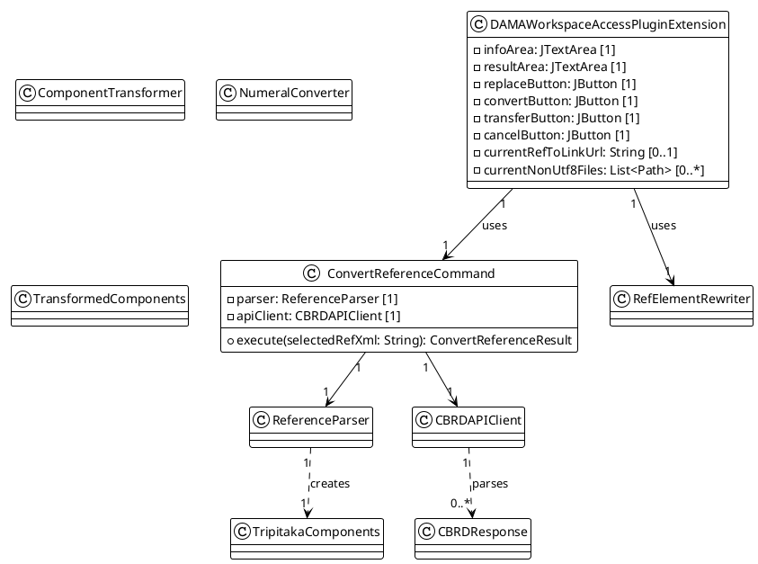


### 3. UI Component Hierarchy

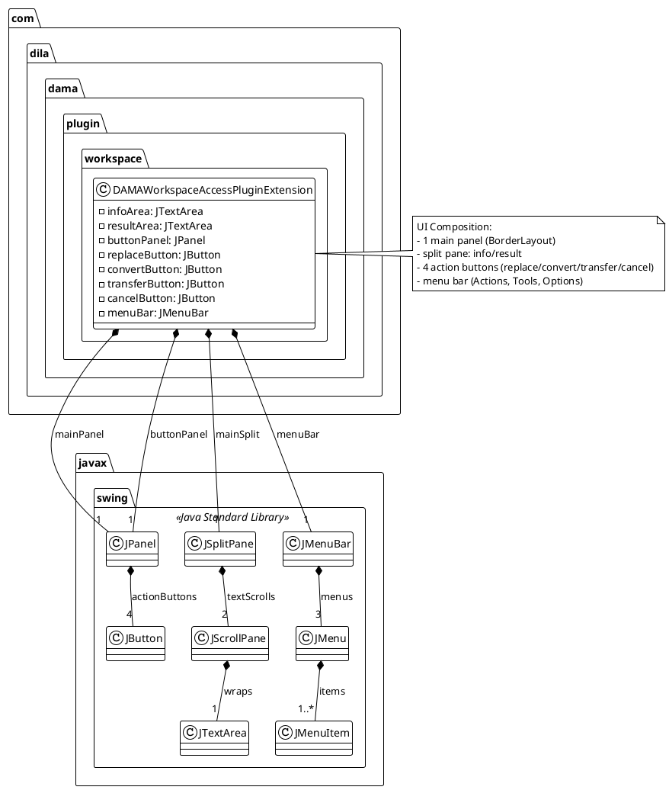


---

## Class Specifications

### Package: com.dila.dama.plugin.workspace

#### Class: DAMAWorkspaceAccessPlugin

**Stereotype**: `<<Singleton>>`

**Responsibility**: Plugin descriptor and lifecycle manager

**Attributes**:

| Name | Type | Visibility | Multiplicity | Description |
|------|------|------------|--------------|-------------|
| instance | DAMAWorkspaceAccessPlugin | private static | 1 | Singleton instance |

**Methods**:

| Signature | Visibility | Return Type | Description |
|-----------|------------|-------------|-------------|
| DAMAWorkspaceAccessPlugin(descriptor: PluginDescriptor) | public | void | Construct plugin and enforce singleton |

**OCL Constraints**:
```ocl
context DAMAWorkspaceAccessPlugin
inv singleton: DAMAWorkspaceAccessPlugin.allInstances()->size() = 1
```

---

#### Class: DAMAWorkspaceAccessPluginExtension

**Stereotype**: `<<Extension Point>>`

**Responsibility**: Main plugin UI and action coordinator (AI Markup, Tag Removal, UTF-8, Ref-to-Link)

**Attributes**:

| Name | Type | Visibility | Multiplicity | Default | Description |
|------|------|------------|--------------|---------|-------------|
| pluginWorkspaceAccess | StandalonePluginWorkspace | private | 1 | null | Oxygen workspace reference |
| resources | Object | private | 1 | null | Plugin resource bundle (i18n) |
| optionStorage | WSOptionsStorage | private | 1 | null | Options storage reference |
| infoArea | JTextArea | private | 1 | null | Information display area |
| resultArea | JTextArea | private | 1 | null | Result display area |
| buttonPanel | JPanel | private | 1 | null | Button container |
| replaceButton | JButton | private | 1 | null | Replace action button |
| convertButton | JButton | private | 1 | null | Convert action button (ref-to-link) |
| transferButton | JButton | private | 1 | null | Transfer UTF-8 button |
| cancelButton | JButton | private | 1 | null | Cancel action button |
| currentRefToLinkUrl | String | private | 0..1 | null | Cached CBRD URL |
| currentRefToLinkSelection | String | private | 0..1 | null | Selected <ref> XML |
| currentNonUtf8Files | List<Path> | private | 0..* | null | Files requiring conversion |
| executor | ExecutorService | private final | 1 | initialized | Async task executor |
| currentOperation | OperationType | private | 1 | NONE | Active operation context |

**Methods**:

| Signature | Visibility | Return Type | Parameters | Description |
|-----------|------------|-------------|------------|-------------|
| applicationStarted | public | void | workspace: StandalonePluginWorkspace | Initialize plugin on app start |
| applicationClosing | public | boolean | - | Cleanup on app close |
| createMainPanel | private | JPanel | - | Build main UI panel |
| createMenuBar | private | JMenuBar | - | Build menu bar (Actions/Tools/Options) |
| createOptionsMenu | private | JMenu | - | Build options menu with icon |
| createTextAreas | private | void | - | Initialize info/result areas |
| createButtonPanel | private | void | - | Initialize action buttons |
| processAIMarkup | private | String | text: String | Call LLM and return markup |
| processTagRemoval | private | String | text: String | Strip XML/HTML tags |
| checkUtf8Files | private | Utf8CheckResult | files: File[] | Scan for non-UTF-8 files |
| convertFilesToUtf8 | private | String | files: List<Path> | Convert files to UTF-8 |
| displayUtf8CheckResults | private | void | result: Utf8CheckResult | Render UTF-8 scan results |
| displayConversionResults | private | void | results: String | Render UTF-8 conversion summary |
| fetchSelectedText | private | String | area: JTextArea | Read selection from editor |
| fetchSelectedRefToLinkText | private | String | - | Validate selected <ref> XML |
| replaceSelectionWithText | private | boolean | replacementText: String | Replace selection in editor |
| i18n | private | String | key: String | Get localized string |
| i18n | private | String | key: String, args: Object[] | Format localized string |

**OCL Constraints**:
```ocl
context DAMAWorkspaceAccessPluginExtension
inv uiConsistency:
    self.infoArea <> null and
    self.resultArea <> null and
    self.buttonPanel <> null and
    self.replaceButton <> null and
    self.convertButton <> null and
    self.transferButton <> null and
    self.cancelButton <> null

inv workspaceRequired:
    self.pluginWorkspaceAccess <> null implies self.optionStorage <> null

context DAMAWorkspaceAccessPluginExtension::convertFilesToUtf8(files: Collection(Path))
pre: files <> null and files->size() > 0
pre: files->forAll(f | f <> null)
post:
    let result = UTF8ValidationService.convertFilesToUtf8(files, null) in
    result.getSuccessCount() + result.getFailureCount() = files->size()
```

---

### Package: com.dila.dama.plugin.preferences

#### Class: DAMAOptionPagePluginExtension

**Stereotype**: `<<Configuration>>`

**Responsibility**: Manage plugin configuration and preferences UI (OpenAI + CBRD)

**Attributes**:

| Name | Type | Visibility | Multiplicity | Default | Description |
|------|------|------------|--------------|---------|-------------|
| parseModelTextField | JTextField | private | 1 | null | Parse model name field |
| detectModelTextField | JTextField | private | 1 | null | Detect model name field |
| apiKeyTextField | JTextField | private | 1 | null | API key input field |
| cbrdApiUrlTextField | JTextField | private | 1 | null | CBRD API endpoint |
| cbrdRefererTextField | JTextField | private | 1 | null | CBRD Referer header |
| cbrdTimeoutTextField | JTextField | private | 1 | null | CBRD timeout (ms) |
| resources | PluginResourceBundle | private | 1 | null | i18n resource bundle |

**Methods**:

| Signature | Visibility | Return Type | Parameters | Description |
|-----------|------------|-------------|------------|-------------|
| init | public | JComponent | workspace: PluginWorkspace | Initialize preferences page |
| apply | public | void | workspace: PluginWorkspace | Save preferences |
| restoreDefaults | public | void | - | Reset to default values |
| getKey | public | String | - | Get option page key |
| getTitle | public | String | - | Get page title |

**OCL Constraints**:
```ocl
context DAMAOptionPagePluginExtension
inv fieldsInitialized:
    self.parseModelTextField <> null and
    self.detectModelTextField <> null and
    self.apiKeyTextField <> null and
    self.cbrdApiUrlTextField <> null and
    self.cbrdRefererTextField <> null and
    self.cbrdTimeoutTextField <> null

context DAMAOptionPagePluginExtension::getKey()
post: result = 'dila_ai_markup_options_page_key'

context DAMAOptionPagePluginExtension::restoreDefaults()
post:
    self.parseModelTextField.text = '' and
    self.detectModelTextField.text = '' and
    self.apiKeyTextField.text = ''
```

---

### Package: com.dila.dama.plugin.application.command

#### Class: ConvertReferenceCommand

**Stereotype**: `<<Command>>`

**Responsibility**: Orchestrate ref-to-link conversion (parse -> API with raw XML)

**Attributes**:

| Name | Type | Visibility | Multiplicity | Description |
|------|------|------------|--------------|-------------|
| parser | ReferenceParser | private final | 1 | XML reference parser |
| apiClient | CBRDAPIClient | private final | 1 | CBRD API client |

**Methods**:

| Signature | Visibility | Return Type | Description |
|-----------|------------|-------------|-------------|
| execute(selectedRefXml: String) | public | ConvertReferenceResult | Execute conversion workflow |

**OCL Constraints**:
```ocl
context ConvertReferenceCommand::execute(selectedRefXml: String)
pre: selectedRefXml <> null and selectedRefXml.size() > 0
post: result <> null
```

---

#### Class: ConvertReferenceResult

**Stereotype**: `<<Value Object>>`

**Responsibility**: Represent conversion success or failure

**Attributes**:

| Name | Type | Visibility | Multiplicity | Description |
|------|------|------------|--------------|-------------|
| success | boolean | private final | 1 | Success flag |
| url | String | private final | 0..1 | Generated URL |
| messageKey | String | private final | 1 | i18n message key |
| messageParams | Object[] | private final | 0..* | Message parameters |

**Methods**:

| Signature | Visibility | Return Type | Description |
|-----------|------------|-------------|-------------|
| success(url: String) | public static | ConvertReferenceResult | Create success result |
| failure(messageKey: String, params: Object...) | public static | ConvertReferenceResult | Create failure result |
| isSuccess() | public | boolean | Check success |
| getUrl() | public | String | Get URL |
| getMessageKey() | public | String | Get message key |
| getMessageParams() | public | Object[] | Get message params |

**OCL Constraints**:
```ocl
context ConvertReferenceResult
inv successImpliesUrl:
    self.success = true implies self.url <> null
inv failureImpliesMessageKey:
    self.success = false implies self.messageKey <> null
```

---

### Package: com.dila.dama.plugin.domain.model

#### Class: TripitakaComponents

**Stereotype**: `<<Value Object>>`

**Responsibility**: Hold raw components parsed from `<ref>`

**Attributes**:

| Name | Type | Visibility | Multiplicity | Description |
|------|------|------------|--------------|-------------|
| canon | String | private final | 1 | Canon identifier |
| volume | String | private final | 1 | Volume number |
| work | String | private final | 0..1 | Work number |
| page | String | private final | 1 | Page number |
| column | String | private final | 0..1 | Column indicator |
| line | String | private final | 0..1 | Line number |

**Methods**:

| Signature | Visibility | Return Type | Description |
|-----------|------------|-------------|-------------|
| TripitakaComponents(...) | public | void | Construct immutable components |
| getCanon() | public | String | Get canon |
| getVolume() | public | String | Get volume |
| getWork() | public | String | Get work |
| getPage() | public | String | Get page |
| getColumn() | public | String | Get column |
| getLine() | public | String | Get line |

**OCL Constraints**:
```ocl
context TripitakaComponents
inv requiredFields:
    self.canon <> null and self.volume <> null and self.page <> null
```

---

#### Class: TransformedComponents

**Stereotype**: `<<Value Object>>`

**Responsibility**: Hold API-ready normalized components

**Attributes**:

| Name | Type | Visibility | Multiplicity | Description |
|------|------|------------|--------------|-------------|
| canonCode | String | private final | 1 | Canon code (1-2 chars) |
| volume | String | private final | 1 | Volume (Arabic digits) |
| work | String | private final | 0..1 | Work (Arabic digits) |
| page | String | private final | 0..1 | Page (Arabic digits) |
| column | String | private final | 0..1 | Column (a/b/c) |
| line | String | private final | 0..1 | Line (Arabic digits) |

**OCL Constraints**:
```ocl
context TransformedComponents
inv canonCodeLength:
    self.canonCode.size() >= 1 and self.canonCode.size() <= 2
```

---

#### Class: ReferenceConversionSession

**Stereotype**: `<<Aggregate Root>>`

**Responsibility**: Track ref-to-link conversion state

**Attributes**:

| Name | Type | Visibility | Multiplicity | Description |
|------|------|------------|--------------|-------------|
| selectedRefXml | String | private final | 1 | Selected `<ref>` XML |
| tripitakaComponents | TripitakaComponents | private final | 0..1 | Parsed components |
| transformedComponents | TransformedComponents | private final | 0..1 | Transformed components |
| generatedUrl | String | private final | 0..1 | Generated URL |
| status | Status | private final | 1 | Session status |
| messageKey | String | private final | 0..1 | i18n key |
| messageParams | Object[] | private final | 0..* | i18n params |

**Methods**:

| Signature | Visibility | Return Type | Description |
|-----------|------------|-------------|-------------|
| initialize(selectedRefXml: String) | public static | ReferenceConversionSession | Create new session |
| parsing() | public | ReferenceConversionSession | Mark parsing state |
| withParsed(parsed: TripitakaComponents) | public | ReferenceConversionSession | Store parsed components |
| withTransformed(transformed: TransformedComponents) | public | ReferenceConversionSession | Store transformed components |
| completed(url: String) | public | ReferenceConversionSession | Mark completed |
| replaced() | public | ReferenceConversionSession | Mark replacement complete |
| failed(messageKey: String, params: Object...) | public | ReferenceConversionSession | Mark failed |

---

#### Class: InvalidReferenceException

**Stereotype**: `<<Exception>>`

**Responsibility**: Signal invalid `<ref>` XML or missing components

**Attributes**:

| Name | Type | Visibility | Multiplicity | Description |
|------|------|------------|--------------|-------------|
| messageKey | String | private final | 1 | i18n key |
| params | Object[] | private final | 0..* | i18n params |

**Methods**:

| Signature | Visibility | Return Type | Description |
|-----------|------------|-------------|-------------|
| getMessageKey() | public | String | Get message key |
| getParams() | public | Object[] | Get parameters |

---

#### Class: TransformationException

**Stereotype**: `<<Exception>>`

**Responsibility**: Signal transformation errors

**Attributes**:

| Name | Type | Visibility | Multiplicity | Description |
|------|------|------------|--------------|-------------|
| messageKey | String | private final | 1 | i18n key |
| params | Object[] | private final | 0..* | i18n params |

**Methods**:

| Signature | Visibility | Return Type | Description |
|-----------|------------|-------------|-------------|
| getMessageKey() | public | String | Get message key |
| getParams() | public | Object[] | Get parameters |

---

### Package: com.dila.dama.plugin.domain.service

#### Class: ReferenceParser

**Stereotype**: `<<Service>>`

**Responsibility**: Parse selected `<ref>` XML into components

**Methods**:

| Signature | Visibility | Return Type | Description |
|-----------|------------|-------------|-------------|
| parseReference(selectedXml: String) | public | TripitakaComponents | Parse and validate XML |

---

#### Class: ComponentTransformer

**Stereotype**: `<<Service>>`

**Responsibility**: Transform raw components into API format

**Attributes**:

| Name | Type | Visibility | Multiplicity | Description |
|------|------|------------|--------------|-------------|
| numeralConverter | NumeralConverter | private final | 1 | Numeral conversion helper |

**Methods**:

| Signature | Visibility | Return Type | Description |
|-----------|------------|-------------|-------------|
| transform(components: TripitakaComponents) | public | TransformedComponents | Normalize values |

---

#### Class: NumeralConverter

**Stereotype**: `<<Service>>`

**Responsibility**: Convert mixed numerals to Arabic digits

**Methods**:

| Signature | Visibility | Return Type | Description |
|-----------|------------|-------------|-------------|
| toArabicDigits(input: String) | public | String | Normalize numerals |

---

#### Class: RefElementRewriter

**Stereotype**: `<<Service>>`

**Responsibility**: Rewrite `<ref>` with new `<ptr>` and checked flag

**Methods**:

| Signature | Visibility | Return Type | Description |
|-----------|------------|-------------|-------------|
| rewrite(refXml: String, newUrl: String) | public | String | Return rewritten XML |

---

### Package: com.dila.dama.plugin.infrastructure.api

#### Class: CBRDAPIClient

**Stereotype**: `<<Infrastructure Service>>`

**Responsibility**: Call CBRD API and return first link

**Attributes**:

| Name | Type | Visibility | Multiplicity | Description |
|------|------|------------|--------------|-------------|
| apiUrl | String | private final | 1 | API endpoint |
| refererHeaderValue | String | private final | 1 | Referer header |
| timeoutMs | int | private final | 1 | Timeout in ms |
| connectionFactory | HttpUrlConnectionFactory | private final | 1 | Connection factory |

**Methods**:

| Signature | Visibility | Return Type | Description |
|-----------|------------|-------------|-------------|
| convertToFirstLink(components: TransformedComponents) | public | String | Call API and return URL |
| convertToFirstLink(refXml: String) | public | String | Call API with raw `<ref>` XML |

---

#### Class: CBRDResponse

**Stereotype**: `<<DTO>>`

**Responsibility**: Parse JSON response from CBRD API

**Attributes**:

| Name | Type | Visibility | Multiplicity | Description |
|------|------|------------|--------------|-------------|
| success | boolean | private final | 1 | Success flag |
| found | List<String> | private final | 0..* | URLs found |
| error | String | private final | 0..1 | Error message |

**Methods**:

| Signature | Visibility | Return Type | Description |
|-----------|------------|-------------|-------------|
| fromJson(json: String) | public static | CBRDResponse | Parse JSON |
| getFirstUrl() | public | String | First URL or null |

---

#### Class: CBRDAPIException

**Stereotype**: `<<Exception>>`

**Responsibility**: Represent API failures (timeout, HTTP, response)

**Attributes**:

| Name | Type | Visibility | Multiplicity | Description |
|------|------|------------|--------------|-------------|
| messageKey | String | private final | 1 | i18n key |
| params | Object[] | private final | 0..* | i18n params |

---

#### Class: HttpUrlConnectionFactory

**Stereotype**: `<<Factory>>`

**Responsibility**: Create HttpURLConnection instances

**Methods**:

| Signature | Visibility | Return Type | Description |
|-----------|------------|-------------|-------------|
| openConnection(url: URL) | public | HttpURLConnection | Open connection |

---

### Package: com.dila.dama.plugin.util

#### Class: XmlDomUtils

**Stereotype**: `<<Utility>>`

**Responsibility**: Parse XML safely and serialize DOM nodes

**Methods**:

| Signature | Visibility | Return Type | Description |
|-----------|------------|-------------|-------------|
| parseXml(xml: String) | public static | Document | Parse XML string |
| toXmlString(node: Node) | public static | String | Serialize XML node |

---

#### Class: PluginLogger

**Stereotype**: `<<Utility>>`

**Responsibility**: Centralized logging with debug toggle

**Methods**:

| Signature | Visibility | Return Type | Description |
|-----------|------------|-------------|-------------|
| debug(message: String) | public static | void | Log debug message |
| info(message: String) | public static | void | Log info message |
| warn(message: String) | public static | void | Log warning |
| error(message: String) | public static | void | Log error |

---
### Package: com.dila.dama.plugin.utf8

#### Class: UTF8ValidationService

**Stereotype**: `<<Utility>>` `<<Static>>`

**Responsibility**: UTF-8 validation and file encoding conversion

**Attributes**:

| Name | Type | Visibility | Multiplicity | Default | Description |
|------|------|------------|--------------|---------|-------------|
| MAX_FILE_SIZE | int | private static final | 1 | 52428800 | Max file size (50MB) |
| BUFFER_SIZE | int | private static final | 1 | 8192 | IO buffer size |

**Methods**:

| Signature | Visibility | Return Type | Parameters | Description |
|-----------|------------|-------------|------------|-------------|
| isValidUtf8 | public static | boolean | filePath: Path | Check if file is valid UTF-8 |
| isTextFile | public static | boolean | filePath: Path | Check if file is text |
| scanForNonUtf8Files | public static | List<Path> | paths: Path[] | Find non-UTF-8 files |
| convertFilesToUtf8 | public static | ConversionResult | files: List<Path>, encoding: String | Convert files to UTF-8 |
| detectEncoding | private static | String | filePath: Path | Detect file encoding |
| readFirstBytes | private static | byte[] | filePath: Path, numBytes: int | Read leading bytes |
| canDecodeWith | private static | boolean | filePath: Path, encoding: String | Check decode capability |
| createBackup | private static | Path | originalFile: Path | Create .utf8backup |
| convertFileToUtf8 | private static | void | filePath: Path, sourceEncoding: String | Convert a single file |
| scanPathRecursively | private static | void | path: Path, results: List<Path> | Recursive directory scan |

**OCL Constraints**:
```ocl
context UTF8ValidationService
inv staticClass: UTF8ValidationService.allInstances()->size() = 0

context UTF8ValidationService::isValidUtf8(filePath: Path)
pre: filePath <> null
post: result = true or result = false

context UTF8ValidationService::convertFilesToUtf8(
    files: Collection(Path),
    encoding: String)
pre: files <> null and files->size() > 0
pre: files->forAll(f | f <> null and Files.exists(f))
post: result <> null
post: result.getSuccessCount() + result.getFailureCount() = files->size()
post: result.getSuccesses()->forAll(s |
    Files.exists(s.getBackupPath()) and
    s.getBackupPath().toString().endsWith('.utf8backup')
)

context UTF8ValidationService::scanForNonUtf8Files(paths: Path[])
pre: paths <> null and paths.length > 0
post: result <> null
```

---

#### Class: ConversionResult

**Stereotype**: `<<Value Object>>`

**責任 (Responsibility)**: Container for conversion operation results

**屬性 (Attributes)**:

| Name | Type | Visibility | Multiplicity | Description |
|------|------|------------|--------------|-------------|
| successes | List\<ConversionSuccess\> | private | 0..* | Successfully converted files |
| failures | List\<ConversionFailure\> | private | 0..* | Failed conversions |

**方法 (Methods)**:

| Signature | Visibility | Return Type | Description |
|-----------|------------|-------------|-------------|
| getSuccesses() | public | List\<ConversionSuccess\> | Get successful conversions |
| getFailures() | public | List\<ConversionFailure\> | Get failed conversions |
| getSuccessCount() | public | int | Count of successes |
| getFailureCount() | public | int | Count of failures |

**OCL Constraints**:
```ocl
context ConversionResult
inv notEmpty: self.successes->size() + self.failures->size() > 0

inv countsMatch:
    self.getSuccessCount() = self.successes->size() and
    self.getFailureCount() = self.failures->size()

inv immutable:
    -- Collections should be immutable after creation
    self.successes->isUnique() and
    self.failures->isUnique()
```

---

#### Class: ConversionSuccess

**Stereotype**: `<<Value Object>>` `<<Immutable>>`

**責任 (Responsibility)**: Details of a successful file conversion

**屬性 (Attributes)**:

| Name | Type | Visibility | Multiplicity | Description |
|------|------|------------|--------------|-------------|
| filePath | Path | private final | 1 | Converted file path |
| backupPath | Path | private final | 1 | Backup file path |
| sourceEncoding | String | private final | 1 | Original encoding |

**方法 (Methods)**:

| Signature | Visibility | Return Type | Description |
|-----------|------------|-------------|-------------|
| getFilePath() | public | Path | Get file path |
| getBackupPath() | public | Path | Get backup path |
| getSourceEncoding() | public | String | Get source encoding |

**OCL Constraints**:
```ocl
context ConversionSuccess
inv pathsNotNull:
    self.filePath <> null and self.backupPath <> null

inv encodingNotNull:
    self.sourceEncoding <> null and self.sourceEncoding.size() > 0

inv backupPathValid:
    self.backupPath.toString().endsWith('.utf8backup')

inv sameDirectory:
    self.filePath.getParent() = self.backupPath.getParent()

inv immutable:
    -- All fields are final, cannot be changed after construction
    self.filePath@pre = self.filePath and
    self.backupPath@pre = self.backupPath and
    self.sourceEncoding@pre = self.sourceEncoding
```

---

#### Class: ConversionFailure

**Stereotype**: `<<Value Object>>` `<<Immutable>>`

**責任 (Responsibility)**: Details of a failed file conversion

**屬性 (Attributes)**:

| Name | Type | Visibility | Multiplicity | Description |
|------|------|------------|--------------|-------------|
| filePath | Path | private final | 1 | File that failed conversion |
| error | String | private final | 1 | Error message |

**方法 (Methods)**:

| Signature | Visibility | Return Type | Description |
|-----------|------------|-------------|-------------|
| getFilePath() | public | Path | Get file path |
| getError() | public | String | Get error message |

**OCL Constraints**:
```ocl
context ConversionFailure
inv pathNotNull: self.filePath <> null

inv errorNotNull: 
    self.error <> null and self.error.size() > 0

inv immutable:
    -- All fields are final
    self.filePath@pre = self.filePath and
    self.error@pre = self.error
```

---

## Sequence Diagrams

### 1. Application Startup Sequence

```plantuml
@startuml
!theme plain

actor User
participant "Oxygen
XML Editor" as Oxygen
participant "DAMAWorkspaceAccess
Plugin" as Plugin
participant "DAMAWorkspaceAccess
PluginExtension" as Extension
participant "ViewComponentCustomizer" as ViewCustomizer
participant "ResourceBundle" as i18n

User -> Oxygen: Start Application
activate Oxygen

Oxygen -> Plugin: new DAMAWorkspaceAccessPlugin(descriptor)
activate Plugin
Plugin -> Plugin: enforce singleton
Plugin --> Oxygen: plugin instance
deactivate Plugin

Oxygen -> Extension: applicationStarted(workspace)
activate Extension
Extension -> Extension: cache workspace + options
Extension -> Oxygen: addViewComponentCustomizer()
deactivate Extension

Oxygen -> ViewCustomizer: customizeView(viewInfo)
activate ViewCustomizer
ViewCustomizer -> Extension: createMainPanel()
Extension -> Extension: createMenuBar()
Extension -> Extension: createTextAreas()
Extension -> Extension: createButtonPanel()
ViewCustomizer --> Oxygen: setComponent(panel)
deactivate ViewCustomizer

Oxygen --> User: Application Ready
deactivate Oxygen

@enduml
```


### 2. AI Markup Processing Sequence

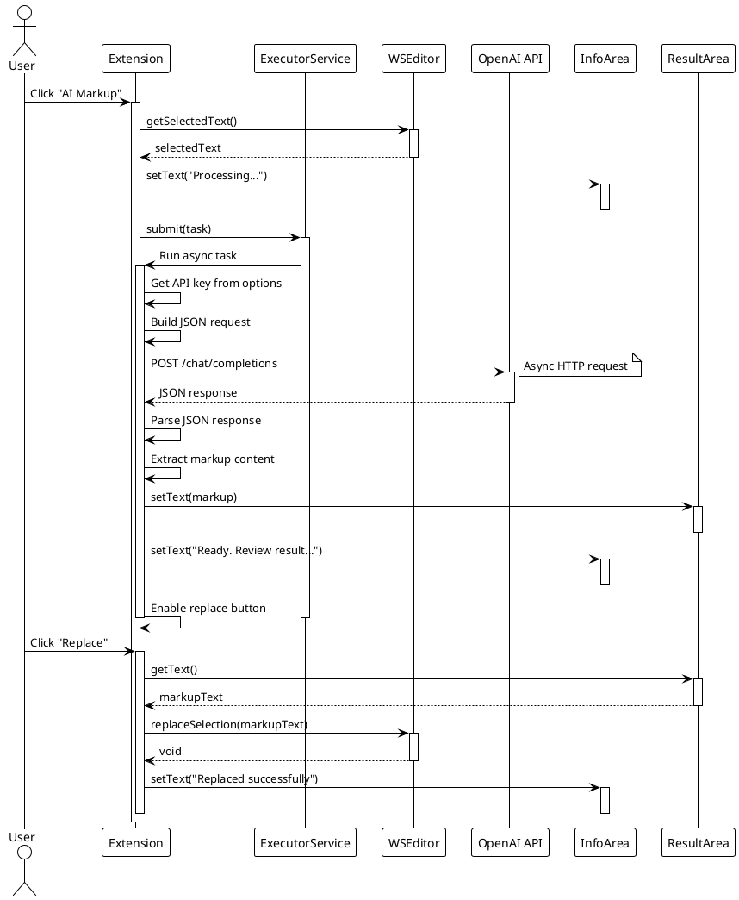


### 3. Ref-to-Link Conversion Sequence

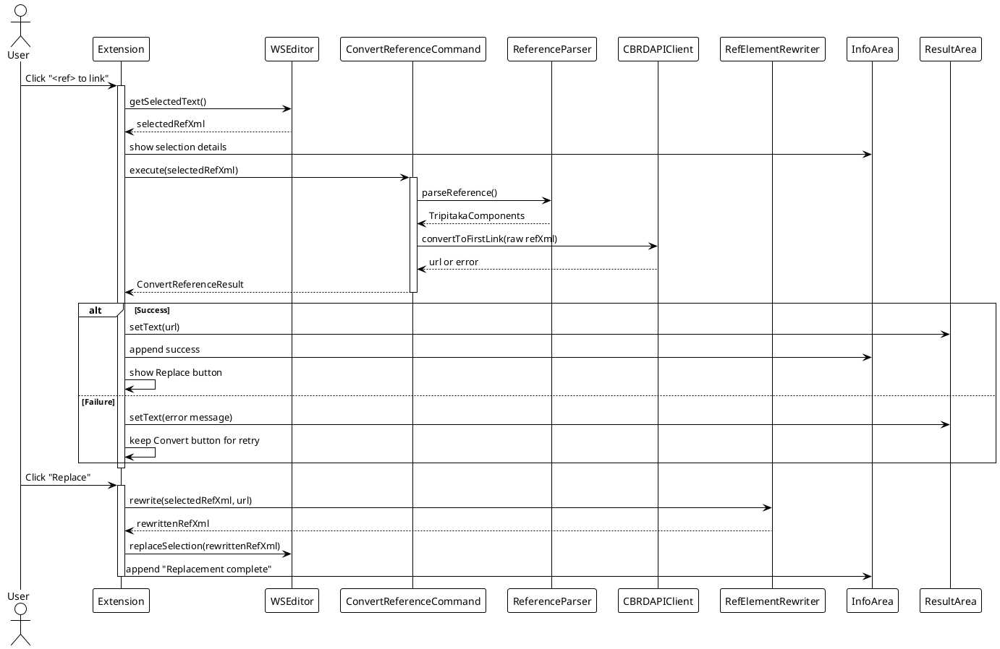

### 4. UTF-8 Validation and Conversion Sequence

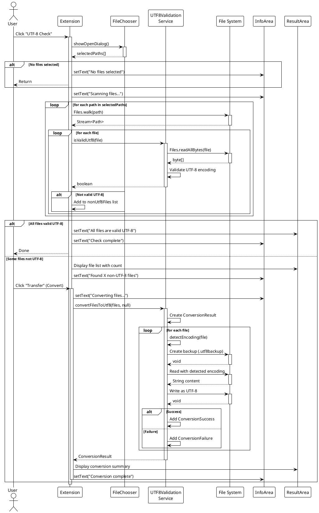

### 5. Tag Removal Sequence

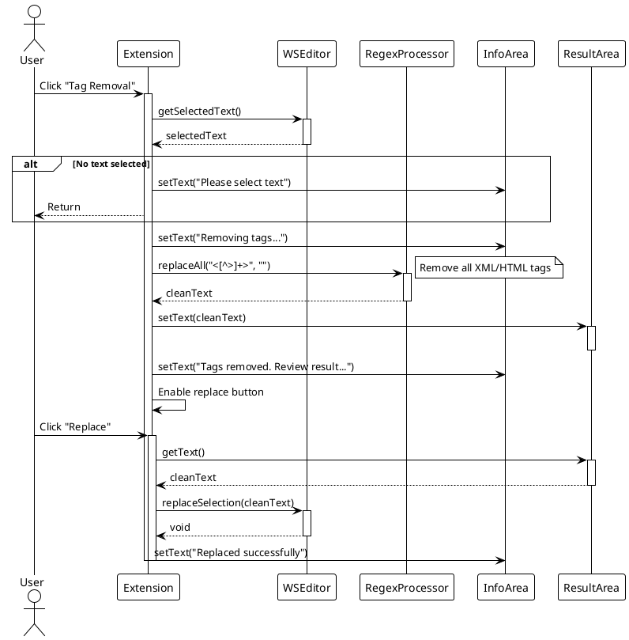

---

## State Diagrams

### 1. Plugin Extension Lifecycle State

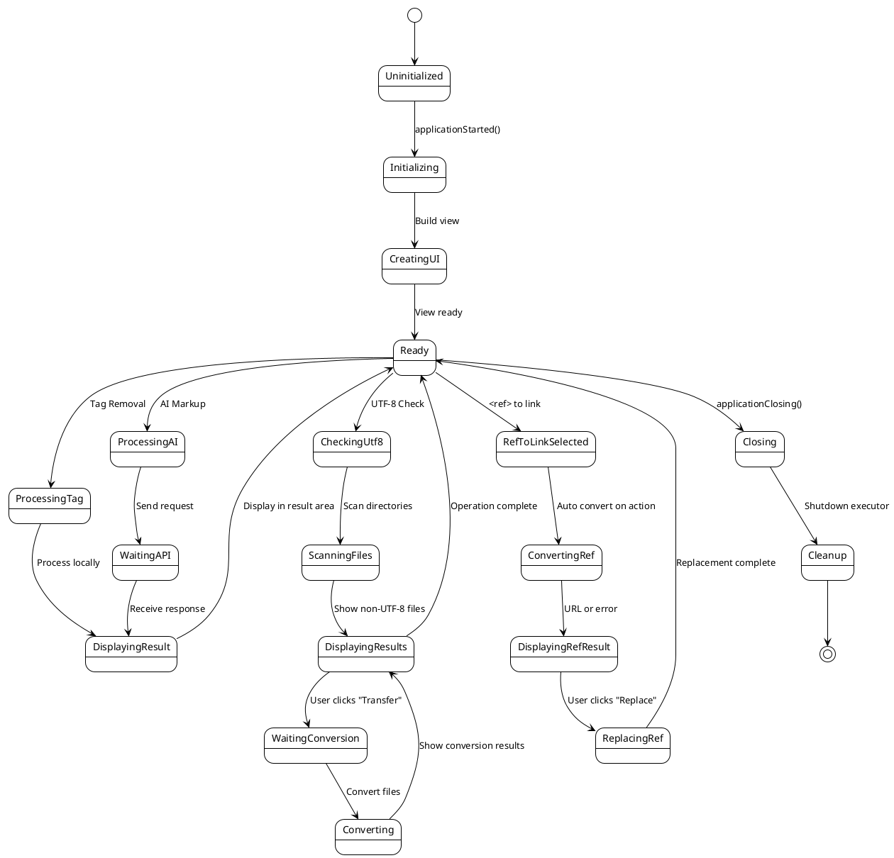


### 2. Conversion Operation State

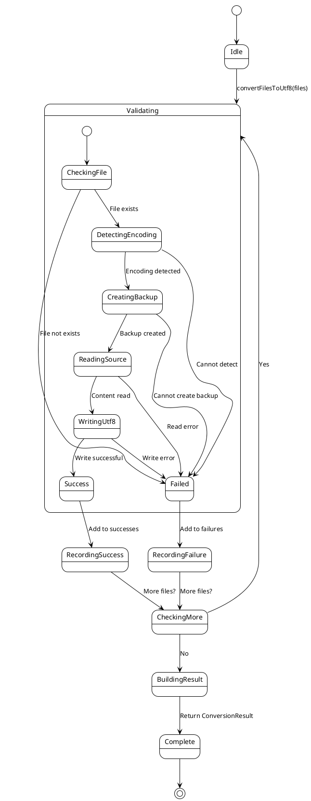

### 3. UI Button State

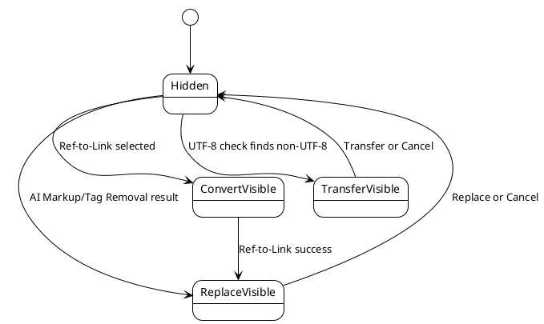


---

## OCL Constraints

### System-Level Invariants

```ocl
-- Plugin Singleton
context DAMAWorkspaceAccessPlugin
inv singleInstance:
    DAMAWorkspaceAccessPlugin.allInstances()->size() <= 1

inv instanceConsistency:
    DAMAWorkspaceAccessPlugin.instance <> null implies
    DAMAWorkspaceAccessPlugin.allInstances()->includes(DAMAWorkspaceAccessPlugin.instance)

-- Extension Initialization
context DAMAWorkspaceAccessPluginExtension
inv uiConsistency:
    self.infoArea <> null and
    self.resultArea <> null and
    self.buttonPanel <> null and
    self.replaceButton <> null and
    self.convertButton <> null and
    self.transferButton <> null and
    self.cancelButton <> null and
    self.executor <> null

inv workspaceRequired:
    self.pluginWorkspaceAccess <> null

-- UTF-8 Service
context UTF8ValidationService
inv noInstances:
    UTF8ValidationService.allInstances()->size() = 0
    
-- Conversion Result
context ConversionResult
inv resultNotEmpty:
    self.successes->size() + self.failures->size() > 0

inv noDuplicateSuccesses:
    self.successes->forAll(s1, s2 | s1 <> s2 implies s1.filePath <> s2.filePath)

inv noDuplicateFailures:
    self.failures->forAll(f1, f2 | f1 <> f2 implies f1.filePath <> f2.filePath)
```


### Pre/Post Conditions

```ocl
-- AI Markup Processing
context DAMAWorkspaceAccessPluginExtension::processAIMarkup(text: String)
pre: text <> null and text.size() > 0
post: result <> null

-- Ref-to-Link Command
context ConvertReferenceCommand::execute(selectedRefXml: String)
pre: selectedRefXml <> null and selectedRefXml.size() > 0
post: result <> null

context RefElementRewriter::rewrite(refXml: String, newUrl: String)
pre: refXml <> null and refXml.size() > 0
pre: newUrl <> null and newUrl.size() > 0
post: result <> null and result.matches('.*<[^>]*ptr[^>]*>.*')

-- UTF-8 Validation
context UTF8ValidationService::isValidUtf8(filePath: Path)
pre fileExists:
    Files.exists(filePath) = true

pre isRegularFile:
    Files.isRegularFile(filePath) = true

pre notTooLarge:
    Files.size(filePath) <= UTF8ValidationService.MAX_FILE_SIZE

post booleanResult:
    result = true or result = false

-- File Conversion
context UTF8ValidationService::convertFilesToUtf8(
    files: Collection(Path),
    encoding: String)
pre filesNotNull:
    files <> null and files->size() > 0

pre filesExist:
    files->forAll(f | Files.exists(f) and Files.isRegularFile(f))

pre filesWritable:
    files->forAll(f | Files.isWritable(f))

post resultComplete:
    result <> null and
    result.getSuccessCount() + result.getFailureCount() = files->size()

post backupsCreated:
    result.getSuccesses()->forAll(s |
        Files.exists(s.getBackupPath()) and
        s.getBackupPath().toString() = s.getFilePath().toString() + '.utf8backup'
    )

post originalContentPreserved:
    result.getSuccesses()->forAll(s |
        -- UTF-8 decoded content equals original decoded content
        Files.readString(s.getFilePath(), StandardCharsets.UTF_8) =
        Files.readString(s.getBackupPath(), Charset.forName(s.getSourceEncoding()))
    )

-- Tag Removal
context DAMAWorkspaceAccessPluginExtension::processTagRemoval(text: String)
pre: text <> null and text.size() > 0
post: not result.matches('.*<[^>]+>.*')
```


### Derived Attributes

```ocl
context ConversionResult
def: totalFiles: Integer = self.successes->size() + self.failures->size()
def: successRate: Real = 
    if self.totalFiles > 0 
    then self.successes->size() / self.totalFiles 
    else 0.0 endif
def: hasFailures: Boolean = self.failures->size() > 0

context DAMAWorkspaceAccessPluginExtension
def: hasResult: Boolean = 
    self.resultArea <> null and 
    self.resultArea.getText() <> null and
    self.resultArea.getText().length() > 0

def: isProcessing: Boolean = 
    self.executor <> null and 
    not self.executor.isShutdown() and
    self.infoArea.getText().contains('Processing')
```

---

## Design Patterns

### 1. Singleton Pattern

**Applied Classes**: `DAMAWorkspaceAccessPlugin`

**Purpose**: Ensure only one plugin instance exists

**Implementation**:
```java
public class DAMAWorkspaceAccessPlugin extends Plugin {
    private static DAMAWorkspaceAccessPlugin instance = null;

    public DAMAWorkspaceAccessPlugin(PluginDescriptor descriptor) {
        super(descriptor);
        if (instance != null) {
            throw new IllegalStateException("Already instantiated!");
        }
        instance = this;
    }
}
```

---

### 2. Command Pattern

**Applied Classes**: `ConvertReferenceCommand`, UI action listeners

**Purpose**: Encapsulate the ref-to-link workflow behind a single command

**Implementation**:
```java
ConvertReferenceCommand command = new ConvertReferenceCommand(
    new ReferenceParser(),
    new CBRDAPIClient(apiUrl, referer, timeoutMs, new HttpUrlConnectionFactory())
);
ConvertReferenceResult result = command.execute(selectedRefXml);
```

---

### 3. Value Object Pattern

**Applied Classes**: `TripitakaComponents`, `TransformedComponents`, `ConvertReferenceResult`,
`ConversionSuccess`, `ConversionFailure`

**Purpose**: Immutable carriers of domain data

**Characteristics**:
- Final fields, no setters
- Equality by value
- Safe to pass across layers

---

### 4. Utility Pattern

**Applied Classes**: `UTF8ValidationService`, `XmlDomUtils`, `PluginLogger`

**Purpose**: Stateless helper methods for cross-cutting concerns

**Implementation**:
```java
Document doc = XmlDomUtils.parseXml(xml);
String serialized = XmlDomUtils.toXmlString(doc.getDocumentElement());
PluginLogger.info("Parsed ref element");
```

---

### 5. Factory Pattern (Lightweight)

**Applied Classes**: `HttpUrlConnectionFactory`

**Purpose**: Centralize creation of HTTP connections for testability

**Implementation**:
```java
HttpURLConnection conn = new HttpUrlConnectionFactory().openConnection(url);
```

---

## Package Structure

### Package Dependency Diagram

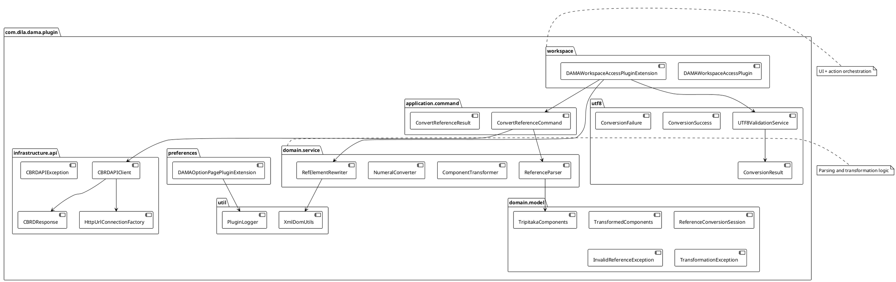

### Package Responsibilities

| Package | Responsibility | Classes | Dependencies |
|---------|---------------|---------|--------------|
| **workspace** | Plugin lifecycle, UI, action orchestration | 2 | preferences, application.command, domain.service, utf8, util, Oxygen SDK, Swing |
| **preferences** | Configuration management, options UI | 1 | Oxygen SDK, util |
| **application.command** | Orchestrate ref-to-link workflow | 2 | domain.service, infrastructure.api |
| **domain.model** | Domain value objects and session state | 5 | Java |
| **domain.service** | Parsing, transformation, rewrite logic | 4 | domain.model, util |
| **infrastructure.api** | CBRD API integration | 4 | domain.model, util, org.json |
| **util** | XML parsing + logging utilities | 2 | Java XML, IO |
| **utf8** | UTF-8 validation and conversion | 4 | Java NIO |

---

## Deployment View

### Component Deployment

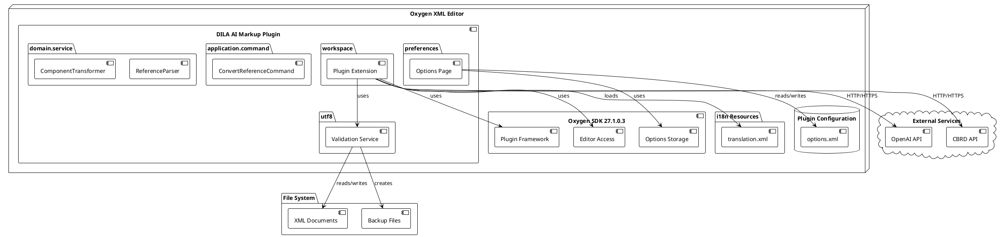

### Runtime Environment

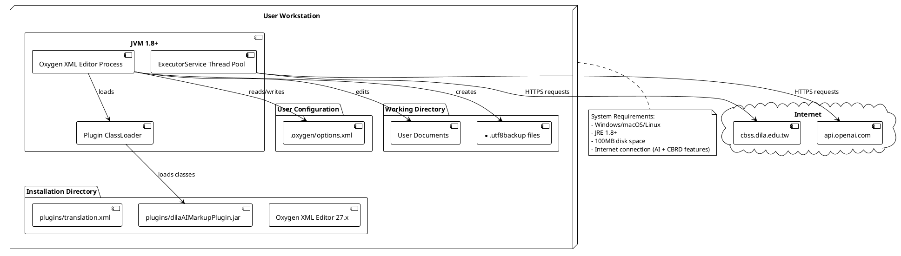

---

## Implementation Notes

### Thread Safety

```ocl
context DAMAWorkspaceAccessPluginExtension
inv threadSafe:
    -- ExecutorService ensures thread-safe async operations
    self.executor <> null implies self.executor.isShutdown() = false

context UTF8ValidationService
inv stateless:
    -- All methods are static, no shared mutable state
    UTF8ValidationService.allInstances()->size() = 0
```

### Performance Considerations

```ocl
context UTF8ValidationService::convertFilesToUtf8(files: Collection(Path), encoding: String)
inv performanceLimit:
    -- Each file must be under MAX_FILE_SIZE
    files->forAll(f | Files.size(f) <= UTF8ValidationService.MAX_FILE_SIZE)

context UTF8ValidationService::isValidUtf8(filePath: Path)
inv fileSize:
    Files.size(filePath) <= UTF8ValidationService.MAX_FILE_SIZE
```

### Error Handling

```ocl
context ConversionResult
inv errorHandling:
    -- All files must result in either success or failure
    self.successes->size() + self.failures->size() > 0

context ConversionFailure
inv errorMessage:
    -- Error messages must be meaningful
    self.error <> null and self.error.size() > 0
```

---

## Appendix: OCL Reference

### OCL Types Used

| Type | Description | Example |
|------|-------------|---------|
| **Boolean** | True/false values | `result = true` |
| **Integer** | Whole numbers | `files->size() = 5` |
| **Real** | Floating point | `successRate = 0.85` |
| **String** | Text strings | `key = 'dila.dama.api.key'` |
| **Collection(T)** | Generic collection | `files: Collection(Path)` |
| **Set(T)** | Unique elements | `Set{1, 2, 3}` |
| **Sequence(T)** | Ordered collection | `Sequence{a, b, c}` |

### OCL Operators

| Operator | Description | Example |
|----------|-------------|---------|
| `->size()` | Collection size | `files->size() > 0` |
| `->forAll(v \| expr)` | All elements satisfy | `files->forAll(f \| f <> null)` |
| `->exists(v \| expr)` | At least one satisfies | `files->exists(f \| isValidUtf8(f))` |
| `->select(v \| expr)` | Filter elements | `files->select(f \| not isValidUtf8(f))` |
| `->includes(elem)` | Contains element | `successes->includes(s)` |
| `@pre` | Previous value | `self.value@pre = self.value` |

### OCL Keywords

- `context`: Define constraint context
- `inv`: Invariant (always true)
- `pre`: Precondition (must be true before operation)
- `post`: Postcondition (must be true after operation)
- `def`: Derived attribute or operation
- `implies`: Logical implication (A implies B)
- `and`, `or`, `not`: Logical operators
- `if-then-else-endif`: Conditional expression
- `let-in`: Variable binding

---

## Document History

| Version | Date | Author | Changes |
|---------|------|--------|---------|
| 0.4.0 | 2026-01-05 | Jeff Y.H. Wu | Update architecture for ref-to-link pipeline and CBRD API |
| 1.0 | 2025-10-10 | Jeff Y.H. Wu | Initial RUP design document |

---

## References

1. **Rational Unified Process (RUP)**: IBM Rational Software
2. **UML 2.5 Specification**: Object Management Group (OMG)
3. **OCL 2.4 Specification**: Object Management Group (OMG)
4. **Oxygen XML Editor SDK Documentation**: Syncro Soft
5. **Java Platform SE 8 Documentation**: Oracle Corporation
6. **Design Patterns**: Gamma, Helm, Johnson, Vlissides (Gang of Four)

---

*End of RUP Design Document*
