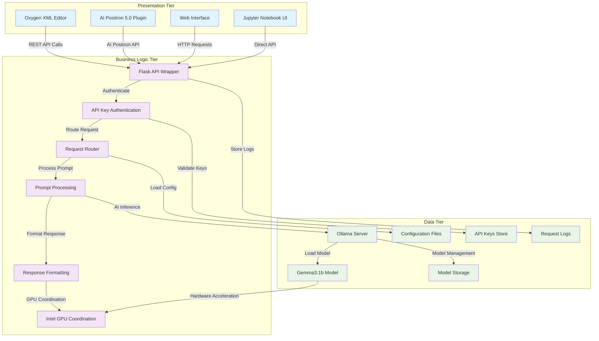
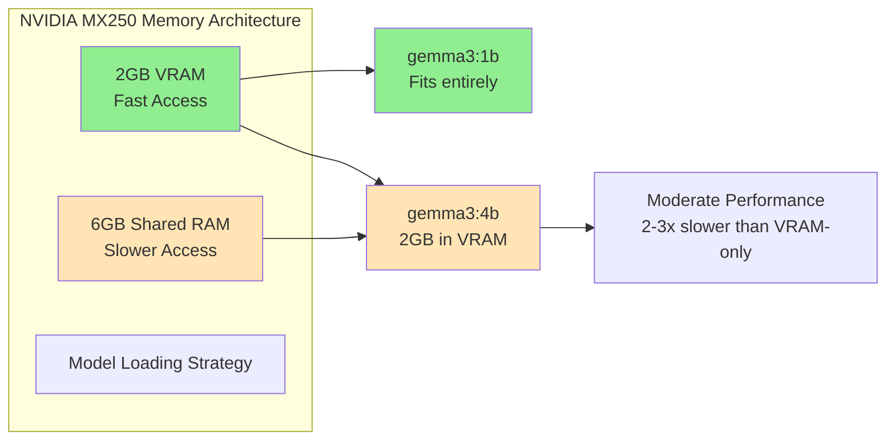

[](https://deepwiki.com/happypig/OCR)

## Architecture

### 3-Tier Architecture - Local LLM Implementation



#### Implementation Details:

- **Presentation Tier**:

  - Oxygen XML Editor with AI Positron 5.0 plugin integration
  - Jupyter Notebook interface for development and testing
  - Web-based interfaces for API interaction
- **Business Logic Tier**:

  - Flask API wrapper (`OxygenOllamaAPI`) with CORS support
  - API key authentication (`X-API-Key`, `Authorization Bearer`)
  - Request routing and prompt processing logic
  - Response formatting and Intel GPU coordination
- **Data Tier**:

  - **Ollama Server**: Specialized AI inference data service
  - **Gemma3:1b Model**: Core language model for text generation
  - Local model storage and configuration management
  - Secure API key storage and request logging

#### Key Endpoints:

- `POST /api/generate` - Text generation (authenticated)
- `POST /api/chat/completions` - OpenAI-compatible chat (authenticated)
- `GET /api/health` - Service health check (public)
- `GET /api/models` - List available models (authenticated)
- `GET /api/key` - Retrieve API key information (public)

#### Security Features:

- API key authentication with multiple methods
- CORS configuration for cross-origin requests
- Rate limiting and request logging
- Secure key generation and validation

## Performance Analysis

### Model Performance Comparison

Based on comprehensive testing with Oxygen XML Editor AI Positron integration, here are the performance results for different models and configurations:

#### Test Configuration
- **Hardware**: Intel system with NVIDIA MX250 GPU (2GB VRAM + 8GB shared memory)
- **Test Cases**: 
  - Simple reference: `p.67c4` → `<ref>p.<p>67</p><c>c</c><l>4</l></ref>`
  - Complex reference: `T.No.366,p.348b9` → `<ref><canon>T</canon>.No.<w>366</w>,p.<p>348</p><c>b</c><l>9</l></ref>`

#### Performance Results

| AI Service | Model | Speed | Accuracy | Memory Usage | Recommendation |
|------------|-------|--------|----------|--------------|----------------|
| **AI Positron (Cloud)** | GPT-4o | Fast | ✅ Excellent | N/A | Best for production |
| | GPT-4o mini | Fast | ✅ Excellent | N/A | Cost-effective cloud option |
| **Local Enterprise** | gemma3:12b | ⚠️ Slower | ✅ Excellent | 11.3GB (requires upgrade) | High accuracy, needs more RAM |
| | gemma3:4b | Moderate | ✅ Good | 3.3GB (VRAM+Shared) | Balanced local option |
| | gemma3:1b | Fast | ❌ Limited | 1.3GB (VRAM only) | Speed over accuracy |
| | llama3.1:8b | ⚠️ Slow | ✅ Excellent | 8GB+ | High quality but slow |
| | mistral:7b | ⚠️ Slow | ❌ Poor | 7GB+ | Not recommended |
| | qwen3:8b | ⚠️ Very Slow | ⚠️ Mixed | 8GB+ | Unstable performance |
| | deepseek-r1:1.5b | ⚠️ Unstable | ❌ Poor | 1.5GB | Not reliable |

#### Memory Optimization for MX250



#### Recommended Configurations

##### For Production Use
```json
{
  "cloud_service": {
    "provider": "OpenAI via AI Positron",
    "model": "GPT-4o mini",
    "pros": ["Fast", "Reliable", "Excellent accuracy"],
    "cons": ["Requires internet", "Usage costs"]
  }
}
```

##### For Local Development
```json
{
  "local_service": {
    "model": "gemma3:4b",
    "memory_config": {
      "vram_usage": "2GB",
      "shared_memory": "1.3GB",
      "gpu_layers": 20
    },
    "pros": ["Good accuracy", "Privacy", "No internet required"],
    "cons": ["Slower than cloud", "Higher memory usage"]
  }
}
```

##### For Resource-Constrained Systems
```json
{
  "lightweight_service": {
    "model": "gemma3:1b",
    "memory_config": {
      "vram_usage": "1.3GB",
      "shared_memory": "0GB"
    },
    "pros": ["Fast local inference", "Low memory usage"],
    "cons": ["Limited accuracy for complex tasks"]
  }
}
```

### Performance Optimization Guidelines

#### Model Selection Matrix

| Use Case | Recommended Model | Expected Performance | Memory Requirement |
|----------|-------------------|---------------------|-------------------|
| **Production XML editing** | GPT-4o mini | Excellent | Cloud |
| **Privacy-focused development** | gemma3:4b | Good | 4GB total |
| **Quick prototyping** | gemma3:1b | Fast but limited | 2GB VRAM |
| **High-accuracy local** | llama3.1:8b | Slow but excellent | 8GB+ |

#### Hardware Upgrade Recommendations

1. **RAM Upgrade**: Increase to 16GB+ for better model support
2. **GPU Upgrade**: RTX 3060 (12GB) or better for larger models
3. **Storage**: NVMe SSD for faster model loading

#### Performance Tuning Parameters

```python
# Optimized settings for MX250
gpu_optimization = {
    "gemma3:1b": {
        "num_gpu": 35,      # Full GPU utilization
        "num_predict": 2000,
        "timeout": 60
    },
    "gemma3:4b": {
        "num_gpu": 20,      # Conservative for shared memory
        "num_predict": 1500,
        "timeout": 120
    }
}
```

### Testing Methodology

The performance analysis was conducted using:

1. **Standardized prompts** for XML reference markup
2. **Multiple test iterations** for consistency
3. **Memory monitoring** during inference
4. **Response quality evaluation** against expected outputs
5. **Speed measurements** including model loading time

This data helps users choose the optimal configuration based on their hardware constraints and accuracy requirements.
