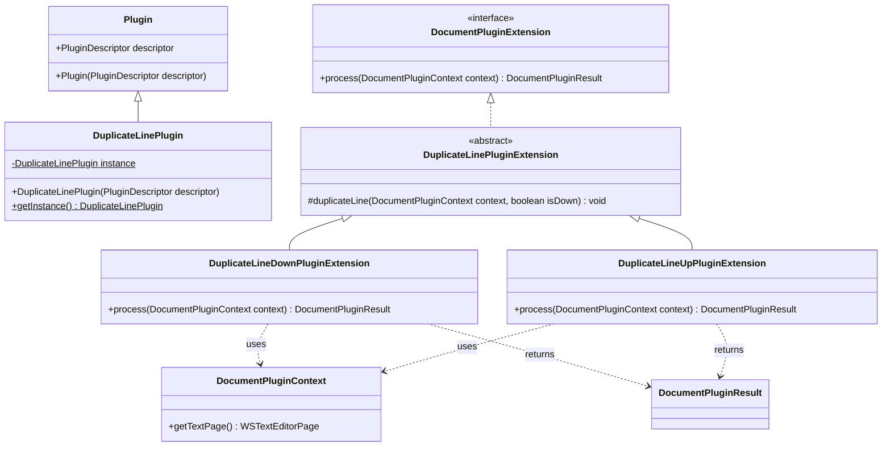

# Duplicate Line Plugin Overview

## Table of Contents
- [Introduction](#introduction)
- [Architecture](#architecture)
- [Class Structure](#class-structure)
- [Features](#features)
- [Implementation Details](#implementation-details)
- [Usage](#usage)
- [Code Examples](#code-examples)
- [Design Patterns](#design-patterns)
- [Extension Points](#extension-points)

## Introduction

The **Duplicate Line Plugin** is an Oxygen XML Editor extension that provides functionality to duplicate text lines in both upward and downward directions. This plugin demonstrates how to implement document manipulation features using the Oxygen SDK's DocumentPluginExtension framework.

### Key Capabilities
- ✅ Duplicate current line downward (below current line)
- ✅ Duplicate current line upward (above current line)
- ✅ Automatic cursor positioning after duplication
- ✅ Undo/Redo support through compound operations
- ✅ Text selection management

## Architecture

### Component Overview
```
DuplicateLinePlugin (Main Plugin)
├── DuplicateLinePluginExtension (Abstract Base)
├── DuplicateLineDownPluginExtension (Concrete Implementation)
└── DuplicateLineUpPluginExtension (Concrete Implementation)
```

### Class Diagram


## Class Structure

### 1. DuplicateLinePlugin
**Purpose**: Main plugin class implementing the singleton pattern
**Responsibilities**:
- Plugin lifecycle management
- Singleton instance control
- Plugin descriptor handling

```java
public class DuplicateLinePlugin extends Plugin {
    private static DuplicateLinePlugin instance = null;
    
    public DuplicateLinePlugin(PluginDescriptor descriptor) {
        super(descriptor);
        if (instance != null) {
            throw new IllegalStateException("Already instantiated!");
        }
        instance = this;
    }
    
    public static DuplicateLinePlugin getInstance() {
        return instance;
    }
}
```

### 2. DuplicateLinePluginExtension (Abstract Base)
**Purpose**: Common functionality for line duplication operations
**Key Features**:
- Protected `duplicateLine()` method with direction parameter
- Document manipulation logic
- Cursor and selection management
- Undo/Redo operation support

### 3. DuplicateLineDownPluginExtension
**Purpose**: Concrete implementation for downward duplication
**Behavior**: Duplicates the current line below the cursor position

### 4. DuplicateLineUpPluginExtension
**Purpose**: Concrete implementation for upward duplication
**Behavior**: Duplicates the current line above the cursor position

## Features

### Core Functionality

#### Line Duplication Logic
1. **Cursor Position Detection**: Determines the current line based on caret offset
2. **Line Boundary Calculation**: Identifies start and end positions of the target line
3. **Text Extraction**: Retrieves the complete line content including newline characters
4. **Insertion**: Places the duplicated line at the appropriate position
5. **Selection Update**: Positions cursor and selection appropriately

#### Direction-Specific Behavior

| Direction | Implementation | Cursor Behavior |
|-----------|----------------|-----------------|
| **Down** | `isDown = true` | Moves to duplicated line below |
| **Up** | `isDown = false` | Stays on original line |

### Advanced Features

#### Compound Undo Operations
```java
textPage.beginCompoundUndoableEdit();
try {
    // Perform duplication operations
} finally {
    textPage.endCompoundUndoableEdit();
}
```

#### Edge Case Handling
- **End of Document**: Automatically adds newline if needed
- **Empty Lines**: Properly handles lines with no content
- **Selection Management**: Maintains appropriate text selection after duplication

## Implementation Details

### Core Algorithm

```java
protected void duplicateLine(final DocumentPluginContext context, final boolean isDown) {
    WSTextEditorPage textPage = (WSTextEditorPage) context.getTextPage();
    int caretOffset = textPage.getCaretOffset();

    textPage.beginCompoundUndoableEdit();
    try {
        // 1. Calculate line boundaries
        int lineOfOffset = textPage.getLineOfOffset(caretOffset);
        int offsetOfLineStart = textPage.getOffsetOfLineStart(lineOfOffset);
        int offsetOfLineEnd = textPage.getOffsetOfLineEnd(lineOfOffset);
        
        // 2. Extract line content
        String lineToDuplicate = textPage.getDocument().getText(
            offsetOfLineStart, 
            offsetOfLineEnd - offsetOfLineStart - 1
        ) + "\n";
        
        // 3. Handle end-of-document edge case
        if (offsetOfLineEnd > textPage.getDocument().getLength()) {
            lineToDuplicate = lineToDuplicate.substring(0, offsetOfLineEnd - offsetOfLineStart - 1);
            offsetOfLineEnd = textPage.getDocument().getLength();
            textPage.getDocument().insertString(offsetOfLineEnd, "\n", null);
            offsetOfLineEnd++;
            if (isDown) {
                offsetOfLineStart++;
            }
        }
        
        // 4. Insert duplicated line
        textPage.getDocument().insertString(offsetOfLineEnd, lineToDuplicate, null);

        // 5. Update selection based on direction
        if (isDown) {
            textPage.select(offsetOfLineEnd + (offsetOfLineEnd - offsetOfLineStart), offsetOfLineEnd);
        } else {
            textPage.select(offsetOfLineEnd, offsetOfLineStart);
        }
    } catch (BadLocationException e) {
        e.printStackTrace();
    } finally {
        textPage.endCompoundUndoableEdit();
    }
}
```

### Plugin Registration

Extensions are typically registered through the plugin descriptor (`plugin.xml`):

```xml
<plugin>
    <extension type="DocumentPlugin" class="ro.sync.sample.plugin.duplicateLine.DuplicateLineDownPluginExtension"/>
    <extension type="DocumentPlugin" class="ro.sync.sample.plugin.duplicateLine.DuplicateLineUpPluginExtension"/>
</plugin>
```

## Usage

### User Interaction
1. **Position Cursor**: Place cursor on the line to be duplicated
2. **Invoke Action**: Use keyboard shortcut or menu option
3. **Result**: Line is duplicated in the specified direction with appropriate cursor positioning

### Integration Points
- **Keyboard Shortcuts**: Can be bound to key combinations (e.g., Ctrl+D, Ctrl+Shift+D)
- **Context Menus**: Right-click menu integration
- **Toolbar Buttons**: Custom toolbar actions
- **Menu Items**: Editor menu integration

## Code Examples

### Basic Usage Pattern
```java
// Down duplication
public class DuplicateLineDownPluginExtension extends DuplicateLinePluginExtension {
    @Override
    public DocumentPluginResult process(DocumentPluginContext context) {
        duplicateLine(context, true);  // isDown = true
        return null;
    }
}

// Up duplication  
public class DuplicateLineUpPluginExtension extends DuplicateLinePluginExtension {
    @Override
    public DocumentPluginResult process(DocumentPluginContext context) {
        duplicateLine(context, false); // isDown = false
        return null;
    }
}
```

### Extension Example
```java
// Custom extension for triple duplication
public class TripleDuplicatePluginExtension extends DuplicateLinePluginExtension {
    @Override
    public DocumentPluginResult process(DocumentPluginContext context) {
        duplicateLine(context, true);  // First duplication
        duplicateLine(context, true);  // Second duplication
        duplicateLine(context, true);  // Third duplication
        return null;
    }
}
```

## Design Patterns

### 1. Singleton Pattern
- **Implementation**: `DuplicateLinePlugin` class
- **Purpose**: Ensures single plugin instance
- **Benefits**: Resource management, state consistency

### 2. Template Method Pattern
- **Implementation**: `DuplicateLinePluginExtension` abstract class
- **Purpose**: Common algorithm with variable direction behavior
- **Benefits**: Code reuse, consistent behavior

### 3. Strategy Pattern
- **Implementation**: Different concrete extensions for up/down
- **Purpose**: Encapsulate direction-specific logic
- **Benefits**: Extensibility, clean separation of concerns

## Extension Points

### Custom Duplication Behaviors
```java
// Example: Duplicate with modification
public class DuplicateAndCommentPluginExtension extends DuplicateLinePluginExtension {
    @Override
    public DocumentPluginResult process(DocumentPluginContext context) {
        duplicateLine(context, true);
        // Additional logic to comment out the duplicated line
        addCommentToLine(context);
        return null;
    }
}
```

### Integration with Other Features
- **Line Numbering**: Update line number displays
- **Syntax Highlighting**: Maintain syntax coloring
- **Code Folding**: Preserve folding states
- **Bookmarks**: Handle bookmark positions

## Technical Specifications

### Dependencies
- **Oxygen SDK**: Core framework dependency
- **Java Swing**: Text component integration
- **Document API**: Text manipulation operations

### Performance Considerations
- **Memory Usage**: Minimal - only duplicates single lines
- **Response Time**: Near-instantaneous for typical use cases
- **Large Documents**: Efficient even with large files due to offset-based operations

### Error Handling
- **BadLocationException**: Handled gracefully with fallback
- **Compound Operations**: Automatic rollback on failure
- **Edge Cases**: Robust handling of document boundaries

## Summary

The Duplicate Line Plugin demonstrates a clean, extensible approach to document manipulation in Oxygen XML Editor. It showcases:

- **Clean Architecture**: Well-separated concerns with abstract base classes
- **Robust Implementation**: Proper error handling and edge case management  
- **Extensibility**: Easy to extend for additional duplication behaviors
- **User Experience**: Smooth operation with proper undo/redo support
- **Best Practices**: Following Oxygen SDK patterns and conventions

This plugin serves as an excellent example for developers looking to implement similar text manipulation features in Oxygen XML Editor plugins.