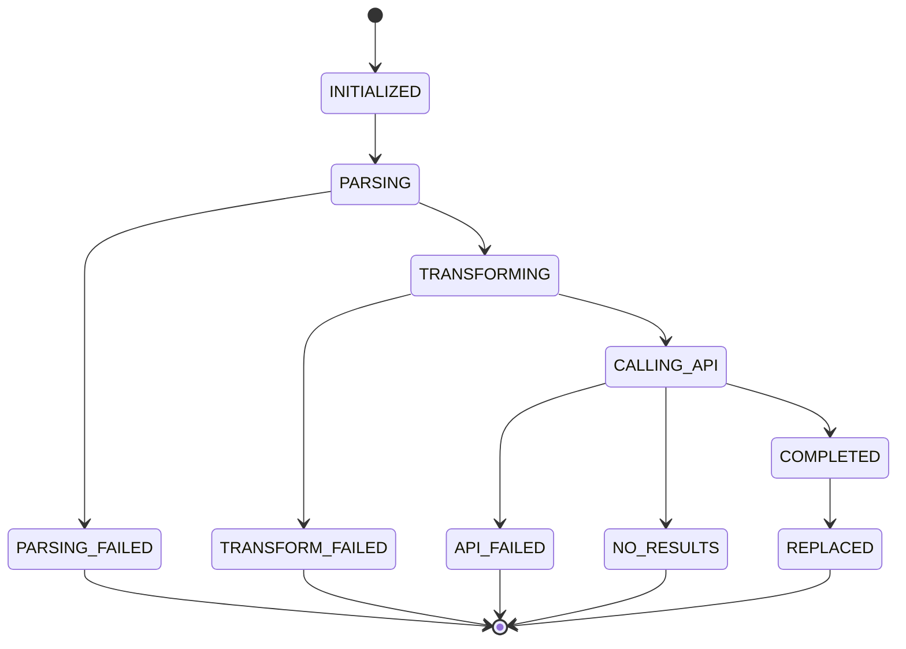

# Data Model: Ref to Link Action

**Branch**: `001-ref-to-link-action` | **Date**: 2026-01-05 | **Spec**: [spec.md](spec.md)

---

## Overview

This document defines the data model for the Ref to Link feature, including entities, value objects, validation rules, and state transitions. The model follows Domain-Driven Design (DDD) principles from the project constitution.

---

## Domain Entities

### 1. TripitakaComponents (Value Object)

**Purpose**: Immutable representation of parsed Tripitaka reference components extracted from a `<ref>` element.

**Package**: `com.dila.dama.plugin.domain.model`

**Fields**:

| Field | Type | Required | Description | Validation Rules |
|-------|------|----------|-------------|------------------|
| `canon` | String | Yes | Canon code (e.g., "T", "X") or name (e.g., "大正蔵", "続蔵") | Non-null, non-empty, trimmed |
| `volume` | String | Yes | Volume number (may contain CJK numerals or punctuation) | Non-null, non-empty, trimmed |
| `work` | String | No | Work number | Trimmed if present, null if absent |
| `page` | String | Yes | Page number (may contain CJK numerals) | Non-null, non-empty, trimmed |
| `column` | String | No | Column indicator (e.g., "上", "左上", "a") | Trimmed if present, null if absent |
| `line` | String | No | Line indicator (may contain CJK numerals) | Trimmed if present, null if absent |

**Characteristics**:
- **Immutable**: All fields are final, no setters
- **Validated on construction**: Constructor throws `IllegalArgumentException` if required fields are missing
- **Value semantics**: Implements `equals()` and `hashCode()` based on all fields

**Example**:
```java
TripitakaComponents components = new TripitakaComponents(
    "続蔵",      // canon (raw from document)
    "一・一六",   // volume (raw, needs transformation)
    null,        // work (optional)
    "二四九",    // page (raw, needs transformation)
    "左上",      // column (optional, needs transformation)
    null         // line (optional)
);
```

**Behavior Methods**:
- `hasColumn()` → boolean: Returns true if column is non-null and non-empty
- `hasLine()` → boolean: Returns true if line is non-null and non-empty
- `hasWork()` → boolean: Returns true if work is non-null and non-empty

---

### 2. TransformedComponents (Value Object)

**Purpose**: Immutable representation of Tripitaka components after transformation to API-compatible format.

**Package**: `com.dila.dama.plugin.domain.model`

**Fields**:

| Field | Type | Required | Description | Validation Rules |
|-------|------|----------|-------------|------------------|
| `canonCode` | String | Yes | Canon code (e.g., "T", "X") | Non-null, uppercase, 1-2 characters |
| `volume` | String | Yes | Volume number in Arabic numerals (e.g., "24", "1.16") | Non-null, numeric or numeric with punctuation |
| `work` | String | No | Work number in Arabic numerals | Numeric if present, null if absent |
| `page` | String | No | Page number in Arabic numerals | Numeric if present, null if absent |
| `column` | String | No | Column code (e.g., "a", "b", "c") | Single letter [a-c] if present, null if absent |
| `line` | String | No | Line number in Arabic numerals | Numeric if present, null if absent |

**Characteristics**:
- **Immutable**: All fields are final
- **API-ready**: All values formatted for CBRD API consumption
- **Validated**: Constructor validates API-compatible format

**Example**:
```java
TransformedComponents transformed = new TransformedComponents(
    "X",     // canonCode (transformed from "続蔵")
    "1.16",  // volume (transformed from "一・一六")
    null,    // work
    "249",   // page (transformed from "二四九")
    "a",     // column (transformed from "左上")
    null     // line
);
```

---

### 3. CBRDResponse (Data Transfer Object)

**Purpose**: Represents the JSON response from CBRD API.

**Package**: `com.dila.dama.plugin.infrastructure.api`

**Fields**:

| Field | Type | Required | Description | Validation Rules |
|-------|------|----------|-------------|------------------|
| `success` | boolean | Yes | Indicates if API call succeeded | Must be true or false |
| `found` | String[] | Yes | Array of CBETA URLs (may be empty) | Non-null array (can be empty) |
| `error` | String | No | Error message if `success` is false | Null if success is true |

**JSON Mapping**:
```json
{
  "success": true,
  "found": ["https://cbetaonline.dila.edu.tw/T1514"],
  "error": null
}
```

**Factory Methods**:
- `fromJson(String json)` → CBRDResponse: Parse JSON string to object
- `isSuccessful()` → boolean: Returns `success && found.length > 0`
- `getFirstUrl()` → String: Returns `found[0]` if available, null otherwise

---

### 4. ReferenceConversionSession (Aggregate Root)

**Purpose**: Tracks the complete state of a reference conversion workflow session.

**Package**: `com.dila.dama.plugin.domain.model`

**Fields**:

| Field | Type | Required | Description | Validation Rules |
|-------|------|----------|-------------|------------------|
| `sessionId` | String | Yes | Unique identifier for this conversion session | UUID format |
| `selectedRefXml` | String | Yes | Raw XML of selected `<ref>` element | Non-null, starts with "<ref" |
| `parsedComponents` | TripitakaComponents | No | Parsed components from XML | Null until parsing completes |
| `transformedComponents` | TransformedComponents | No | Transformed API-ready components | Null until transformation completes |
| `generatedUrl` | String | No | CBETA URL from API | Null until API call completes |
| `status` | ConversionStatus | Yes | Current status of conversion | Valid enum value |
| `errorMessage` | String | No | Error message if conversion fails | Null if no error |
| `timestamp` | long | Yes | Session creation timestamp | Unix epoch milliseconds |

**ConversionStatus Enum**:
```java
public enum ConversionStatus {
    INITIALIZED,        // Session created, no processing yet
    PARSING,            // Parsing selected XML
    PARSING_FAILED,     // XML parsing failed
    TRANSFORMING,       // Transforming components for API
    TRANSFORM_FAILED,   // Transformation failed
    CALLING_API,        // CBRD API call in progress
    API_FAILED,         // API call failed
    NO_RESULTS,         // API succeeded but returned no URLs
    COMPLETED,          // URL generated successfully
    REPLACED            // User applied replacement to document
}
```

**State Transition Rules**:
```
INITIALIZED
    → PARSING (start parsing)

PARSING
    → PARSING_FAILED (parsing error)
    → TRANSFORMING (parsing success)

TRANSFORMING
    → TRANSFORM_FAILED (transformation error)
    → CALLING_API (transformation success)

CALLING_API
    → API_FAILED (network/HTTP error)
    → NO_RESULTS (API returned empty found array)
    → COMPLETED (API returned URL)

COMPLETED
    → REPLACED (user clicked Replace button)
```

**Validation Rules**:
1. Status can only transition forward, never backward
2. `errorMessage` must be set when transitioning to any `*_FAILED` or `NO_RESULTS` status
3. `parsedComponents` must be non-null in `TRANSFORMING`, `CALLING_API`, `COMPLETED`, `REPLACED` statuses
4. `generatedUrl` must be non-null in `COMPLETED` and `REPLACED` statuses

**Behavior Methods**:
- `startParsing()` → void: Transition to PARSING
- `completeParsing(TripitakaComponents)` → void: Transition to TRANSFORMING
- `failParsing(String error)` → void: Transition to PARSING_FAILED
- `completeTransforming(TransformedComponents)` → void: Transition to CALLING_API
- `failTransforming(String error)` → void: Transition to TRANSFORM_FAILED
- `completeApiCall(String url)` → void: Transition to COMPLETED
- `failApiCall(String error)` → void: Transition to API_FAILED
- `noResults()` → void: Transition to NO_RESULTS with appropriate message
- `markReplaced()` → void: Transition to REPLACED

---

## Domain Services

### 1. ReferenceParser

**Purpose**: Domain service for parsing `<ref>` XML elements to extract Tripitaka components.

**Package**: `com.dila.dama.plugin.domain.service`

**Inputs**:
- `refXml` (String): Raw XML string of `<ref>` element

**Outputs**:
- `TripitakaComponents`: Parsed components

**Exceptions**:
- `InvalidReferenceException`: Thrown if XML is malformed or required elements missing

**Validation Rules**:
1. Input must be non-null and non-empty
2. Input must start with "<ref"
3. Input must be valid XML (parseable by DOM)
4. Must contain `<canon>` element with non-empty text
5. Must contain `<v>` (volume) element with non-empty text
6. Must contain `<p>` (page) element with non-empty text
7. Optional elements (`<w>`, `<c>`, `<l>`) can be missing or empty

---

### 2. ComponentTransformer

**Purpose**: Domain service for transforming raw Tripitaka components to API-compatible format.

**Package**: `com.dila.dama.plugin.domain.service`

**Inputs**:
- `components` (TripitakaComponents): Raw components from parser

**Outputs**:
- `TransformedComponents`: API-ready components

**Exceptions**:
- `TransformationException`: Thrown if transformation fails (unknown canon, invalid numerals, etc.)

**Transformation Rules**:

#### Canon Name to Code Mapping
| Canon Name (Chinese) | Canon Name (Japanese) | Canon Code |
|---------------------|---------------------|------------|
| 大正蔵 | 大正蔵 | T |
| 続蔵 | 続蔵 | X |

**Note**: Additional canons should be added to mapping table as needed.

#### CJK Numeral to Arabic Conversion
| CJK Character | Arabic Value |
|--------------|--------------|
| 〇 | 0 |
| 一 | 1 |
| 二 | 2 |
| 三 | 3 |
| 四 | 4 |
| 五 | 5 |
| 六 | 6 |
| 七 | 7 |
| 八 | 8 |
| 九 | 9 |

**Conversion Algorithm**:
- Single digits: 一 → "1", 二 → "2", etc.
- Two-digit numbers: 二四 → "24" (concatenate)
- With punctuation: 一・一六 → "1.16" (preserve punctuation)
- Mixed format: Handle combinations of CJK and Arabic numerals

#### Column Position Mapping
| Column Text | Column Code |
|------------|-------------|
| 上 (upper) | a |
| 中 (middle) | b |
| 下 (lower) | c |
| 左上 (upper left) | a |
| 右上 (upper right) | a |
| 左中 (middle left) | b |
| 右中 (middle right) | b |
| 左下 (lower left) | c |
| 右下 (lower right) | c |

**Note**: Left/right distinction is lost in API format; only upper/middle/lower matters.

---

## Infrastructure Layer

### 1. CBRDAPIClient

**Purpose**: HTTP client for calling CBRD API.

**Package**: `com.dila.dama.plugin.infrastructure.api`

**Configuration**:
- `apiUrl`: String (default: `https://cbss.dila.edu.tw/dev/cbrd/link`)
- `refererHeader`: String (default: `CBRD@dila.edu.tw`)
- `timeout`: int (default: 10000ms, per-attempt connect/read timeout)
- `maxAttempts`: int (default: 3, timeout retries)
- `baseBackoffMs`: long (default: 250ms, exponential backoff between retries)

**Inputs**:
- `components` (TransformedComponents): API-ready components

**Outputs**:
- `String`: CBETA URL (first URL from `found` array)
- `null`: If API returns empty results

**Exceptions**:
- `CBRDAPIException`: Thrown if API call fails (network error, HTTP error, timeout)

**Request Format**:
```
GET https://cbss.dila.edu.tw/dev/cbrd/link?q=<ref><canon>T</canon><v>25</v>.<w>1514</w></ref>
Headers:
  Referer: CBRD@dila.edu.tw
```

**XML Query Construction**:
```xml
<ref>
  <canon>{canonCode}</canon>
  <v>{volume}</v>
  [.<w>{work}</w>]  <!-- Only if work is present -->
  [<p>{page}</p>]   <!-- Only if page is present -->
  [<c>{column}</c>] <!-- Only if column is present -->
  [<l>{line}</l>]   <!-- Only if line is present -->
</ref>
```

**Response Handling**:
1. HTTP 200 + `success: true` + non-empty `found` array → Return `found[0]`
2. HTTP 200 + `success: true` + empty `found` array → Return null
3. HTTP 200 + `success: false` → Throw `CBRDAPIException` with error message
4. HTTP 4xx/5xx → Throw `CBRDAPIException` with HTTP status
5. Timeout → Retry up to `maxAttempts` with exponential backoff and per-attempt timeout scaling; after final attempt, throw `CBRDAPIException` with timeout message

**Debug Logging** (when `DILA_DEBUG=true` or `-Ddila.debug=true`):
- Logs request start/end with elapsed time per attempt
- Logs request headers (Referer, Accept, Accept-Charset, User-Agent)

---

### 2. RefToLinkActionListener

**Purpose**: UI event handler for Ref to Link action.

**Package**: `com.dila.dama.plugin.infrastructure.ui`

**State**:
- `currentSession`: ReferenceConversionSession (tracks current workflow)

**Event Handlers**:
- `actionPerformed(ActionEvent)`: Triggered when user clicks [Actions] → [<ref> to link]
- `onConvertButtonClicked()`: Triggered when user clicks [Convert]
- `onReplaceButtonClicked()`: Inherited from existing `ReplaceButtonActionListener`

**UI Updates**:
- `infoArea`: Displays session status, parsed components, progress messages
- `resultArea`: Displays generated CBETA URL or error messages
- `convertButton`: Visible after parsing completes successfully
- `replaceButton`: Visible after API call completes successfully (reuse existing button)

---

## Application Layer

### ConvertReferenceCommand (Command Handler)

**Purpose**: Orchestrates the entire reference conversion workflow.

**Package**: `com.dila.dama.plugin.application.command`

**Inputs**:
- `selectedXml` (String): XML string from editor selection

**Outputs**:
- `ReferenceConversionSession`: Session with final state (COMPLETED or error state)

**Workflow**:
```
1. Create new ReferenceConversionSession
2. Parse XML → TripitakaComponents
   - If fails: Update session to PARSING_FAILED, return
3. Transform components → TransformedComponents
   - If fails: Update session to TRANSFORM_FAILED, return
4. Call CBRD API → URL
   - If fails: Update session to API_FAILED, return
   - If no results: Update session to NO_RESULTS, return
5. Update session to COMPLETED with URL
6. Return session
```

**Error Handling**:
- All errors are captured in session.errorMessage
- Session.status reflects the stage where error occurred
- No exceptions thrown to UI layer (errors are part of session state)

---

## Validation Rules Summary

### Selection Validation (FR-011)
1. Selected text must be non-null and non-empty
2. Selected text must start with "<ref"
3. Selected text must be valid XML (parseable)
4. Selected text must contain a `<ref>` root element

### Component Validation (FR-003)
1. `<canon>` element must exist with non-empty text
2. `<v>` (volume) element must exist with non-empty text
3. `<p>` (page) element must exist with non-empty text
4. `<w>`, `<c>`, `<l>` are optional (can be missing or empty)

### Transformation Validation
1. Canon name must be in mapping table (reject unknown canons)
2. Numeral conversion must succeed (reject invalid numeral sequences)
3. Column position must be in mapping table (reject unknown positions)

### API Call Validation
1. Per-attempt timeout uses configured `timeout`; retries increase timeout by attempt (e.g., 10000ms, 20000ms, 30000ms)
2. URL must be valid HTTP/HTTPS URL
3. Response must be valid JSON
4. Response must contain `success` boolean and `found` array

### Replacement Validation (FR-008, FR-009)
1. Generated URL must be non-null and non-empty
2. Selected `<ref>` element must still be selected in editor
3. After replacement:
   - All `<ptr>` elements inside `<ref>` are removed
   - New `<ptr href="{url}"/>` is inserted as the first child of `<ref>`
   - `checked` attribute is set to "2" (or added if missing)
   - All other content inside `<ref>` is preserved

---

## State Transitions

### ConversionStatus State Machine



**Terminal States** (workflow ends):
- `PARSING_FAILED`: User must fix XML and retry
- `TRANSFORM_FAILED`: User must correct reference format and retry
- `API_FAILED`: User can click [Convert] again to retry (FR-013)
- `NO_RESULTS`: CBRD API found no matching URLs (valid state, not an error)
- `REPLACED`: Conversion complete, changes applied to document

**Non-Terminal States** (workflow continues):
- `INITIALIZED`: Session created
- `PARSING`: Parser is extracting components
- `TRANSFORMING`: Transformer is converting to API format
- `CALLING_API`: HTTP request in progress
- `COMPLETED`: URL ready, waiting for user to click [Replace]

---

## Persistence

**No persistence required** (per plan.md Technical Context):
- All operations are stateless
- Session state exists only in memory during UI workflow
- No database, no file storage
- Configuration stored in Oxygen's `WSOptionsStorage`:
  - `cbrd.api.url` (String): API endpoint URL
  - `cbrd.referer.header` (String): Referer header value
  - `cbrd.timeout` (int): API call timeout in milliseconds (per attempt)

---

## Error Messages (i18n)

All error messages must be internationalized (en_US, zh_CN, zh_TW):

| Key | en_US | Use Case |
|-----|-------|----------|
| `error.no.selection` | No text selected | User invoked action without selecting text |
| `error.invalid.xml` | Selected text is not valid XML | XML parsing failed |
| `error.not.ref.element` | Selected text is not a `<ref>` element | Root element is not `<ref>` |
| `error.missing.canon` | Missing required `<canon>` element | `<canon>` not found or empty |
| `error.missing.volume` | Missing required `<v>` (volume) element | `<v>` not found or empty |
| `error.missing.page` | Missing required `<p>` (page) element | `<p>` not found or empty |
| `error.unknown.canon` | Unknown canon: {0} | Canon not in mapping table |
| `error.invalid.numerals` | Invalid numeral format: {0} | Numeral conversion failed |
| `error.unknown.column` | Unknown column position: {0} | Column not in mapping table |
| `error.api.timeout` | CBRD API timeout (after retries) | API call exceeded timeout |
| `error.api.http` | CBRD API error: HTTP {0} | API returned non-200 status |
| `error.api.connection` | Cannot connect to CBRD API | Network error |
| `error.api.response` | Invalid API response format | JSON parsing failed |
| `error.no.results` | No CBETA links found for this reference | API returned empty results |
| `success.link.generated` | CBETA link generated successfully | API call succeeded |
| `success.replacement.complete` | Replacement complete, `checked` attribute updated | Document modified successfully |

---

## Example Workflow

**Given**: User selects this `<ref>` element:
```xml
<ref xml:id="ref001" checked="0">
  <canon>続蔵</canon>
  <v>一・一六</v>
  <p>二四九</p>
  <c>左上</c>
</ref>
```

**Workflow**:

1. **Action Invoked**:
   - Session created: `status = INITIALIZED`
   - UI displays selected XML in infoArea

2. **Parsing** (`status = PARSING`):
   - `ReferenceParser.parseReference()` extracts:
     ```
     canon: "続蔵"
     volume: "一・一六"
     work: null
     page: "二四九"
     column: "左上"
     line: null
     ```
   - Session updated: `status = TRANSFORMING`

3. **Transformation** (`status = TRANSFORMING`):
   - `ComponentTransformer.transform()` converts to:
     ```
     canonCode: "X"
     volume: "1.16"
     work: null
     page: "249"
     column: "a"
     line: null
     ```
   - Session updated: `status = CALLING_API`
   - UI shows [Convert] button

4. **User clicks [Convert]**:
   - `CBRDAPIClient.convertToLink()` calls:
     ```
     GET https://cbss.dila.edu.tw/dev/cbrd/link?q=<ref><canon>X</canon><v>1.16</v><p>249</p><c>a</c></ref>
     ```
   - API responds:
     ```json
     {
       "success": true,
       "found": ["https://cbetaonline.dila.edu.tw/X0116_p0249a"]
     }
     ```
   - Session updated: `status = COMPLETED`, `generatedUrl = "https://cbetaonline.dila.edu.tw/X0116_p0249a"`
   - UI shows URL in resultArea and [Replace] button

5. **User clicks [Replace]**:
   - Document is modified:
     ```xml
     <ref xml:id="ref001" checked="2">
       <ptr href="https://cbetaonline.dila.edu.tw/X0116_p0249a"/>
       <canon>続蔵</canon>
       <v>一・一六</v>
       <p>二四九</p>
       <c>左上</c>
     </ref>
     ```
   - Session updated: `status = REPLACED`
   - UI shows success message, hides [Replace] button

---

## Summary

This data model provides:

1. **Value Objects**: `TripitakaComponents`, `TransformedComponents` (immutable, validated)
2. **Aggregate Root**: `ReferenceConversionSession` (tracks workflow state)
3. **Domain Services**: `ReferenceParser`, `ComponentTransformer` (business logic)
4. **Infrastructure**: `CBRDAPIClient` (external API integration)
5. **State Machine**: Clear transitions from INITIALIZED to terminal states
6. **Validation Rules**: Comprehensive validation at each layer
7. **Error Handling**: Errors captured in session state, not exceptions
8. **i18n Support**: All user-facing messages internationalized

The model follows Clean Architecture principles, with clear separation between domain, application, and infrastructure layers.
